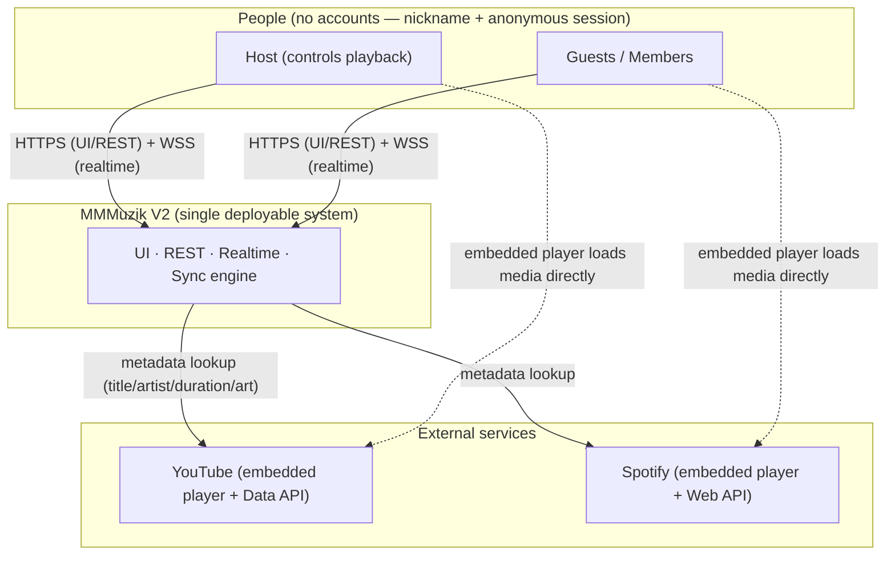
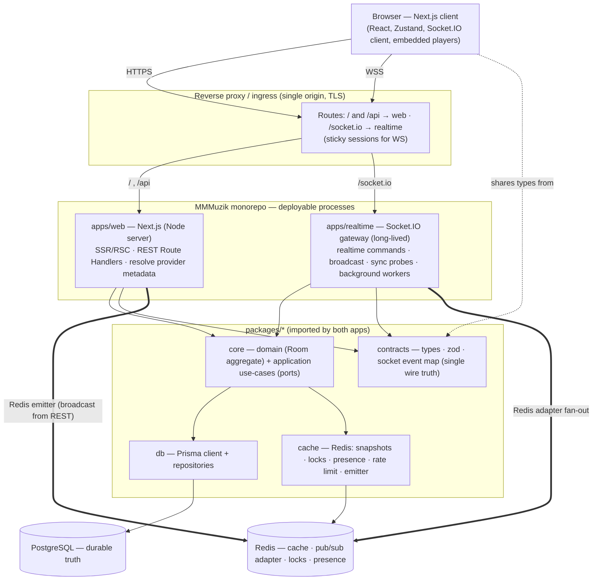
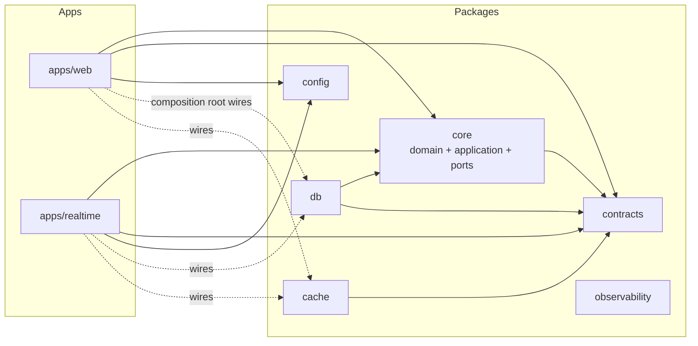
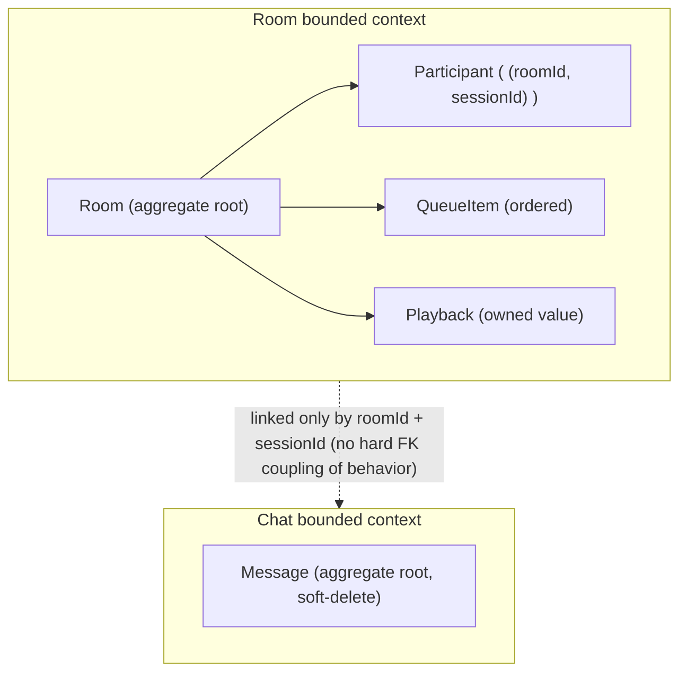
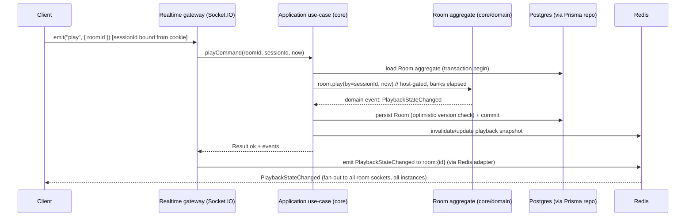
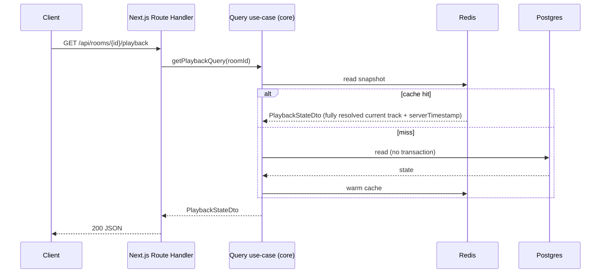
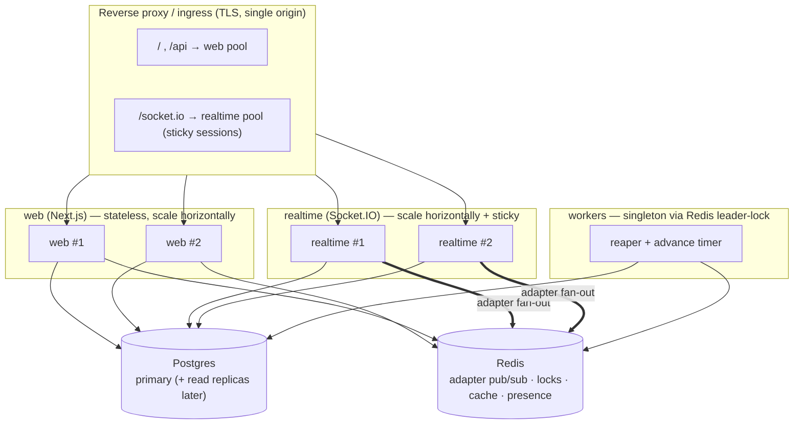

# ARCHITECTURE.md — MMMuzik V2

> **Purpose.** Define the **target architecture** for MMMuzik V2: a single-repository, end-to-end **TypeScript** rebuild of the V1 real-time collaborative listening product. This document is the architectural north star — it describes the system context, layering, module and domain boundaries, data and realtime flows, caching, and scaling — and justifies every significant decision against the **lessons learned in V1** (see `PROJECT_KNOWLEDGE.md`).
>
> **Relationship to other docs.** `SPEC.md` defines *what* the product does (behavior). This document defines *how* V2 is built. Where behavior is referenced, `SPEC.md` is authoritative; where structure is referenced, this document is authoritative.
>
> **Mandated stack.** Single repo · TypeScript only · Next.js full-stack · Socket.IO · PostgreSQL · Prisma · Redis.

---

## Table of Contents

1. [Architectural Goals & Principles](#1-architectural-goals--principles)
2. [Technology Stack & Rationale](#2-technology-stack--rationale)
3. [System Context](#3-system-context)
4. [High-Level Architecture](#4-high-level-architecture)
5. [Repository Structure (Single Repo)](#5-repository-structure-single-repo)
6. [Module Boundaries](#6-module-boundaries)
7. [Domain Boundaries](#7-domain-boundaries)
8. [Layer Descriptions](#8-layer-descriptions)
   - 8.1 [Frontend Layer](#81-frontend-layer)
   - 8.2 [Backend Layer](#82-backend-layer)
   - 8.3 [Realtime Layer](#83-realtime-layer)
   - 8.4 [Database Layer](#84-database-layer)
   - 8.5 [Cache Layer](#85-cache-layer)
9. [Data Flow](#9-data-flow)
10. [Realtime Flow](#10-realtime-flow)
11. [Cache Strategy](#11-cache-strategy)
12. [Scaling Strategy](#12-scaling-strategy)
13. [Cross-Cutting Concerns](#13-cross-cutting-concerns)
14. [Architecture Decision Log (V1 Lesson → V2 Choice)](#14-architecture-decision-log-v1-lesson--v2-choice)

---

# 1. Architectural Goals & Principles

V2 keeps everything V1 got right and removes the friction V1 paid for. The guiding principles:

| # | Principle | Why (V1 lesson) |
|---|-----------|-----------------|
| **P1** | **One language, one repo, one contract.** End-to-end TypeScript in a single monorepo with a shared types/schema package. | V1 split a C# backend and a TypeScript frontend across two repos; this produced **pervasive wire-contract drift** (missing `roomId`, `MessageReceived` vs `MessagePosted`, flat vs nested DTOs — V1 §12.7). A shared contract package makes drift a **compile error**. |
| **P2** | **Single origin.** UI, REST, and realtime are served under one origin; the client uses **relative URLs** and **runtime** configuration. | V1 baked `NEXT_PUBLIC_*` absolute URLs at **build time**, causing the localhost/tunnel/caching failures (V1 §12.4–12.6). Same-origin + runtime config eliminates the entire class of bugs and the cross-site cookie problem. |
| **P3** | **Server is the clock authority; clients reconcile.** | This is V1's crown jewel for sync (V1 §8) and is preserved nearly verbatim. |
| **P4** | **Pure domain, injected infrastructure.** Business rules live in a framework-free core; databases, caches, and transports are adapters behind ports. | V1's Clean-Architecture/DDD-lite core was testable and durable; keep it (V1 §4). The clock is **passed in as a parameter** for determinism. |
| **P5** | **Idempotent, convergent operations.** Auto-advance, reconnection, and broadcasts tolerate duplicates and races. | V1's idempotent auto-advance and merge-by-id queue hydration prevented double-skips and lost adds (V1 §6.8, §7.6). |
| **P6** | **Simplify the moving parts.** No message broker in the MVP; Redis is the single coordination fabric. | V1's RabbitMQ outbox added operational weight and noise (`ACCESS_REFUSED`, V1 §12.7) while **in-process broadcast was always the primary path** (V1 §6.5). V2 drops the broker and uses Redis for fan-out, locks, presence, and cache. |
| **P7** | **Horizontal scale built in from day one.** | V1 **deferred** the SignalR Redis backplane, blocking multi-instance realtime (V1 §10.4, §13.4). V2 wires the **Socket.IO Redis adapter from the start**. |
| **P8** | **Boundaries are enforced, not suggested.** Layer/module dependency rules are checked in CI. | V1 enforced layering with architecture tests (NetArchTest). V2 uses lint-level dependency rules to the same end. |

---

# 2. Technology Stack & Rationale

| Layer | V2 Technology | Why this choice (and the V1 lesson behind it) |
|-------|---------------|------------------------------------------------|
| **Language** | **TypeScript** everywhere (strict) | Kills the cross-language contract drift that plagued V1 (§12.7). One mental model, one toolchain, one set of types from DB row to React prop. |
| **App framework** | **Next.js (App Router)** | Full-stack: server components for SSR snapshots, Route Handlers for REST, one origin for UI + API (P2). Standalone Node output for containerized deploy (matches V1's container model, §10). |
| **Realtime** | **Socket.IO** | Mature WebSocket framework with rooms, acknowledgements (for clock probes), automatic reconnection with backoff, and a **first-class Redis adapter** for horizontal fan-out — the exact capability V1 deferred (§10.4). |
| **Database** | **PostgreSQL** | Durable source of truth; unchanged from V1 — it worked. Strong relational guarantees for the Room aggregate and chat. |
| **ORM / migrations** | **Prisma** | Type-safe DB access that feeds the shared TypeScript types (P1); declarative schema + migration workflow replaces EF Core. |
| **Cache / coordination** | **Redis** | Hot read-through snapshots, rate-limit counters, the advance lock, presence sets, code→room lookup, **and** the Socket.IO adapter pub/sub. One fabric instead of V1's Redis-**plus**-RabbitMQ (P6). |
| **Validation** | **Zod** (in the contracts package) | Runtime validation that doubles as the static type source — one definition guards the wire and types the code. Replaces FluentValidation + hand-kept DTOs. |
| **Monorepo tooling** | Workspaces + a task runner (e.g., **pnpm + Turborepo**) | Single repo (mandated), shared packages, incremental builds, one CI pipeline. |

> **Deliberately removed from V1:** RabbitMQ + transactional outbox (P6), MediatR/CQRS ceremony (replaced by plain use-case functions with a light command/query split), and build-time public URLs (P2). The good ideas they served — decoupling, read/write separation, sync authority — are retained in lighter form.

---

# 3. System Context

The product's external boundary. MMMuzik never proxies audio; it embeds each provider's player and synchronizes **control + position** only (V1 §1, §9).



**Key context facts**
- **No authentication.** Identity = nickname + an anonymous session token in an httpOnly cookie; host authority is a **domain rule**, not an auth layer (V1 §2.0).
- **Media never flows through our servers.** The browser's embedded provider player fetches the audio/video; we only synchronize when/where it plays. This is why a YouTube "bot wall" is **not our defect** and is handled with an "Open on YouTube" escape hatch (V1 §9.5, §12.1).
- **Trusted-audience scale:** up to 50 concurrent participants per room (V1 NFR-3).

---

# 4. High-Level Architecture

V2 is a **modular monolith in a single repo**, deployed as a small number of cooperating processes that all import the **same shared packages**. The split between processes is dictated by one hard constraint: **WebSockets require a long-lived, stateful server, which serverless/request-scoped handlers cannot provide.** Therefore the realtime gateway is a dedicated long-lived Node process, while Next.js owns the request/response (HTTP) surface.



**Why two processes, not one?**
- Next.js Route Handlers are request-scoped — they cannot **hold** a WebSocket connection or run the reconcile/advance timers. The realtime gateway must be a persistent process. (You *can* co-host both on one custom Node server for small deployments; the package boundaries below make that a deploy-time choice, not a code change.)
- A REST-triggered change in `web` (e.g., a room join) still needs to reach connected sockets. It does so through the **Redis emitter** (`web` publishes a Socket.IO event into Redis; the `realtime` gateway's Redis adapter fans it out). One broadcast fabric, two entrypoints. This is the clean replacement for V1's "command handler broadcasts via the in-process broadcaster" pattern (V1 §6.5), now made cross-process.

---

# 5. Repository Structure (Single Repo)

A workspace monorepo. Apps are thin entrypoints; all logic lives in shared packages.

```
mmmuzik/
├─ apps/
│  ├─ web/                 # Next.js App Router: UI (RSC/SSR) + REST Route Handlers
│  │  ├─ app/              # routes: / , /join/[code], /room/[roomId]
│  │  ├─ app/api/          # route handlers: rooms, join/leave, snapshots, tracks/resolve, health, config
│  │  └─ src/features/     # feature UI: room · playback · queue · chat · participants
│  └─ realtime/            # Socket.IO gateway (long-lived Node) + background workers
│     ├─ src/gateway/      # io server, handshake auth, event handlers
│     └─ src/workers/      # reconnect-grace reaper · playback-advance timer · idle-room reaper
│
├─ packages/
│  ├─ contracts/           # SINGLE SOURCE OF WIRE TRUTH
│  │  ├─ dto/              # zod schemas → inferred TS types (Room, Participant, QueueItem, Playback, Chat)
│  │  ├─ events/           # typed Socket.IO ClientToServer & ServerToClient event maps
│  │  └─ errors/           # error code catalog (typed)
│  ├─ core/                # PURE: no Next/Prisma/Socket.IO imports
│  │  ├─ domain/           # Room aggregate, value objects, invariants, domain events (clock-as-parameter)
│  │  ├─ application/      # use-cases (commands/queries) depending only on ports
│  │  └─ ports/            # interfaces: RoomRepo, MessageRepo, Clock, RoomCache, EventPublisher, RateLimiter, MetadataResolver
│  ├─ db/                  # Prisma schema + generated client + repository implementations of ports
│  ├─ cache/              # Redis client + RoomCache, locks, rate limiter, presence, Socket.IO adapter/emitter
│  ├─ config/             # runtime config load + zod validation (no build-time public URLs)
│  └─ observability/      # logger, tracing, metrics helpers
│
├─ prisma/                 # (or under packages/db) schema.prisma + migrations
├─ docker-compose.yml      # web · realtime · postgres · redis (+ proxy)
├─ turbo.json              # task pipeline
└─ package.json            # workspaces
```

**Why a monorepo (vs V1's two repos):** the contract lives in `packages/contracts`, imported by the client, `web`, and `realtime` alike. A change to a wire shape that isn't reflected everywhere **fails to compile**. This is the single most important structural fix relative to V1 (§12.7).

---

# 6. Module Boundaries

Modules are packages plus feature folders. Dependencies flow **inward** toward the pure core; nothing inward depends on a framework.



**Dependency rules (enforced in CI via lint-level import restrictions — the V2 analogue of V1's NetArchTest, P8):**

| Package | May import | May **not** import |
|---------|-----------|--------------------|
| `core` | `contracts` only | `db`, `cache`, `next`, `socket.io`, `@prisma/*`, `ioredis` — **must stay pure** |
| `db` | `core` (ports it implements), `contracts`, Prisma | `cache`, `apps/*` |
| `cache` | `contracts`, Redis client | `db`, `core` domain internals |
| `contracts` | nothing (leaf) | everything |
| `apps/web`, `apps/realtime` | all packages (composition roots) | each other |

**Apps never share runtime state with each other** — only through Postgres and Redis. The composition root (each app's bootstrap) is the only place where concrete adapters (`db`, `cache`) are bound to the `core` ports. This is V1's "infrastructure implements application ports" rule (§4.3), preserved in TS.

---

# 7. Domain Boundaries

The domain is unchanged in spirit from V1 — its model was correct. Two bounded contexts:

## 7.1 Room context (the consistency boundary)

`Room` is the **single aggregate root**. It owns:
- **Participants** — identity is `(roomId, sessionId)` (a **compound key**, fixing V1's global-session-id collision, §12.3). A session may belong to multiple rooms.
- **Queue** — an ordered list of `QueueItem`s; positions recompact on removal.
- **Playback** — one `Playback` value (`currentItemId`, `position`, `status`, `updatedAt`) maintaining the **banking invariant**: stored `position` is always the true offset *at* `updatedAt` (V1 §8.2).

All business rules and invariants live on `Room` (host-only gating, auto-play-first-track, drain-to-idle, cannot-remove-current, idempotent advance, reorder-must-be-exact-set, reconnect-grace host survival). Methods take `now: Date` as a parameter — **the domain never reads the clock** (P4, V1 §4.3).

## 7.2 Chat context (separate aggregate)

`Message` is its own aggregate — durable, independently queryable, soft-deletable — **not** under `Room` (V1 §4.3). This keeps chat history independent of room mutation hotspots and lets it scale/evict on its own terms.



**Cross-context rule:** contexts coordinate only by id (`roomId`, `sessionId`) and through application use-cases — never by reaching into each other's internals. This is the seam that would let Chat become its own service later (a V1 future-extraction goal, §13.4) without a rewrite.

**Domain events** (emitted by `Room`/`Message`, consumed by the application layer to broadcast + invalidate cache): `RoomCreated`, `ParticipantJoined`, `ParticipantLeft`, `HostChanged`, `TrackAddedToQueue`, `TrackRemoved`, `QueueReordered`, `PlaybackStateChanged`, `TrackSkipped`, `TrackEnded`, `RoomClosed`, `ChatMessageSent`. (Same 12 as V1 — the behavior contract is stable.)

---

# 8. Layer Descriptions

## 8.1 Frontend Layer

**Tech:** Next.js App Router (React Server Components for first paint + client components for interactivity), Zustand stores, Socket.IO client, embedded provider players.

**Responsibilities & rules (carried from V1 §4.4, which were sound):**
- **Pages compose, they don't contain logic.** All network access lives in feature **services**; state lives in **Zustand stores**; business logic lives in **hooks/services**.
- **Stores:** `connection` (the single Socket.IO connection + status), `room`, `playback` (`{ playback, clockOffsetMs }`), `queue` (hydrate **merge-by-id** so a late snapshot can't clobber a just-added item — V1 §7.6), `chat` (dedupe by id), `participants`.
- **The local player is never canonical.** It is **reconciled** to the server-authoritative anchor (P3). Guests reconcile continuously; the host's player drives the server.
- **Per-handler subscription disposal** — when unsubscribing socket handlers, remove the specific handler, never all handlers for an event (V1's shared-connection bug class, §4.4).
- **Subscribe before fetching** the initial snapshot, and **re-fetch on reconnect** (V1 §4.4, §6.6).

**V2 improvements over V1's frontend:**
- **No baked API URL.** The client talks to **same-origin relative paths** (`/api/...`) and connects Socket.IO to the same origin (`io()` with default path). This deletes V1's §12.4–12.6 failure modes (P2). Any genuinely runtime value (e.g., feature flags) is delivered by a `/api/config` endpoint or injected into the document — never baked at build.
- **Types come from `contracts`.** Components consume DTOs and emit events typed by the shared package — no hand-maintained frontend types that can drift.

## 8.2 Backend Layer

**Tech:** Next.js Route Handlers (HTTP) + `core` application use-cases.

**What lives here:**
- **REST Route Handlers** (`apps/web/app/api/*`) for request/response operations that don't need a socket: create room, join, leave, snapshots (participants/queue/playback/messages), resolve track metadata, health, config. These mirror V1's REST surface (V1 Appendix A).
- **Application use-cases** (`packages/core/application`) — plain async functions, one per command/query, depending only on **ports**. A light **command/query split** (V1's CQRS value without the MediatR ceremony): commands run in a Prisma transaction and emit domain events; queries are read-through cache, no transaction.
- **A thin pipeline** wrapping use-cases: correlation id → structured logging → rate limiting → zod validation → handler → typed `Result`/`Error`. This is V1's behavior pipeline (§4.3) reimplemented as composable middleware/decorators.

**Result/Error pattern:** use-cases return a typed `Result<T>` with an error catalog (`room.not_found`, `room.closed`, `queue.cannot_remove_current`, `playback.forbidden`, `chat.message_too_long`, …) defined in `contracts/errors`. Route handlers map error types → HTTP status (`Validation→400`, `NotFound→404`, `Conflict→409`, `Forbidden→403`, `TooManyRequests→429`). Socket handlers map the same errors → typed error acks. **One error catalog, two transports** (V1 §4.3, preserved and unified).

**Deployment note (lesson-driven):** `web` runs as a **long-lived Node server** (Next.js standalone), not edge/serverless. This keeps a **singleton Prisma client** and avoids the connection-storm that serverless ORMs suffer; it also matches V1's container topology (§10). If a serverless target is ever required, front Postgres with a pooler (PgBouncer / Prisma Accelerate).

## 8.3 Realtime Layer

**Tech:** Socket.IO server (`apps/realtime`) with the **Redis adapter**, plus background workers.

**Responsibilities:**
- **Connection & identity.** On the handshake, a Socket.IO middleware reads the session token from the httpOnly cookie (same origin → sent automatically) and binds `sessionId` to the socket. **Identity is never trusted from a client argument** (V1 §6.2).
- **Rooms.** Each socket joins the Socket.IO room `room:{roomId}`; all broadcasts target that room.
- **Client→server events** (high-frequency / realtime commands): `joinRoom`, `leaveRoom`, `addTrack`, `removeTrack`, `reorderQueue`, `play`, `pause`, `seek`, `reportPosition` (host heartbeat), `skip`, `skipPrevious`, `notifyTrackEnded`, `reportDuration`, `requestState`, `sendMessage`, and `time` (clock probe via **acknowledgement callback**).
- **Server→client events** (the 12 domain broadcasts): `participantJoined`, `participantLeft`, `hostChanged`, `trackAddedToQueue`, `trackRemoved`, `queueReordered`, `playbackStateChanged`, `messagePosted`, `roomClosed`, etc. — all typed by `contracts/events`.
- **Workers** (background, run in/with the realtime process, guarded by Redis locks so only one instance acts):
  - **Reconnect-grace reaper** — finalizes participants whose grace window expired; triggers host failover (V1 §3.5).
  - **Playback-advance timer** — the authoritative auto-advance path; detects `elapsed ≥ duration (+grace)` and advances, guarded by a per-`(room, endedItem)` Redis `SET NX` lock (V1 §7.4).
  - **Idle-room reaper** — closes rooms with no participants after the inactivity period (V1 §5.4).

**One namespace, room-per-`roomId`** (not a hub-per-feature). V1 consolidated to a single hub because realtime groups are per-hub and one broadcaster targeted one hub (§6.1); V2 likewise uses one Socket.IO server and routes everything through `room:{roomId}`.

**Why Socket.IO over the V1 approach:** built-in reconnection with escalating backoff, acknowledgement callbacks (clean clock probes), and — critically — a **production Redis adapter** that V1 never wired (§10.4). Multi-instance fan-out is a config concern, not a code rewrite.

## 8.4 Database Layer

**Tech:** PostgreSQL + Prisma.

**Schema (behavioral parity with V1 §5, expressed in Prisma):**
- `Room` — id, code (unique), name, status (`Active|Idle|Closed`), hostSessionId, embedded playback fields (`pbCurrentItemId?`, `pbPositionMs`, `pbStatus`, `pbUpdatedAt`), closedAt?, audit timestamps. Optimistic concurrency via a `version` column (Prisma `@version`-style optimistic locking) to protect rapid playback writes (V1 used `xmin`; §5.2).
- `Participant` — **compound primary key `(roomId, sessionId)`** (the V1 §12.3 fix, first-class in V2), nickname, isHost, isOnline, joinedAt (host-failover ordering), lastSeenAt, disconnectedAt? (indexed for the reaper).
- `QueueItem` — id, roomId (FK, cascade), position (0-based, indexed `(roomId, position)`), track fields (title/artist/durationMs/thumbnailUrl), source fields (provider/providerTrackId), addedBySessionId, addedByNickname, addedAt. `durationMs = 0` ⇒ unknown placeholder, corrected on play (V1 §7.5).
- `Message` — id, roomId, sessionId, nickname (snapshot at send), body (≤ 2000), sentAt (indexed `(roomId, sentAt)`), isDeleted + deletedAt (**soft delete**, filtered from reads), audit.

**Repository pattern.** `packages/db` implements the `core` ports (`RoomRepo`, `MessageRepo`). **All Prisma queries live in repositories** — use-cases never touch Prisma directly (V1 §4.3). Writes go through a single transaction boundary per command.

**Migration & permissions (lesson-driven).** V1 crash-looped when the runtime DB role lacked DDL ownership (§12.7). V2 makes this explicit: **migrations run as a privileged migration role** (CI/deploy step `prisma migrate deploy`); the **app runtime role has DML only**. Two roles, one documented deploy step — no startup DDL surprises.

## 8.5 Cache Layer

**Tech:** Redis (single instance/cluster) serving five distinct jobs, replacing V1's Redis **and** RabbitMQ (P6).

| Job | Use |
|-----|-----|
| **Hot snapshots** | Read-through cache of participants/queue/playback DTOs (read → Redis → miss → Postgres → re-warm; **invalidate-on-write**). V1 §6.7. |
| **Realtime fan-out** | The **Socket.IO Redis adapter** (pub/sub) broadcasts across all realtime instances; the **Redis emitter** lets `apps/web` (REST) inject broadcasts. P7. |
| **Locks** | `SET NX` advance lock `playback:advance-lock:{roomId}:{endedItemId}` (idempotent auto-advance across instances) and a worker leader-lock. V1 §7.4. |
| **Rate limiting** | Fixed-window counters per client/action (create/join/resolve/add/send). V1 §11.2. |
| **Presence & lookup** | `code:{code} → roomId` for O(1) join-by-code, and per-room presence sets — a V1 future improvement (§13.4) brought forward. |

**Graceful degradation (kept from V1 §11.2):** if Redis is absent, snapshots fall back to Postgres and the app still serves a single instance. The Redis adapter is only **required** for multi-instance realtime (it's the one piece that must exist to scale out — exactly the gap V1 left open).

---

# 9. Data Flow

## 9.1 Write path (a command — e.g., host presses Play, or any participant adds a track)



**Notes:** the aggregate enforces host authority and the banking invariant; persistence and broadcast happen **only if** the transaction commits (the consistency guarantee V1 got from its outbox, achieved here more simply because broadcast is post-commit in the same process). No broker, no outbox table in the MVP path.

> **REST-originated writes** (e.g., `POST /api/rooms/{code}/join`) run the same use-case inside `apps/web`, then broadcast the resulting events through the **Redis emitter**, so connected sockets see the join even though the mutation didn't originate on a socket.

## 9.2 Read path (a query — e.g., late-join snapshot)



The **REST snapshot** carries the fully-resolved current track + `serverTimestamp` for late-join/reconnect; the **live broadcast** carries a lighter payload because clients already hold the queue (V1 §6.4 — preserved).

---

# 10. Realtime Flow

## 10.1 Connection lifecycle & disconnect grace

```mermaid
sequenceDiagram
  participant C as Client
  participant RT as Socket.IO gateway
  participant W as Grace reaper (worker)
  participant DB as Postgres
  participant RD as Redis

  C->>C: POST /api/rooms/{code}/join (REST) → session cookie set
  C->>RT: connect (cookie sent on handshake, same origin)
  RT->>RT: middleware binds sessionId from cookie
  C->>RT: emit("joinRoom", { roomId })
  RT->>DB: MarkOnline(roomId, sessionId)  // clears disconnectedAt
  RT->>RT: socket.join("room:{roomId}")
  RT->>RD: update presence set
  C->>RT: emit("requestState") + emit("time", ack) ; pull REST snapshots
  Note over C,RT: steady state — host drives, guests reconcile

  C--xRT: disconnect (refresh / blip)
  RT->>DB: BeginDisconnect(roomId, sessionId)  // opens ~30s grace; NO host failover
  alt returns within grace
    C->>RT: reconnect → joinRoom → MarkOnline (identity & host preserved)
  else grace expires
    W->>DB: ReconcileDisconnections(cutoff, now) → finalize offline + host failover
    W->>RD: broadcast HostChanged / ParticipantLeft
  end
```

This preserves V1's most important resilience rule: **a disconnect opens a grace window; it does not immediately fail over the host** (V1 §3.5, §6.2). Refreshes never move ownership.

## 10.2 Clock synchronization & reconciliation (the sync engine — preserved from V1 §8)

The server is the clock authority. Each client estimates a clock **offset** and reconciles its embedded player to the server anchor.

```
// clock offset via Socket.IO acknowledgement (NTP-style):
client emits "time" at t0 ; server replies serverMs ; client receives at t1
rtt    = t1 - t0
offset = serverMs - (t0 + rtt/2)            // serverNow ≈ Date.now() + offset
// take the min-RTT of several probes; refresh on mount, on reconnect, on interval

// expected position (banking invariant):
expectedPos = isPlaying ? position + (serverNow - updatedAt) : position

// reconcile each tick and on every PlaybackStateChanged:
if (no/old video)                 loadVideoById({ id, startSeconds: expectedSec })
match play/pause to isPlaying
if (|playerPos - expectedPos| > DRIFT_THRESHOLD)  seekTo(expectedPos)   // rate-limited
skip correction while BUFFERING/UNSTARTED/CUED                          // unreliable readings
```

**Design targets (unchanged from V1):** perceived drift `< 1s`; drift threshold `≈ 750 ms`; reconcile tick `≈ 1s`; clock-probe refresh `≈ 10s`; host re-anchors only when its own drift `≥ 750 ms` (avoids broadcast churn). Anti-thrash rules (cooldown between seeks, brief grace after a host action so guests don't fight an in-flight command) carry over (V1 §8.4, §12.2).

## 10.3 Auto-advance (idempotent, two convergent paths — V1 §7.4)

1. **Authority:** the playback-advance worker detects the current track's duration has elapsed → advances (Redis `SET NX` lock ensures one instance acts).
2. **Accelerator:** the host's player fires "ended" → `notifyTrackEnded(roomId, endedItemId)`.

Both call the same idempotent advance: **no-op unless `endedItemId` is still current.** No next item ⇒ playback goes **Idle**, room stays open. Duplicate signals can never double-skip.

---

# 11. Cache Strategy

| Concern | Strategy | Invalidation | V1 lineage |
|---------|----------|--------------|-----------|
| Participants / Queue / Playback snapshots | **Read-through** Redis; miss → Postgres → re-warm | **Invalidate (or update) on every committed write** | §6.7 — kept |
| Join-by-code | `code:{code} → roomId` key for O(1) lookup | set on create, drop on close | §13.4 — brought forward |
| Presence | Per-room set of online sessions | updated on connect/disconnect/reaper | §13.4 — brought forward |
| Realtime fan-out | Socket.IO **Redis adapter** (pub/sub) | n/a (transport) | §10.4 gap — **now closed** |
| Cross-process broadcast from REST | Socket.IO **Redis emitter** | n/a | new in V2 (replaces in-process-only broadcaster) |
| Auto-advance idempotency | `SET NX` lock `playback:advance-lock:{roomId}:{endedItemId}` (~30s TTL) | TTL expiry | §7.4 — kept |
| Rate limiting | Fixed-window counters per client/action | TTL window | §11.2 — kept |
| Metadata cache | Short-TTL resolved-track cache (title/artist/duration/art) | TTL (~1h) | §11.2 — kept |

**Consistency rule (unchanged):** Redis always **mirrors committed Postgres state** — never leads it. Writes commit to Postgres first, then update/invalidate Redis. Reads tolerate a cold cache by falling back to Postgres. **Redis is an accelerator and a coordination bus, never the source of truth.**

**Degradation:** absent Redis → single-instance still works (snapshots from Postgres). Multi-instance realtime **requires** the adapter — this is the one hard dependency for scale-out, and V2 wires it from day one rather than deferring it (V1's mistake, §10.4).

---

# 12. Scaling Strategy



**Scaling rules, by tier:**

1. **`web` (HTTP) — stateless.** Scale horizontally with no stickiness; each instance holds a singleton Prisma client. Reads are Redis-accelerated.
2. **`realtime` (Socket.IO) — horizontal + sticky.** Multiple instances coordinate exclusively through the **Redis adapter**, so a broadcast on any instance reaches every room member on every instance. **Sticky sessions** at the proxy are required so a client's WebSocket (and any long-poll fallback) lands on the same instance for its connection lifetime. This is the precise capability V1 deferred and the reason its realtime couldn't scale past one instance (§10.4).
3. **Workers — singleton semantics.** The grace reaper, advance timer, and idle reaper must act once per event. Use a **Redis leader-lock** (or run a single worker replica) plus the per-event `SET NX` advance lock so duplicate timers are harmless.
4. **Postgres — vertical first, then replicas.** The Room aggregate's optimistic-concurrency writes are small and bounded by room activity. When read volume grows, add **read replicas** for snapshot/query traffic and a **connection pooler** (PgBouncer / Prisma Accelerate) in front. Hot lookups (presence, code→room) already live in Redis to keep Postgres off the join hot path.
5. **Redis — the coordination ceiling.** It carries adapter pub/sub, cache, locks, presence, and rate limits. Scale via a managed cluster; shard by `roomId` if a single node becomes the bottleneck.

**Capacity target:** 50 participants/room (NFR-3). A room is a single Socket.IO room broadcast; 50 sockets per room across a handful of instances is comfortable. Load-test the 50-participant room and measure end-to-end drift on the real WS path before scaling claims (V1 §13.4 action item).

**Future extraction path:** because Chat is a separate bounded context and all coordination is event-shaped over Redis, a hot module (Chat or Playback) can be peeled into its own service later without touching the Room aggregate — the same end-state V1 designed its outbox for, reached here with far less machinery.

---

# 13. Cross-Cutting Concerns

| Concern | V2 approach | V1 lesson applied |
|---------|-------------|--------------------|
| **Configuration** | **Runtime** config validated by zod at boot (`packages/config`); client uses **relative URLs** + a `/api/config` endpoint for any runtime value. **No build-time public URLs.** | Eliminates §12.4–12.6 (baked localhost URL, tunnel CORS, stale cache from rebuilds). |
| **Session & cookies** | httpOnly session cookie; **same-origin** so it's first-party by default. Bound to the socket on handshake; never read from client args. | Removes the `SameSite=None; Secure` cross-site dance V1 needed for tunnels (§12.4); identity-spoofing prevented (§6.2). |
| **Identity model** | Nickname + anonymous session; host authority is a **domain rule**; duplicate nicknames suffixed `(2)`, `(3)`. | Unchanged — it worked (§2.0, §2.2). |
| **Authorization** | No auth layer in MVP; host-only actions checked in the aggregate on every command. A future optional-accounts pass layers on top without changing the guest fast path. | §2.0, §13.3. |
| **Validation** | Zod schemas in `contracts` validate at the boundary (REST body + socket payloads) and *are* the types. | One definition guards wire + types; replaces FluentValidation + drift-prone DTOs (§12.7). |
| **Observability** | Structured logging with correlation/room/session ids; OpenTelemetry traces across HTTP → use-case → DB → broadcast; metrics for active rooms, online participants, broadcast latency, client-reported drift. | V1 defined telemetry but didn't export it (§13.5) — V2 ships dashboards/alerts as a first-class deliverable. |
| **YouTube/provider limits** | Embed the real provider player; declare embed origin; require a user gesture; **always offer "Open on YouTube ↗ · Retry."** | The bot wall is provider-side and not bypassable (§9.5, §12.1) — degrade gracefully, never block the room. |
| **Error contract** | Single typed error catalog in `contracts`; mapped to HTTP statuses (REST) and error acks (socket). | One catalog, two transports (§4.3). |
| **Testing** | Domain unit tests (pure, deterministic via injected clock); use-case tests against in-memory ports; integration tests with a real Postgres + Redis (Testcontainers); E2E with Playwright; **dependency-rule lint** in CI. | Mirrors V1's test pyramid + architecture tests (§14, §4.1) with the boundary checks made language-native. |

---

# 14. Architecture Decision Log (V1 Lesson → V2 Choice)

| # | Decision | V1 lesson / pain | V2 choice & rationale |
|---|----------|------------------|------------------------|
| **AD-1** | One language, one repo, shared contract | Two repos + two languages caused **wire-contract drift** (§12.7). | Monorepo + `packages/contracts` (zod→types + typed socket events). Drift becomes a compile error. **Headline reason for the rewrite.** |
| **AD-2** | Single origin + runtime config | Build-time `NEXT_PUBLIC_*` URLs broke localhost/tunnel/caching (§12.4–12.6). | Relative URLs, runtime config, same-origin cookies. Whole bug class deleted. |
| **AD-3** | Socket.IO with Redis adapter from day one | SignalR Redis backplane **deferred**, blocking multi-instance realtime (§10.4). | Adapter + sticky sessions are baseline. Horizontal scale is config, not a rewrite. |
| **AD-4** | Drop RabbitMQ + outbox for MVP | Broker added ops weight & `ACCESS_REFUSED` noise while **in-process broadcast was always primary** (§6.5, §12.7). | Redis is the single coordination fabric (adapter + emitter + locks + cache). Post-commit broadcast keeps the "events iff commit" guarantee. Optional Postgres outbox can return if true cross-service durability is needed. |
| **AD-5** | Keep server-authoritative clock + reconcile | Sync drift solved by anchor + clock-offset + reconcile (§8, §12.2). | Preserved nearly verbatim, now over Socket.IO acknowledgements for clock probes. |
| **AD-6** | Compound participant key `(roomId, sessionId)` | Global session-id PK collided when one session joined two rooms — **HTTP 500** (§12.3). | First-class compound key in Prisma. A session is unique **per room**. |
| **AD-7** | Pure domain, ports & adapters, clock-as-parameter | Clean Architecture/DDD-lite made the core testable and durable (§4). | `packages/core` imports only `contracts`; infra implements ports; lint enforces purity (replacing NetArchTest). |
| **AD-8** | Light command/query split, no mediator | CQRS via MediatR was valuable but heavy; v13+ also went commercial (§14.1). | Plain async use-case functions + a composable pipeline. Same read/write separation, no framework lock-in or licensing risk. |
| **AD-9** | Idempotent, convergent operations | Idempotent auto-advance & merge-by-id queue prevented double-skips / lost adds (§6.8, §7.6). | Preserved: `SET NX` advance lock, "advance only if still current," merge-by-id hydration. |
| **AD-10** | Two DB roles, explicit migration step | Runtime role lacked DDL ownership → startup crash-loop (§12.7). | Privileged migration role (`prisma migrate deploy` in CI/deploy) + DML-only runtime role. No startup DDL. |
| **AD-11** | `web` as long-lived Node server (not edge/serverless) | — (new constraint from Prisma + persistent connections) | Singleton Prisma client, no connection storms; matches container topology. Realtime *must* be long-lived for WebSockets regardless. |
| **AD-12** | Chat as a separate bounded context | V1 already modeled chat as its own aggregate for independent scaling/extraction (§4.3). | Kept — and is the natural first service to extract if needed. |
| **AD-13** | Room **visibility** (Public/Private) + discovery | SPEC originally listed public room discovery as a **non-goal** (§2.2). Product later reversed this to let people find and join rooms with zero friction. | `rooms.visibility` enum (default `public`). The browse list (`GET /api/rooms/public`) returns **both** visibilities; Public rooms are one-click-joinable, Private rooms appear **locked** with their `code` + now-playing withheld and require typing the code. Visibility gates **how you join**, not whether the room is shown. Trade-off: a private room's name/existence/listener-count are visible. SPEC §2.2/§5.3 updated in the same change. |
| **AD-14** | Inactive-room reaper **hard-deletes** (vs close→purge) | Documented retention was *idle → auto-close → purge-after-TTL* (DATABASE §8). Product chose to simply remove dead rooms outright. | A background reaper (`roomReaperWorker`, same `SET NX` single-instance pattern as the advance worker) hard-deletes rooms with **no online participants** and `last_activity_at` older than `ROOM_INACTIVE_GRACE_MS`; children cascade. Presence changes + joins bump `last_activity_at` so the grace measures real emptiness. Trade-off: no reconnect-after-close window for reaped rooms (acceptable — they had no listeners). Host-initiated `close` (→ `closed`) is unchanged. |

---

*This document describes the target architecture for MMMuzik V2. It preserves the V1 behaviors proven correct (sync engine, host failover, idempotent advance, late-join, banking invariant) and removes the V1 friction (cross-language drift, build-time URLs, deferred scale-out, broker complexity, DDL crash-loop). Build to this; revise it deliberately and record changes in the decision log (§14).*

---

# 15. As-Built Notes (through Phase 3)

The **single-app variant** (ARCHITECTURE §4 — permitted co-hosting) is what's implemented. Concrete layering realized in one Next.js app + custom server:

| Logical layer (this doc) | As-built location |
|--------------------------|-------------------|
| `contracts` + pure domain | `src/shared/{types,validation,errors,http,events,constants,domain}` (lint-enforced pure — no Prisma/Redis/Next/Socket.IO) |
| application use-cases | `src/server/services/*` |
| repositories | `src/server/repositories/*` |
| cache adapters | `src/server/cache/*` + `src/lib/redis.ts` |
| realtime gateway | `src/server/socket/*` co-hosted on the custom server (`src/server/index.ts`) |
| HTTP (REST + UI) | `src/app/api/*` (route handlers) + `src/app/*` |

**Decisions taken during implementation:**

- **Response envelope unified** to `{ success, data }` / `{ success, code, message }` for **both** HTTP responses and Socket.IO acks (Phase 2 D2), via the shared `describeError` mapper. This supersedes the `{ ok, error:{...} }` shape sketched in REALTIME §4.2 — REALTIME_ENGINE.md should be updated to match when the realtime features land.
- **`tsx` resolves the `@/` path aliases at runtime** (verified), so the co-hosted custom server and socket handlers use the same aliases as the Next app.
- **Production deploy reminder:** the custom server runs Next in production mode against the prebuilt `.next`. New routes require a rebuild (`pnpm build`) before `pnpm start` — confirmed during Phase 3 verification.
- **Optimistic concurrency** on the room playback anchor is implemented via an integer `version` guard with a bounded reload-retry loop (DATABASE §11), replacing V1's `xmin`.

## 15.1 Phase 4 — UI + integration layer (as-built)

The first user-facing layer. Frontend layering (CLAUDE.md §8.1), all client-side:

| Concern | Location |
|---------|----------|
| HTTP client (relative URLs, envelope unwrap) | `src/lib/http.ts` |
| Socket.IO client (same-origin, typed, autoConnect off) | `src/lib/socket-client.ts` |
| Zustand stores | `src/stores/connectionStore.ts`, `src/features/{room,participants,playback}/store.ts` |
| Feature services (REST + realtime subscribe + clock sync) | `src/features/*/services/*` |
| Hooks (orchestrator + server-driven timeline tick) | `src/features/*/hooks/*` |
| Components | `src/components/*` (RoomLayout, RoomHeader, ParticipantList, PlaybackPanel, SyncStatusIndicator, ConnectionStatus, LoadingState) |
| Routes | `src/app/{,create,join,room/[roomId]}/page.tsx` |

- **Redis emitter is now implemented** (`src/server/realtime/emitter.ts`) for REST-originated broadcasts (the leave endpoint), bridging Next's separate module graph to the Socket.IO adapter — exactly the §4 pattern. (Resolves the cross-graph singleton limitation: a route handler cannot share the in-memory `io` instance.)
- **Presence broadcasts implemented** (deferred from Phase 3): `presence:participant{Joined,Left,Online,Offline}` + `presence:hostChanged` + `room:closed` (REALTIME §6.2). Join/online via the socket handler; leave/host-transfer/close broadcast via the emitter from REST.
- **New endpoints added** for the UI: `GET /api/rooms/:id`, `GET /api/rooms/:id/participants`, `POST /api/rooms/leave`, `GET /api/session` (the last lets the client learn its own sessionId for host detection, since the cookie is httpOnly).
- **Timeline is server-driven**: the UI computes `expectedPosition` via the Phase-3 pure `computeExpectedPosition` + clock offset in a local 250ms tick — never written to the store, never local-clock-as-truth. No playback logic is duplicated in the UI.
- **State-driven realtime**: host controls only emit existing socket commands; the authoritative `playback:stateChanged` broadcast updates the store. The UI never mutates playback state directly.
- **Styling:** Tailwind CSS (no component library yet). **Tests:** Vitest + React Testing Library (stores, sync-health, components); browser E2E (Playwright) deferred.

## 15.2 Phase 5 — YouTube media renderer (as-built)

- **Pure renderer model:** `src/features/youtube/components/YouTubePlayer.tsx` is a persistent `YT.Player` (one per room, `loadVideoById` on track change, never recreated) bound to the server anchor. It **drives nothing** — for host or guest. Position comes only from the Phase-3 `computeExpectedPosition` + clock offset; the client never computes time. This refines PLAYBACK_ENGINE §8.6 (host's player no longer drives the server; the host changes playback via the existing UI commands).
- **Reconcile decision** is a pure helper `src/shared/domain/reconcile.ts#shouldHardSeek` that **consumes** Phase-3 `classifyDrift` (no new sync logic): tolerate drift below threshold, re-align (seek) only above, never while buffering/unstarted/cued, rate-limited by `SEEK_COOLDOWN_MS`. Buffering/iframe delay never touches the server timeline.
- **Minimal load primitive (Phase 6 deferred otherwise):** the anchor gains `currentVideoId` (`pb_current_video_id`, migration `0004`); a host-only `playback:loadVideo {videoId}` socket command sets it (playing@0). `extractYouTubeId` (`src/shared/domain/youtube.ts`) parses URL/id forms (client input + server validation). This is **not** a queue — single current video, no list/add/reorder/auto-next.
- **Error handling:** video errors show the always-available **"Open on YouTube ↗ · Retry"** fallback (L-3.1); muted autoplay + tap-to-unmute (L-3.4); host is `youtube.com` (not nocookie, L-3.2). Server-side error→skip-to-next is deferred to Phase 6 (no queue/next track yet).

## 15.3 Phase 6 — Queue + auto-next (as-built)

- **`playback:loadVideo` is removed**, superseded by **`queue:add`** — the first track added to an idle room auto-plays. The current track is always a queue item; `playTrack`/`goIdle` transitions (replacing `loadVideo`) set `currentTrackId` + `currentVideoId` together.
- **Normalized data (migration `0005`):** `Track` catalog (`@@unique(provider, providerTrackId)`, title/durationMs/thumbnailUrl) + `QueueItem` (position/addedBy…). Wire `QueueItemDto` flattens the join. Title/thumbnail resolved server-side via **YouTube oEmbed** (`metadataResolver`); duration starts at 0 and is corrected by the host player's `reportDuration`.
- **`queueService` is the authority** (`src/server/services/queueService.ts`): add (any participant) / remove · reorder · clear · skip (host) / `advanceIfCurrent` (idempotent). It does DB + Redis cache (`room:{roomId}:queue`) + broadcasts via the **Redis emitter** (so it's correct from socket handlers, the worker, and REST alike). `queue:updated` is a **full-snapshot** broadcast — clients never merge.
- **Auto-next = two convergent paths** (PLAYBACK §7.4): the host player's **ENDED report** (`playback:trackEnded`, accelerator) + a **server timer** (`src/server/workers/advanceWorker.ts`) that advances when `elapsed ≥ duration` — robust to host disconnect — guarded by a per-`(room,item)` Redis `SET NX` lock. Both call the idempotent `advanceIfCurrent`.
- **No Phase-3 sync changes.** `advance`/`playTrack`/`goIdle` are state transitions (like play/pause/seek); clock/offset/reconcile untouched. The renderer change is additive: the host player now reports ENDED + duration (the §7.4 accelerator Phase 5 deferred). Removing the current track is blocked (SPEC §7.6 — skip instead).
