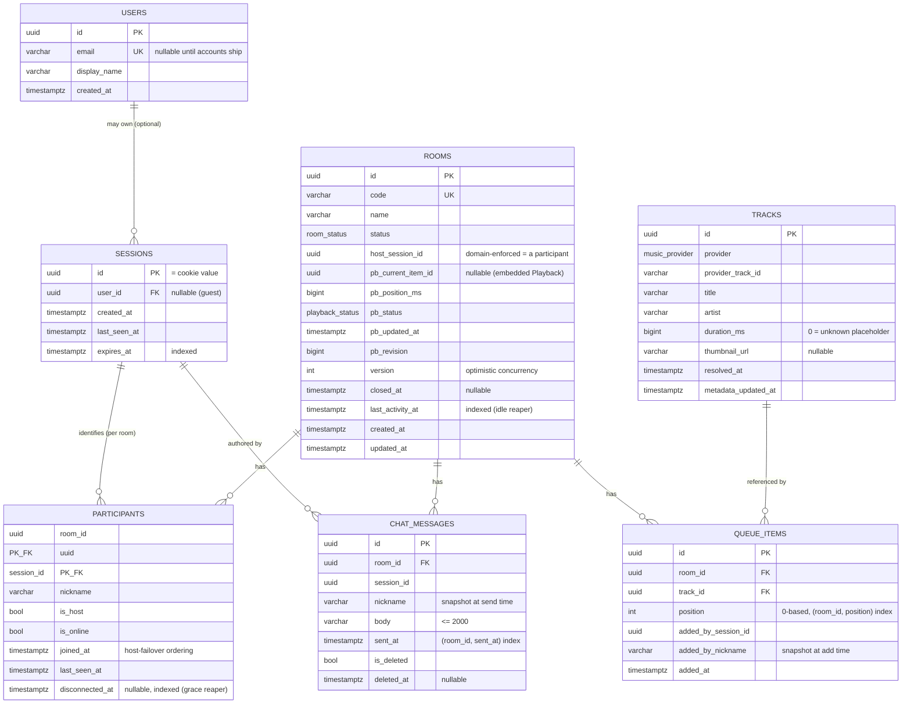

# DATABASE.md — MMMuzik V2 Data Model

> **Purpose.** Define the persistence design for MMMuzik V2: the entity model, the PostgreSQL schema, the Prisma models that generate it, the Redis caching strategy, relationships, indexes, constraints, and data-retention rules — and an explicit rule for **what lives in PostgreSQL vs Redis and why**.
>
> **Source of truth.** `PROJECT_KNOWLEDGE.md` (V1) §5 (Database Design), §2.0 (no-auth identity), §12.3 (participant composite key), §6.7 (read-through cache), §13.3 (future accounts). Stack/decisions: `ARCHITECTURE.md` (Postgres + Prisma + Redis; two DB roles; no message broker). Wire shapes: `REALTIME_ENGINE.md` Appendix A.
>
> **One rule above all (from V1 §6.7):** **PostgreSQL is the single source of truth. Redis only mirrors or accelerates it, or holds connection-lifetime ephemeral state.** Redis must never hold the only copy of anything that matters.

---

## Table of Contents

1. [What Changed from V1 (and what didn't)](#1-what-changed-from-v1-and-what-didnt)
2. [Entity Model & ER Diagram](#2-entity-model--er-diagram)
3. [PostgreSQL Schema](#3-postgresql-schema)
4. [Prisma Models](#4-prisma-models)
5. [Relationships](#5-relationships)
6. [Indexes](#6-indexes)
7. [Constraints](#7-constraints)
8. [Data Retention](#8-data-retention)
9. [Redis Caching Strategy](#9-redis-caching-strategy)
10. [PostgreSQL vs Redis — What Goes Where, and Why](#10-postgresql-vs-redis--what-goes-where-and-why)
11. [Operational Notes (roles, migrations, concurrency)](#11-operational-notes-roles-migrations-concurrency)

---

# 1. What Changed from V1 (and what didn't)

> **Fact vs. forward-looking design — read this first.** Three of the eight requested tables (**Users**, **Sessions**, **Tracks**) **did not exist in V1** and are deliberate V2 additions. They are designed to be **opt-in / non-breaking**: the core guest experience works without a single `users` row, exactly as V1 did. Each is justified below and explicitly marked. I have **not invented any business requirement** — accounts remain a *future* capability (V1 §13.3); the schema is merely shaped so that pass is additive, not a rewrite.

| Entity | V1 reality | V2 decision | Why |
|--------|-----------|-------------|-----|
| **Users** | None — no accounts, no auth (§2.0). | **New, optional** table. A `session` *may* link to a `user`; nearly all rooms have `user_id = NULL`. | Forward-compatible with the §13.3 "optional accounts / reclaim host / saved history" pass **without** retrofitting. Guests stay the fast path. **Not required by any MVP flow.** |
| **Sessions** | Identity was a bare opaque cookie value; **no table** — only `host_session_id` and `participant.session_id` columns referenced it. | **New** first-class `sessions` table. | Makes the anonymous identity durable and queryable: enables reconnection across restarts, session→participant integrity, expiry/cleanup, and the upgrade path to accounts. The cookie value **is** `sessions.id`. |
| **Tracks** | No table — track metadata was **denormalized** (owned `Track`+`SongSource`) directly onto `queue_items`. | **New** `tracks` catalog, keyed by `(provider, provider_track_id)`; `queue_items` reference it. | Dedupe identical adds, a **durable metadata cache** (replacing V1's volatile in-memory/Redis-only cache), and **duration-correction that propagates** to every queue item of that track (V2 improvement over V1 §7.5, which fixed only the host's row). |
| **Participants** | Composite PK `(room_id, session_id)` — the §12.3 fix after a `session_id`-only PK crashed with `23505`. | **Kept** as composite PK. | A session is unique **per room**, not globally — foundational for multi-room (REALTIME §12.3). |
| **Playback State** | **Embedded** (owned) on the `rooms` row as `pb_*` columns under one optimistic-concurrency token. | **Kept embedded** on `rooms` (documented as its own logical entity). | Preserves the Room aggregate's single consistency boundary + atomic re-anchor + no join on the hot read path. The alternative 1:1 table adds a join and a second concurrency story for zero benefit. |
| **Outbox** | `outbox_messages` for the RabbitMQ transactional outbox. | **Removed.** | V2 drops the broker (ARCHITECTURE AD-4); Redis adapter handles fan-out. An outbox can return later if true cross-service durability is needed. |
| **Chat** | `chat_messages`, soft-delete, global `is_deleted=false` read filter, own aggregate. | **Kept** unchanged. | It worked; chat is independently scalable/extractable (§4.3). |

Everything else (snake_case + plural names, `timestamptz` UTC, owned-value flattening for `tracks`, enums) follows V1 conventions (§5).

---

# 2. Entity Model & ER Diagram



**Playback State** is the `pb_*` group embedded on `ROOMS` (1:1 owned), shown inline above. `pb_current_item_id` points at a `queue_items.id` and is enforced by the domain (the current track can never be removed — §7), so it needs no hard FK (avoiding a `rooms ↔ queue_items` cyclic relation).

---

# 3. PostgreSQL Schema

Canonical relational design (illustrative DDL; the Prisma schema in §4 is the authoritative generator). snake_case + plural, `timestamptz` UTC, native enums.

```sql
-- ── enums ───────────────────────────────────────────────────────────────
CREATE TYPE room_status     AS ENUM ('active', 'idle', 'closed');
CREATE TYPE playback_status AS ENUM ('idle', 'playing', 'paused');
CREATE TYPE music_provider  AS ENUM ('youtube', 'spotify');

-- ── users (OPTIONAL / future accounts — guests have none) ────────────────
CREATE TABLE users (
  id            uuid PRIMARY KEY DEFAULT gen_random_uuid(),
  email         varchar(320) UNIQUE,          -- nullable until accounts ship
  display_name  varchar(80)  NOT NULL,
  created_at    timestamptz  NOT NULL DEFAULT now(),
  updated_at    timestamptz  NOT NULL DEFAULT now()
);

-- ── sessions (anonymous identity; id == cookie value) ────────────────────
CREATE TABLE sessions (
  id            uuid PRIMARY KEY DEFAULT gen_random_uuid(),
  user_id       uuid REFERENCES users(id) ON DELETE SET NULL,  -- NULL for guests
  created_at    timestamptz NOT NULL DEFAULT now(),
  last_seen_at  timestamptz NOT NULL DEFAULT now(),
  expires_at    timestamptz NOT NULL          -- e.g. now() + 30 days
);
CREATE INDEX ix_sessions_expires_at ON sessions(expires_at);
CREATE INDEX ix_sessions_user_id    ON sessions(user_id) WHERE user_id IS NOT NULL;

-- ── rooms (aggregate root; embeds Playback State as pb_*) ─────────────────
CREATE TABLE rooms (
  id                uuid PRIMARY KEY DEFAULT gen_random_uuid(),
  code              varchar(12)  NOT NULL,
  name              varchar(80)  NOT NULL,
  status            room_status  NOT NULL DEFAULT 'active',
  visibility        room_visibility NOT NULL DEFAULT 'public',  -- public ⇒ listed + one-click join; private ⇒ listed but locked (code-only)
  host_session_id   uuid         NOT NULL,        -- domain-enforced: a participant of this room
  -- embedded Playback State (owned 1:1) -----------------------------------
  pb_current_item_id uuid,                         -- NULL ⇒ Idle (no current track)
  pb_position_ms     bigint      NOT NULL DEFAULT 0,
  pb_status          playback_status NOT NULL DEFAULT 'idle',
  pb_updated_at      timestamptz NOT NULL DEFAULT now(),   -- the elapsed-math ANCHOR (T)
  pb_revision        bigint      NOT NULL DEFAULT 0,        -- monotonic; client revision-gating
  -- lifecycle / concurrency / audit ---------------------------------------
  version           int          NOT NULL DEFAULT 0,        -- optimistic concurrency token
  closed_at         timestamptz,
  last_activity_at  timestamptz  NOT NULL DEFAULT now(),
  created_at        timestamptz  NOT NULL DEFAULT now(),
  updated_at        timestamptz  NOT NULL DEFAULT now(),
  CONSTRAINT uq_rooms_code        UNIQUE (code),
  CONSTRAINT ck_rooms_position    CHECK (pb_position_ms >= 0)
);
CREATE INDEX ix_rooms_status_activity ON rooms(status, last_activity_at);  -- idle reaper
CREATE INDEX ix_rooms_visibility_status_activity ON rooms(visibility, status, last_activity_at);  -- public browse list + reaper
CREATE INDEX ix_rooms_pb_current_item ON rooms(pb_current_item_id);

-- ── participants (composite PK — a session is unique PER ROOM) ────────────
CREATE TABLE participants (
  room_id         uuid NOT NULL REFERENCES rooms(id)    ON DELETE CASCADE,
  session_id      uuid NOT NULL REFERENCES sessions(id) ON DELETE CASCADE,
  nickname        varchar(40)  NOT NULL,
  is_host         boolean      NOT NULL DEFAULT false,
  is_online       boolean      NOT NULL DEFAULT true,
  joined_at       timestamptz  NOT NULL DEFAULT now(),   -- host-failover ordering
  last_seen_at    timestamptz  NOT NULL DEFAULT now(),
  disconnected_at timestamptz,                            -- reconnect-grace marker
  PRIMARY KEY (room_id, session_id)
);
CREATE INDEX ix_participants_room_joined  ON participants(room_id, joined_at);
CREATE INDEX ix_participants_session      ON participants(session_id);
CREATE INDEX ix_participants_grace        ON participants(disconnected_at)
  WHERE disconnected_at IS NOT NULL;       -- partial index for the grace reaper

-- ── tracks (resolved-metadata catalog; durable cache) ─────────────────────
CREATE TABLE tracks (
  id                  uuid PRIMARY KEY DEFAULT gen_random_uuid(),
  provider            music_provider NOT NULL,
  provider_track_id   varchar(64)  NOT NULL,
  title               varchar(300) NOT NULL,
  artist              varchar(300) NOT NULL DEFAULT '',
  duration_ms         bigint       NOT NULL DEFAULT 0,    -- 0 = unknown placeholder
  thumbnail_url       varchar(1024),
  resolved_at         timestamptz  NOT NULL DEFAULT now(),
  metadata_updated_at timestamptz  NOT NULL DEFAULT now(),
  CONSTRAINT uq_tracks_provider_id UNIQUE (provider, provider_track_id),
  CONSTRAINT ck_tracks_duration    CHECK (duration_ms >= 0)
);

-- ── queue_items (references a track; snapshots who added it) ──────────────
CREATE TABLE queue_items (
  id                 uuid PRIMARY KEY DEFAULT gen_random_uuid(),
  room_id            uuid NOT NULL REFERENCES rooms(id)  ON DELETE CASCADE,
  track_id           uuid NOT NULL REFERENCES tracks(id) ON DELETE RESTRICT,
  position           int  NOT NULL,                       -- 0-based, recompacted on removal
  added_by_session_id uuid NOT NULL,
  added_by_nickname  varchar(40) NOT NULL,                -- snapshot at add time
  added_at           timestamptz NOT NULL DEFAULT now(),
  CONSTRAINT ck_queue_position CHECK (position >= 0)
);
CREATE INDEX ix_queue_room_position ON queue_items(room_id, position);
CREATE INDEX ix_queue_track         ON queue_items(track_id);

-- ── chat_messages (own aggregate; soft delete) ───────────────────────────
CREATE TABLE chat_messages (
  id          uuid PRIMARY KEY DEFAULT gen_random_uuid(),
  room_id     uuid NOT NULL REFERENCES rooms(id) ON DELETE CASCADE,
  session_id  uuid NOT NULL,
  nickname    varchar(40)   NOT NULL,                     -- snapshot at send time
  body        varchar(2000) NOT NULL,
  sent_at     timestamptz   NOT NULL DEFAULT now(),
  is_deleted  boolean       NOT NULL DEFAULT false,
  deleted_at  timestamptz,
  CONSTRAINT ck_chat_body_len CHECK (char_length(body) BETWEEN 1 AND 2000)
);
CREATE INDEX ix_chat_room_sent ON chat_messages(room_id, sent_at)
  WHERE is_deleted = false;                 -- partial: matches the global read filter
```

---

# 4. Prisma Models

Authoritative schema. Models are PascalCase TS; `@@map`/`@map` honor V1's snake_case + plural DB. `provider = "postgresql"`.

```prisma
generator client {
  provider = "prisma-client-js"
}

datasource db {
  provider = "postgresql"
  url      = env("DATABASE_URL")          // runtime app role (DML only)
}

enum RoomStatus      { active  idle  closed }
enum PlaybackStatus  { idle    playing  paused }
enum MusicProvider   { youtube spotify }

/// OPTIONAL — future accounts (§13.3). Guests never create a row here.
model User {
  id          String    @id @default(uuid()) @db.Uuid
  email       String?   @unique @db.VarChar(320)
  displayName String    @map("display_name") @db.VarChar(80)
  createdAt   DateTime  @default(now()) @map("created_at") @db.Timestamptz
  updatedAt   DateTime  @updatedAt      @map("updated_at") @db.Timestamptz
  sessions    Session[]
  @@map("users")
}

/// Anonymous identity. `id` is the value stored in the httpOnly session cookie.
model Session {
  id           String        @id @default(uuid()) @db.Uuid
  userId       String?       @map("user_id") @db.Uuid
  user         User?         @relation(fields: [userId], references: [id], onDelete: SetNull)
  createdAt    DateTime      @default(now()) @map("created_at") @db.Timestamptz
  lastSeenAt   DateTime      @default(now()) @map("last_seen_at") @db.Timestamptz
  expiresAt    DateTime      @map("expires_at") @db.Timestamptz
  participants Participant[]

  @@index([expiresAt])
  @@index([userId])
  @@map("sessions")
}

model Room {
  id              String        @id @default(uuid()) @db.Uuid
  code            String        @unique @db.VarChar(12)
  name            String        @db.VarChar(80)
  status          RoomStatus    @default(active)
  visibility      RoomVisibility @default(public)                  // public ⇒ listed; private ⇒ code-only
  hostSessionId   String        @map("host_session_id") @db.Uuid   // domain-enforced

  // ── embedded Playback State (owned 1:1) ───────────────────────────────
  pbCurrentItemId String?       @map("pb_current_item_id") @db.Uuid // null ⇒ Idle
  pbPositionMs    BigInt        @default(0) @map("pb_position_ms")
  pbStatus        PlaybackStatus @default(idle) @map("pb_status")
  pbUpdatedAt     DateTime      @default(now()) @map("pb_updated_at") @db.Timestamptz // anchor T
  pbRevision      BigInt        @default(0) @map("pb_revision")      // client revision-gating

  // ── lifecycle / concurrency / audit ──────────────────────────────────
  version         Int           @default(0)                          // optimistic concurrency
  closedAt        DateTime?     @map("closed_at") @db.Timestamptz
  lastActivityAt  DateTime      @default(now()) @map("last_activity_at") @db.Timestamptz
  createdAt       DateTime      @default(now()) @map("created_at") @db.Timestamptz
  updatedAt       DateTime      @updatedAt      @map("updated_at") @db.Timestamptz

  participants    Participant[]
  queueItems      QueueItem[]
  messages        ChatMessage[]

  @@index([status, lastActivityAt])
  @@index([pbCurrentItemId])
  @@map("rooms")
}

model Participant {
  roomId         String     @map("room_id") @db.Uuid
  sessionId      String     @map("session_id") @db.Uuid
  nickname       String     @db.VarChar(40)
  isHost         Boolean    @default(false) @map("is_host")
  isOnline       Boolean    @default(true)  @map("is_online")
  joinedAt       DateTime   @default(now()) @map("joined_at") @db.Timestamptz
  lastSeenAt     DateTime   @default(now()) @map("last_seen_at") @db.Timestamptz
  disconnectedAt DateTime?  @map("disconnected_at") @db.Timestamptz

  room    Room    @relation(fields: [roomId], references: [id], onDelete: Cascade)
  session Session @relation(fields: [sessionId], references: [id], onDelete: Cascade)

  @@id([roomId, sessionId])                    // composite PK — the §12.3 fix
  @@index([roomId, joinedAt])
  @@index([sessionId])
  @@index([disconnectedAt])
  @@map("participants")
}

/// Resolved-metadata catalog. Durable cache keyed by provider identity.
model Track {
  id                String        @id @default(uuid()) @db.Uuid
  provider          MusicProvider
  providerTrackId   String        @map("provider_track_id") @db.VarChar(64)
  title             String        @db.VarChar(300)
  artist            String        @default("") @db.VarChar(300)
  durationMs        BigInt        @default(0) @map("duration_ms")  // 0 = unknown placeholder
  thumbnailUrl      String?       @map("thumbnail_url") @db.VarChar(1024)
  resolvedAt        DateTime      @default(now()) @map("resolved_at") @db.Timestamptz
  metadataUpdatedAt DateTime      @default(now()) @map("metadata_updated_at") @db.Timestamptz
  queueItems        QueueItem[]

  @@unique([provider, providerTrackId])
  @@map("tracks")
}

model QueueItem {
  id               String   @id @default(uuid()) @db.Uuid
  roomId           String   @map("room_id") @db.Uuid
  trackId          String   @map("track_id") @db.Uuid
  position         Int                                      // 0-based; recompacted on remove
  addedBySessionId String   @map("added_by_session_id") @db.Uuid
  addedByNickname  String   @map("added_by_nickname") @db.VarChar(40)  // snapshot
  addedAt          DateTime @default(now()) @map("added_at") @db.Timestamptz

  room  Room  @relation(fields: [roomId], references: [id], onDelete: Cascade)
  track Track @relation(fields: [trackId], references: [id], onDelete: Restrict)

  @@index([roomId, position])
  @@index([trackId])
  @@map("queue_items")
}

model ChatMessage {
  id         String    @id @default(uuid()) @db.Uuid
  roomId     String    @map("room_id") @db.Uuid
  sessionId  String    @map("session_id") @db.Uuid
  nickname   String    @db.VarChar(40)                      // snapshot at send time
  body       String    @db.VarChar(2000)
  sentAt     DateTime  @default(now()) @map("sent_at") @db.Timestamptz
  isDeleted  Boolean   @default(false) @map("is_deleted")
  deletedAt  DateTime? @map("deleted_at") @db.Timestamptz

  room Room @relation(fields: [roomId], references: [id], onDelete: Cascade)

  @@index([roomId, sentAt])
  @@map("chat_messages")
}
```

> **Soft-delete read filter (V1 §5.2):** Prisma has no global query filter, so chat reads must always include `where: { isDeleted: false }`. Centralize this in the `MessageRepository` (the only place that queries chat) — never query `chat_messages` directly from a use-case (ARCHITECTURE §8.2).

---

# 5. Relationships

| Relationship | Cardinality | On delete | Notes |
|--------------|-------------|-----------|-------|
| `users → sessions` | 1 — 0..* | `SET NULL` | Optional. A session keeps working if its (future) user is removed → reverts to guest. |
| `sessions → participants` | 1 — 0..* | `CASCADE` | A session may participate in **many rooms** (multi-room). |
| `sessions → chat_messages` | 1 — 0..* (soft) | — (no FK; session id retained) | `session_id` stored, not FK-enforced, so message history survives session cleanup. |
| `rooms → participants` | 1 — 0..* | `CASCADE` | Aggregate children die with the room. |
| `rooms → queue_items` | 1 — 0..* | `CASCADE` | Same. |
| `rooms → chat_messages` | 1 — 0..* | `CASCADE` | Same. |
| `tracks → queue_items` | 1 — 0..* | `RESTRICT` | A track can't be deleted while referenced; GC removes only unreferenced tracks (§8). |
| `rooms ⇢ playback` | 1 — 1 (embedded) | — | `pb_*` columns owned by the room row; updated atomically with it. |
| `room.host_session_id` | → a participant of the room | — (domain-enforced) | Single-host pointer; the invariant "host is a current participant" is enforced in the aggregate, not by FK (avoids a cyclic relation). |
| `room.pb_current_item_id` | → a `queue_items.id` | — (domain-enforced) | The current track can never be removed (§7), so no orphan risk; kept FK-free to avoid the `rooms ↔ queue_items` cycle. |

---

# 6. Indexes

| Table | Index | Purpose |
|-------|-------|---------|
| `rooms` | `UNIQUE(code)` | Join-by-code lookup; uniqueness guarantee. |
| `rooms` | `(status, last_activity_at)` | Idle-room reaper scan (`status='idle' AND last_activity_at < cutoff`). |
| `rooms` | `(pb_current_item_id)` | Resolve current-track joins. |
| `participants` | `PK(room_id, session_id)` | Identity lookup + the §12.3 collision fix. |
| `participants` | `(room_id, joined_at)` | Host-failover ordering ("longest-present") + participant listing. |
| `participants` | `(session_id)` | "Which rooms is this session in?" (multi-room, reconnect). |
| `participants` | `(disconnected_at) WHERE NOT NULL` | **Partial** index for the grace reaper's hot query. |
| `tracks` | `UNIQUE(provider, provider_track_id)` | Catalog dedupe + resolve cache hit. |
| `queue_items` | `(room_id, position)` | Ordered queue reads + recompaction. |
| `queue_items` | `(track_id)` | Reverse lookup for GC + duration-correction fan-out. |
| `chat_messages` | `(room_id, sent_at) WHERE NOT deleted` | **Partial** index matching the recent-history read (oldest-first, take ≤100). |
| `sessions` | `(expires_at)` | Expiry sweep. |
| `sessions` | `(user_id) WHERE NOT NULL` | Account → sessions (future). |

---

# 7. Constraints

**Keys & uniqueness**
- `rooms.code` unique; `tracks (provider, provider_track_id)` unique; `participants` composite PK `(room_id, session_id)`.

**Foreign keys** — as in §5 (cascade for room children; restrict for `tracks`; set-null for the optional user link).

**Check constraints**
- `pb_position_ms >= 0`, `queue_items.position >= 0`, `tracks.duration_ms >= 0`.
- `char_length(chat.body) BETWEEN 1 AND 2000` (rejects empty + over-long — SPEC REQ-CHAT-4).
- Column widths cap inputs: `name ≤ 80`, `nickname ≤ 40`, `body ≤ 2000`. (`urlOrId ≤ 2048` is validated at the boundary, not stored.)

**Enums** (DB-level, type-safe): `room_status`, `playback_status`, `music_provider`.

**Domain-enforced invariants (not DB constraints, by design — they require aggregate logic):**
- Exactly one `is_host = true` per room; `host_session_id` equals that participant's session.
- `pb_current_item_id` references a non-removed queue item; the current track cannot be removed.
- Queue `position` values are contiguous `0..n` after every mutation (recompaction).
- Reorder lists every current item id exactly once.
- Mutations on a `closed` room are rejected.

> **Why these aren't pushed into the DB:** they are multi-row, transition-dependent rules that belong in the `Room` aggregate (the single consistency boundary, V1 §4.3). The DB enforces *shape*; the domain enforces *behavior*. Position is a **non-unique** index (not a unique constraint) precisely so reorder can update rows in one transaction without tripping immediate uniqueness.

---

# 8. Data Retention

Rooms are ephemeral but persisted (durability + reconnect across restarts — V1 §5.4). Retention is enforced by scheduled cleanup jobs (the V2 reapers, ARCHITECTURE §8.3) and is **runtime-configurable**.

> **Implemented divergence (ARCHITECTURE §14).** The shipped inactive-room reaper **hard-deletes** rooms with no online participants whose `last_activity_at` predates the grace window, instead of the close→purge two-step below. It cascades `participants`/`queue_items`/`chat_messages` in one step. The close→purge rows below describe the original intent and the host-initiated `closed` path (REQ-ROOM-7), which still applies.

| Data | Lifetime | Cleanup mechanism |
|------|----------|-------------------|
| **Inactive rooms (shipped)** | No online participants for `ROOM_INACTIVE_GRACE_MS` (default 15 min). | **Room reaper** (`src/server/workers/roomReaperWorker.ts`): `status != 'closed' AND last_activity_at < now()-GRACE AND no online participants` → **hard delete** (children cascade). Single-instance Redis `SET NX` lock. |
| **Active/Idle rooms** | While in use. Idle rooms auto-close after the inactivity window. | Idle-room reaper: `status='idle' AND last_activity_at < now()-IDLE_TTL` → set `closed`. |
| **Closed rooms (+ all children)** | Retained briefly for late reconnect/forensics, then purged. **Default: 7 days.** | Purge job deletes `rooms WHERE status='closed' AND closed_at < now()-CLOSED_RETENTION`; `participants`, `queue_items`, `chat_messages` cascade. |
| **Participants** | Live with the room; removed on explicit leave. | Cascade on room purge; grace reaper finalizes departures. |
| **Queue items / Playback** | Live with the room. | Cascade on room purge. |
| **Chat messages** | Live with the room; individual messages soft-deletable. | Soft delete sets `is_deleted=true`; hard-purged with the room. (No long-term retention — NFR-7 ephemeral.) |
| **Sessions** | **30 days** of inactivity (matches V1's cookie lifetime, §12.3). | Sweep `sessions WHERE expires_at < now()` **and** the session has no participant in a non-closed room. |
| **Tracks (catalog)** | Long-lived cache. | Optional GC: delete tracks with **no referencing queue item** and `metadata_updated_at < now()-TRACK_TTL` (e.g., 90 days). Safe due to `RESTRICT`. |
| **Users (future)** | Per account policy (not in MVP scope). | n/a until accounts ship. |

**Retention tunables:** `IDLE_TTL` (e.g., 15 min), `CLOSED_RETENTION` (7 days), `SESSION_TTL` (30 days), `TRACK_TTL` (90 days). All in `packages/config` (runtime, never build-time — ARCHITECTURE §13).

---

# 9. Redis Caching Strategy

Redis serves five jobs (ARCHITECTURE §11). Every cached datum is **derivable from Postgres** and may be evicted at any time.

| Concern | Key pattern | Type / TTL | Write/invalidate rule |
|---------|------------|-----------|------------------------|
| **Playback snapshot** | `room:{roomId}:playback` | string (JSON) / 1 h | **Updated on every committed playback write**; read-through on miss → warm from `rooms`. |
| **Participants snapshot** | `room:{roomId}:participants` | string (JSON) / 1 h | Invalidated on join/leave/host-change; read-through on miss. |
| **Queue snapshot** | `room:{roomId}:queue` | string (JSON) / 1 h | Invalidated on add/remove/reorder/duration-correct; read-through on miss. |
| **Join-by-code** | `code:{code}` → `roomId` | string / room lifetime | Set on create; dropped on close. O(1) join (V1 §13.4 brought forward). |
| **Presence** | `presence:{roomId}` → hash `sessionId→connCount` | hash / connection-scoped | INCR/DECR on connect/disconnect; **not** rebuilt from Postgres (it's connection state — REALTIME §11). |
| **Advance lock** | `playback:advance-lock:{roomId}:{itemId}` | `SET NX` / ~30 s | Idempotent auto-advance across instances (V1 §7.4). |
| **Worker leader lock** | `lock:worker:{job}` | `SET NX` / short TTL | Single-runner for reapers/advance timer (ARCHITECTURE §12). |
| **Rate limits** | `ratelimit:{action}:{sessionId}` | counter / window TTL | Fixed-window counters; fail-open if Redis down (V1 §11.2). |
| **Metadata hot cache** | `track:{provider}:{providerId}` | string (JSON) / 1 h | Optional hot layer in front of the durable `tracks` table to skip a DB hit on very hot resolves. |
| **Session auth cache** | `session:{id}` → `{ userId, expiresAt }` | string / ≤ 5 min | Avoids a DB read on every socket handshake; short TTL so expiry/logout propagate. |
| **Realtime adapter** | (internal channels) | pub/sub | Socket.IO Redis adapter fan-out (not application data). |

**Consistency protocol (V1 §6.7, unchanged):** write commits to **Postgres first**, then **update-or-invalidate** the Redis snapshot. Reads are **read-through** (miss → Postgres → re-warm). Therefore Redis always lags-or-matches committed Postgres, never leads it.

**Degradation:** with Redis absent, snapshots are served straight from Postgres and a single instance still works (V1 §11.2). The **adapter** is the one Redis dependency that's *required* for multi-instance realtime correctness.

---

# 10. PostgreSQL vs Redis — What Goes Where, and Why

The deciding question for every datum: **"If Redis is wiped right now, is anything lost?"** If yes → it belongs in Postgres. If it's rebuildable or only meaningful for the current connection → Redis.

### Lives in PostgreSQL (durable source of truth)

| Data | Why Postgres |
|------|--------------|
| **Rooms (incl. embedded Playback anchor)** | Must survive restart so participants reconnect into a live room (V1 §5.4, NFR-10). The anchor `{position, status, updatedAt, revision}` is canonical truth; losing it desynchronizes everyone. |
| **Participants** | Identity, host designation, and join-order (failover) must be durable and transactional. |
| **Queue items + Tracks** | The shared curation is the product; must persist and be queryable; metadata catalog dedupes and survives. |
| **Chat messages** | History is shown on join; must be durable and ordered. |
| **Sessions / Users** | Identity continuity across restarts and the account upgrade path. |

> **The playback anchor is deliberately Postgres-resident, not Redis-only.** It changes only on real state transitions (play/pause/seek/skip/track-change/drift-reanchor) — **the continuously-moving position is computed (`P + elapsed`), never written** — so write volume is bounded and durability is cheap. This is the core reason a server restart doesn't lose a playing room.

### Lives in Redis (ephemeral / accelerator / coordination)

| Data | Why Redis (and why losing it is safe) |
|------|----------------------------------------|
| **Snapshots (playback/queue/participants)** | Pure read-through projections of Postgres — rebuilt on the next miss. Pure latency win. |
| **Presence (conn ref-counts)** | Meaningful only while sockets are connected; after a restart, clients reconnect and rebuild it. Storing it durably would be wrong. |
| **Locks (advance / leader)** | Coordination primitives with TTL; their whole purpose is cross-instance, in-the-moment mutual exclusion. |
| **Rate-limit counters** | Short windows; fail-open; no value in persisting. |
| **Code→room, metadata, session-auth caches** | Rebuildable from Postgres; TTL-bounded; reduce DB load on hot paths. |
| **Adapter pub/sub** | Transport fan-out, not data. |

**Net effect:** Postgres holds *truth*; Redis holds *speed and coordination*. This split is the same one V1 chose (§4.2 "Postgres = durable truth; Redis = fast hot projections") — V2 only widens Redis's coordination role (adapter, presence, code lookup, session cache) because the broker is gone and horizontal realtime is in from day one.

---

# 11. Operational Notes (roles, migrations, concurrency)

**Two database roles (the V1 §12.7 crash-loop fix — ARCHITECTURE AD-10).**
- **Migration role** — owns the schema; runs `prisma migrate deploy` in a CI/deploy step. Has DDL.
- **Runtime app role** — used by `DATABASE_URL` at runtime; **DML only**, no DDL. This prevents the `42501: must be owner of table` startup crash V1 hit when the runtime user tried to migrate.

**Migrations.** Prisma Migrate; never auto-migrate on app boot in multi-instance deploys — run the dedicated deploy step so all instances start against an already-migrated schema.

**Optimistic concurrency on `rooms`.** V1 used Postgres `xmin`; V2 uses an explicit integer `version` (Prisma-friendly). The playback write pattern:

```ts
// re-anchor: read version V, then guard the update on it
const updated = await prisma.room.updateMany({
  where: { id: roomId, version: V },
  data: { pbPositionMs, pbStatus, pbUpdatedAt, pbRevision: { increment: 1 }, version: { increment: 1 } },
});
if (updated.count === 0) {           // someone else wrote first
  // reload, re-evaluate the command, retry (bounded)
}
```

This protects the rapid playback updates that motivated V1's concurrency token (§5.4), without `xmin`.

**`version` vs `pb_revision` — distinct counters:**
- `version` — DB optimistic-concurrency token; bumps on **any** room write; used to detect write conflicts.
- `pb_revision` — playback broadcast sequence; bumps **only** on playback state changes; sent to clients so they **reject stale `playback:stateChanged`** (PLAYBACK_ENGINE §2, REALTIME §5). Keeping them separate means non-playback room writes don't churn the clients' revision gate.

**`gen_random_uuid()` / `uuid`.** Use database-generated UUIDs (or app-generated v4/v7) for `@db.Uuid` keys; UUIDv7 is preferable for index locality if available.

**Transaction boundary.** Each command runs in one Prisma transaction (load aggregate → mutate → persist), then post-commit broadcast + cache invalidation (ARCHITECTURE §9.1). An event is broadcast **iff** the write commits — the consistency guarantee V1 got from its outbox, achieved here without one.

---

*This document is implementation-ready: §3 is the relational design, §4 is the Prisma source that generates it, §6–§7 lock down integrity, §8 governs lifecycle, and §9–§10 draw the Postgres/Redis line with explicit justification. The forward-looking tables (Users, Sessions, Tracks) are additive and clearly marked — the MVP guest flow needs only Sessions, Rooms, Participants, Tracks, Queue Items, and Chat Messages, exactly mirroring V1's behavior with V2's normalization and durability improvements.*

---

# 12. As-Built Notes (through Phase 3)

Deltas from the target schema above, decided during implementation (migrations `0001_init`, `0003_room_and_playback_foundation`):

- **`Participant.role` enum replaces the `isHost` boolean.** A `ParticipantRole { host | member }` enum is used instead of `is_host`; `room.hostSessionId` remains the authoritative single-host pointer (invariant: exactly one `host` participant == `hostSessionId`). Rationale: explicit roles + a clean path to future co-host roles (Phase 2 decision D1).
- **`Session` carries guest identity:** added `displayName` (chosen nickname) + `avatar` (nullable) so a returning browser restores its identity, alongside `lastSeenAt` + `expiresAt` (sliding 30-day). The cookie value **is** `sessions.id` (Phase 2 decision D3).
- **Room code generation:** 6 chars from the human-friendly alphabet `ABCDEFGHJKMNPQRSTUVWXYZ23456789` (excludes I, L, O, 0, 1), uppercase, with unique-collision retry. Codes are normalized to uppercase in the service on join (not only at the validation layer).
- **`pbPositionMs` / `pbRevision` are `BigInt` in Postgres**, converted to `number` at the repository boundary (positions fit JS safe-int range). `pbRevision` is the client-facing anti-stale counter; `version` is the optimistic-concurrency token (distinct).
- **Not yet built (later phases):** `Track` / `QueueItem` / `Message` remain minimal placeholders; `User` is untouched (no accounts). Participant `isOnline` / `disconnectedAt` columns exist but presence/grace logic is deferred to the presence/reconnection phase.
- **Phase 5 (migration `0004`):** added `rooms.pb_current_video_id VARCHAR(16)` — the YouTube id the renderer binds to. (Phase 5's `playback:loadVideo` is superseded by `queue:add` in Phase 6.)
- **Phase 6 (migration `0005`):** `Track` expanded to the catalog target (`provider_track_id`, `title`, `duration_ms`, `thumbnail_url`, `@@unique(provider, provider_track_id)`); `QueueItem` expanded (`position`, `added_by_session_id`, `added_by_nickname`, `added_at`, index `(room_id, position)`); `rooms.pb_current_duration_ms` added (current track length for the auto-next timer). `pb_current_item_id` now holds the live queue-item id. The Track catalog is normalized storage; the wire `QueueItemDto` flattens the Track join (title/videoId/duration/thumbnail).
