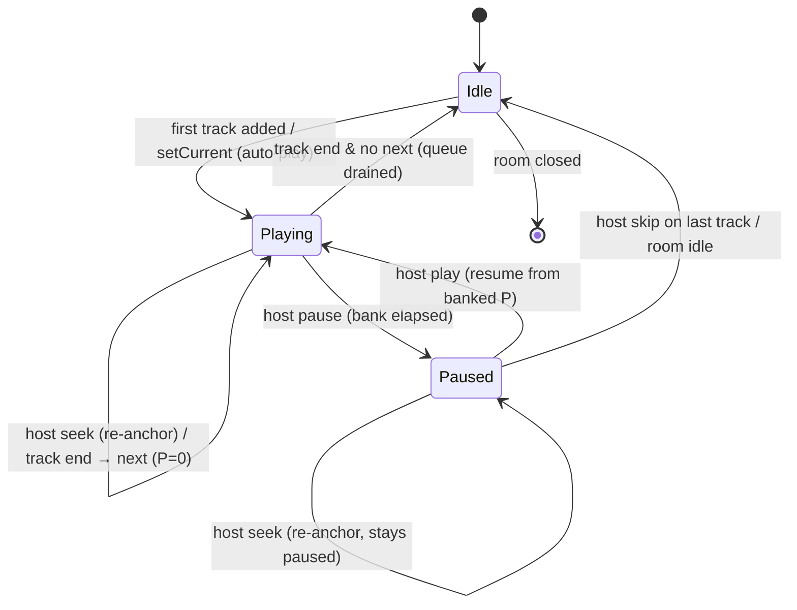
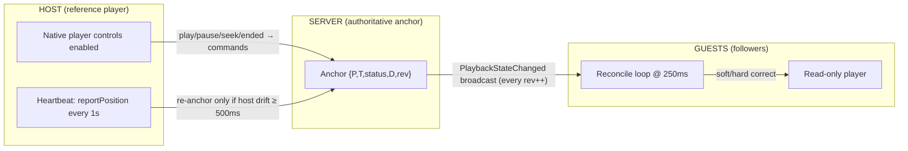
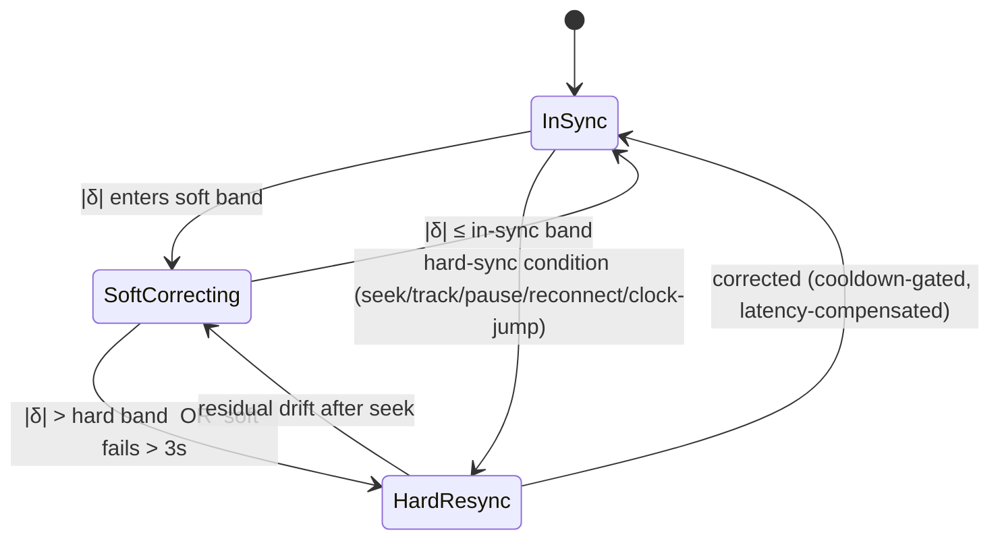

# PLAYBACK_ENGINE.md — MMMuzik V2 Synchronization Engine

> **Purpose.** Specify a **Spotify-level synchronization engine** for MMMuzik V2 — precise enough to implement directly. It defines the playback state model, authority model, clock synchronization, drift detection and correction, latency compensation, and the handling of join-in-progress, seek, pause, and track-end. It carries forward everything V1 proved correct (server-authoritative anchor, position banking, clock-offset probing, idempotent auto-advance) and fixes the two problems V1 documented: **unbounded steady-state drift** and **audible seek "thrash."**
>
> **Source of truth.** `PROJECT_KNOWLEDGE.md` (V1) §8 (Playback Engine), §9 (YouTube), §7.4 (auto-advance), §12.2 (sync drift lessons), §13.1 (Spotify-level goals). Behavior targets come from `SPEC.md`. Transport/process context comes from `ARCHITECTURE.md`.
>
> **Design goal.** Steady-state convergence of all listeners to within **±150 ms** (target) and **never more than 1 s** (hard ceiling, NFR-1), with correction that is **smooth and inaudible** in the common case and **immediate** when a discontinuity occurs.

---

## Table of Contents

1. [Definitions & Notation](#1-definitions--notation)
2. [Playback State Model](#2-playback-state-model)
3. [Playback Authority](#3-playback-authority)
4. [Playback Timeline Calculation](#4-playback-timeline-calculation)
5. [Clock Synchronization](#5-clock-synchronization)
6. [Latency Compensation](#6-latency-compensation)
7. [Drift Detection](#7-drift-detection)
8. [Drift Correction](#8-drift-correction)
9. [Resynchronization Strategy (the reconcile loop)](#9-resynchronization-strategy-the-reconcile-loop)
10. [Join-in-Progress Sync](#10-join-in-progress-sync)
11. [Seek Handling](#11-seek-handling)
12. [Pause Handling](#12-pause-handling)
13. [Track End Handling](#13-track-end-handling)
14. [Thresholds & Constants](#14-thresholds--constants)
15. [Hard vs Soft Sync Conditions](#15-hard-vs-soft-sync-conditions)
16. [Timing Examples (worked)](#16-timing-examples-worked)
17. [Provider Capability Model](#17-provider-capability-model)
18. [V1 Problems → V2 Prevention](#18-v1-problems--v2-prevention)

---

# 1. Definitions & Notation

| Symbol | Meaning |
|--------|---------|
| `C()` | the client's local wall clock, `Date.now()` (ms since epoch). Untrusted. |
| `S()` | the server's wall clock (ms since epoch). **The single shared time reference.** |
| `θ` (theta) | the client's estimated **clock offset**: `θ = S − C`. So `serverNow = C() + θ`. |
| `A` | the authoritative **playback anchor** held by the server (see §2). |
| `P` | anchor position in ms (`A.positionMs`) — the true offset into the track **at** `A.anchorAt`. |
| `T` | anchor timestamp (`A.anchorAt`), in **server epoch ms** — the instant `P` was true. |
| `D` | current track duration in ms (`A.durationMs`); `0` = unknown placeholder. |
| `status` | `Idle` \| `Playing` \| `Paused`. |
| `rev` | monotonically increasing anchor revision (orders updates; rejects stale ones). |
| `expected(now_s)` | the position the track *should* be at, given server time `now_s` (see §4). |
| `playerPos` | the local embedded player's reported current time (ms). |
| `δ` (delta) | **drift**: `δ = playerPos − expected(serverNow)`. `δ > 0` ⇒ local player is **ahead**; `δ < 0` ⇒ **behind**. |
| `L` | estimated **ready latency**: time from issuing a load/seek to the player actually rendering audio at that position (per-client, smoothed). |
| `RTT` | round-trip time of a clock probe. |

All times are UTC epoch milliseconds. The engine math is identical for every music provider; only the thin **player adapter** (§17) differs.

---

# 2. Playback State Model

The server stores exactly **one authoritative anchor per room**. It is the only canonical playback truth; every client's local player is a *reconciliation target*, never authoritative.

```
PlaybackAnchor {
  currentItemId : QueueItemId | null   // null ⇒ Idle (no track)
  positionMs    : P    // true offset into the track AT anchorAt
  status        : Idle | Playing | Paused
  anchorAt      : T    // SERVER epoch ms when P was measured  ← the anchor for elapsed math
  durationMs    : D    // 0 = unknown placeholder (corrected later)
  revision      : rev  // increments on every state change; used to reject stale updates
}
```

**The position-banking invariant (carried verbatim from V1 §8.2):** `positionMs` is *always* the true offset **at** `anchorAt`. Every mutation preserves this:

| Mutation | Effect on the anchor |
|----------|----------------------|
| `play(now)` | if currently Playing, **bank elapsed** first: `P += (now − T)`. Then `status = Playing`, `T = now`, `rev++`. |
| `pause(now)` | **bank elapsed**: `P += (now − T)` (only while Playing), `status = Paused`, `T = now`, `rev++`. |
| `seek(pos, now)` | `P = clamp(pos, 0, D)`, `T = now`, status unchanged, `rev++`. (No banking — replaces.) |
| `setCurrent(itemId, now)` | new track: `currentItemId = itemId`, `P = 0`, `status = Playing` (or `Idle` if none), `T = now`, `D = newDuration`, `rev++`. |
| `correctDuration(d)` | `D = d`. **No re-anchor, no rev++** (timeline unchanged; only the end boundary is corrected). |

> Because `P` is banked, the stored value is meaningful at all times: a client can reconstruct the live position from `(P, T, status)` and its own clock offset without any further server chatter.

## 2.1 Playback status state machine



---

# 3. Playback Authority

V2 keeps V1's **"host-native + guests-reconcile"** model but tightens it into a closed control loop.



**Roles**

- **Server — authority.** Holds the anchor, performs all banking math, runs the auto-advance timer, and is the *only* writer of canonical state. The server does not play audio; it keeps a mathematical timeline that is continuously *reality-checked* by the host's heartbeat.
- **Host — reference + driver.** Native controls. The host's player is the *physical reference*: its play/pause/seek/ended map to server commands, and its `reportPosition` heartbeat re-anchors the server **only when the host has drifted ≥ `HOST_REANCHOR_MS` (500 ms)** from the server timeline — preventing broadcast churn (V1 §8.6, `SyncHostPosition`).
- **Guests — followers.** Read-only player; run the reconcile loop (§9) to converge on the anchor. Guests **never** drive the server.

**Why host-as-reference (and not a pure server clock):** the server's timeline is an *idealized* `position + elapsed`, but real provider playback rate is never exactly 1.0 (decode jitter, buffering stalls, device-clock skew). The host heartbeat folds reality back into the anchor, so guests converge on *what is actually playing*, not on an ideal that has silently diverged. This was the correct instinct in V1; V2 only adds smoothing (§5.4) so heartbeat jitter doesn't propagate.

---

# 4. Playback Timeline Calculation

Given the anchor `A` and a server time `now_s`, the expected position is:

```
expected(now_s) =
    status == Playing  ?  clamp(P + (now_s − T), 0, D)
                       :  P            // Paused/Idle: frozen at banked P
```

A client computes its own `serverNow` from its offset and evaluates:

```
serverNow      = C() + θ
expectedNow    = expected(serverNow)
δ              = playerPos − expectedNow      // signed drift
```

`D` (duration) is used only to clamp the upper bound and to drive auto-advance; while `D == 0` (unknown placeholder) the upper clamp is disabled until a real duration arrives (§13.3).

---

# 5. Clock Synchronization

A client cannot trust `C()` relative to `S()`, so it estimates `θ` with an NTP-style probe over the realtime channel's **acknowledgement** mechanism (V2 uses a Socket.IO ack; V1 used the `Ping` RPC — §8.3).

## 5.1 Single probe

```
t0       = C()                       // client send time
serverMs = S()                       // server stamps on receipt, returns in the ack
t1       = C()                       // client receive time
RTT      = t1 − t0
θ_sample = serverMs − (t0 + RTT/2)   // assumes symmetric path
```

## 5.2 Probe burst + best-sample selection

A single sample is noisy. Each probe round fires **`PROBE_COUNT` = 5** probes and keeps the sample with the **minimum RTT** (least queueing, most symmetric path) — V1's "best (min-RTT) of several pings" rule (§8.3), formalized:

```
round():
  samples = [probe() for _ in 1..5]              // sequential or pipelined
  best    = argmin(samples, by = RTT)
  if best.RTT > 2 × medianRTT(recentRounds):     // reject degenerate round
      schedule retry soon; keep previous θ
  else:
      feed best.θ_sample into the offset filter (§5.4)
```

## 5.3 Probe schedule

| When | Cadence |
|------|---------|
| On connect / reconnect | a **fast burst**: rounds every `2 s` until θ stabilizes (variance below `STABLE_VAR`), then back off |
| Steady state | every `CLOCK_PROBE_MS` = **10 s** (V1 §8.4) |
| On `visibilitychange → visible` | one immediate round (device may have slept → clock jump, §5.5) |
| On any hard-sync event | one immediate round before correcting |

## 5.4 Offset filter (the "sync conductor")

Raw `θ_sample`s jitter. V2 smooths them with an **EWMA**, the lightweight realization of V1's proposed "sync conductor / jitter buffer on offset" (§13.1):

```
θ ← α · θ_sample + (1 − α) · θ        // α = OFFSET_EWMA_ALPHA = 0.3
```

This is a low-pass filter: transient network asymmetry is attenuated, while a genuine, sustained offset change is tracked within a few rounds. The filter also keeps a short window of recent `θ_sample`s to compute `medianRTT` and detect steps (§5.5).

## 5.5 Clock-jump (step) detection

Laptops sleeping, tab throttling, and NTP corrections can make `C()` jump discontinuously. If a fresh `θ_sample` differs from the filtered `θ` by more than `CLOCK_STEP_MS` = **400 ms**, treat it as a **step**, not noise:

```
if |θ_sample − θ| > 400 ms:
    θ = θ_sample                 // hard-reset the filter (do not EWMA a step)
    request immediate hard resync (§15)
```

```mermaid
sequenceDiagram
  participant G as Client
  participant R as Realtime channel
  participant S as Server
  loop 5 probes (keep min-RTT)
    G->>R: emit("time") @ t0
    R->>S: stamp serverMs = S()
    S-->>R: ack(serverMs)
    R-->>G: ack @ t1
    Note over G: RTT=t1−t0 ; θ_sample=serverMs−(t0+RTT/2)
  end
  Note over G: pick min-RTT sample → EWMA into θ (or step-reset if |Δ|>400ms)
```

---

# 6. Latency Compensation

A naïve `seekTo(expectedNow)` lands **late**, because by the time the player actually renders audio, real time has advanced by the **ready latency `L`** (network for the segment + decode + the player's own seek delay). V2 compensates by seeking to where the timeline **will be** when the player is ready — V1's documented gap ("predictive seeking that accounts for buffer latency", §13.1).

## 6.1 Estimating `L`

`L` is measured per client and smoothed. Whenever the engine issues a load/seek, it timestamps the request and the subsequent first frame of stable `Playing` at the new position:

```
L_sample = (time player reached PLAYING at target) − (time seek/load was issued)
L ← β · L_sample + (1 − β) · L        // β = 0.3 ; seed L with a conservative 400 ms
L = clamp(L, 100 ms, 1500 ms)
```

## 6.2 Predictive target

For any **hard correction** (load on join/track-change, or a hard seek) while `status == Playing`:

```
targetServerTime = serverNow + L
seekTarget       = expected(targetServerTime) = clamp(P + (serverNow + L − T), 0, D)
player.seekTo(seekTarget); player.play()
```

While `status == Paused`, no prediction is needed (the timeline is frozen): `seekTarget = P`.

## 6.3 One-way delay for state changes

For play/pause propagation, the relevant latency is the broadcast one-way delay ≈ `RTT/2`. Because guests apply state changes the instant the broadcast arrives **and** re-evaluate `expected()` against `serverNow` (which already includes elapsed transit time), no extra correction is needed for play/pause beyond the predictive seek above — the timeline math self-compensates.

---

# 7. Drift Detection

Every `RECONCILE_TICK_MS` = **250 ms**, and immediately on every inbound anchor update, a guest samples `playerPos`, computes `δ`, and classifies it into a **drift band**.

```
sampleDrift():
  if player.state ∈ {BUFFERING, UNSTARTED, CUED, SEEKING}:  return IGNORE   // unreliable (V1 §8.4)
  if withinHostActionGrace():                                return IGNORE   // don't fight in-flight host cmd
  serverNow = C() + θ
  δ = player.currentTimeMs − expected(serverNow)
  return classify(δ)
```

**Drift bands** (absolute value of `δ`):

```
        0      150ms        1000ms                 ∞
        |───────|─────────────|──────────────────────
        IN_SYNC    SOFT_DRIFT       HARD_DRIFT
        (do        (smooth          (immediate
         nothing)   converge)        hard seek)
```

| Band | Range | Meaning | Action (see §8) |
|------|-------|---------|------------------|
| **In-sync** | `|δ| ≤ 150 ms` | imperceptible for collaborative listening | none — leave it alone (dead-band prevents thrash) |
| **Soft drift** | `150 ms < |δ| ≤ 1000 ms` | audible over time; correctable smoothly | **soft correction** (rate nudge / micro-converge) |
| **Hard drift** | `|δ| > 1000 ms` | discontinuity / unacceptable | **hard seek** (predictive, latency-compensated) |

Detection also tracks a **rolling sign** of `δ`: persistent same-sign drift (e.g., always falling behind) escalates correction aggressiveness (§8.3), which is exactly the *accumulating* drift V1 tolerated and never corrected (§12.2).

---

# 8. Drift Correction

Correction is **two-tier**: smooth (soft) for the common small drift, hard only for discontinuities. This is the core fix for V1's "seek-on-every-drift causes audible rebuffer thrash" problem (§12.2): V1 had *only* the hard tier, so it had to choose between thrash and tolerating drift — and chose to tolerate drift. V2 adds a smooth tier so it can keep tight sync **without** seeking.

## 8.1 Soft correction (the smooth tier)

The goal is to nudge `playerPos` toward `expectedNow` **without an audible jump**. The technique depends on the provider's capability (§17):

**Fine-rate providers** (HTML5 audio, Spotify Web Playback SDK — continuous `playbackRate`):

```
// proportional micro-rate: speed up if behind (δ<0), slow down if ahead (δ>0)
rate = 1 − clamp(δ / RATE_GAIN, −MAX_RATE_DEV, +MAX_RATE_DEV)
       // RATE_GAIN = 8000 ; MAX_RATE_DEV = 0.05  (±5% → pitch shift negligible for music)
player.setPlaybackRate(rate)
// when |δ| falls back into the in-sync band → restore rate = 1.0
```

A 1 s track lasting 1.04 s while it catches up a 300 ms deficit is inaudible and never rebuffers. The loop continuously trims `δ` to zero — drift can **never accumulate**.

**Coarse-rate providers** (YouTube IFrame — only discrete rates `{0.75, 1, 1.25, …}`): fine nudging is impossible. The soft tier instead uses **patience + a single micro-seek with hysteresis**:
- Within soft drift, **wait** up to `SOFT_GRACE_MS` (1500 ms) — transient drift often self-resolves after a buffering blip.
- If drift persists and `|δ| > SOFT_MICROSEEK_MS` (400 ms) and the seek cooldown has elapsed, perform **one** predictive micro-seek.
- Optionally, if `|δ|` is in the upper soft band and the player is **behind**, apply a brief `1.25×` catch-up for `(δ / 0.25)` ms then restore `1.0×` (audible but less jarring than a seek; off by default — enable per deployment).

> **Honest constraint:** truly inaudible continuous correction requires fine rate control. YouTube cannot provide it, so YouTube sync is "tight but seek-assisted," while audio/Spotify providers reach true Spotify-level smoothness. The engine is provider-aware and degrades gracefully (§17).

## 8.2 Hard correction (the discontinuity tier)

Triggered by hard-sync conditions (§15) or `|δ| > HARD_DRIFT_MS`:

```
hardSeek():
  if now − lastHardSeekAt < SEEK_COOLDOWN_MS (2000):  defer    // anti-thrash (V1 §8.4)
  if player.state == BUFFERING:                       defer
  seekTarget = predictiveTarget()      // §6.2, latency-compensated
  player.seekTo(seekTarget)
  matchPlayPause()
  lastHardSeekAt = now
```

## 8.3 Escalation (anti-stall)

If soft correction fails to close the gap within `SOFT_ESCALATE_MS` (3000 ms) — e.g., a coarse-rate provider stuck behind — escalate to one hard seek. This guarantees convergence even when the smooth tier can't keep up, while still preferring smoothness first.



---

# 9. Resynchronization Strategy (the reconcile loop)

The guest reconcile loop, run on a `250 ms` tick **and** immediately on every inbound anchor update. This is the single algorithm that ties §4–§8 together.

```
onAnchorUpdate(newAnchor):           // inbound PlaybackStateChanged
  if newAnchor.rev <= A.rev: return  // reject stale/out-of-order (idempotent)
  A = newAnchor
  reconcile(reason = ANCHOR_UPDATE)  // immediate, do not wait for tick

reconcileTick():                     // every 250 ms
  reconcile(reason = TICK)

reconcile(reason):
  if A.status == Idle or A.currentItemId == null:
      player.stopOrHold(); return

  // 1. track / load
  if player.loadedVideoId != A.currentItemId:
      hardLoad(A.currentItemId, predictiveTarget()); return     // atomic load+seek (V1 §9.2)

  // 2. play/pause state must always match (hard condition)
  if player.isPlaying != (A.status == Playing):
      matchPlayPause(); // and predictive re-seek if resuming

  // 3. drift handling (skip while unreliable)
  band = sampleDrift()
  switch band:
      IN_SYNC:      restoreRate(); // nothing else
      SOFT_DRIFT:   softCorrect();
      HARD_DRIFT:   hardSeek();
      IGNORE:       /* buffering / host-grace / seeking */
```

Key properties:
- **Immediate on update, continuous on tick** — fast reaction to host actions, steady convergence between them (V1 §8.4 note).
- **Revision-gated** — a late or duplicated broadcast can never roll the client back (§2, `rev`).
- **Buffer-guarded** — never corrects on garbage readings during buffering/seeking (V1 §8.4).
- **Cooldown- and grace-gated** — hard seeks are rate-limited; guests defer to in-flight host actions for `HOST_ACTION_GRACE_MS` (V1 §8.4).

---

# 10. Join-in-Progress Sync

A latecomer must land *inside* the song at the right position (SPEC §7.4 / V1 FR-5.3), accounting for both clock offset and load latency.

```mermaid
sequenceDiagram
  participant G as Joining client
  participant W as REST (snapshot)
  participant R as Realtime channel
  participant S as Server

  G->>W: GET /api/rooms/{id}/playback
  W-->>G: snapshot { currentItemId, currentTrack, P, status, anchorAt(T), D, rev }
  G->>R: connect → joinRoom
  par clock burst (before first seek)
    loop 5 probes
      G->>R: emit("time") ; R-->>G: ack(serverMs)
    end
  end
  Note over G: θ acquired (min-RTT → EWMA)
  Note over G: targetServerTime = serverNow + L ; seekTarget = expected(targetServerTime)
  G->>G: player.loadVideoById({ id, startSeconds: seekTarget/1000 })   // atomic load+seek
  Note over G: on PLAYING → re-sample δ → one corrective hardSeek if still off
  G->>R: emit("requestState")  // belt-and-suspenders: get freshest anchor
```

**Algorithm**

1. **Snapshot first.** Pull the full playback snapshot (resolved current track + `P`, `status`, `T`, `D`, `rev`). The snapshot carries the fully-resolved track so the player has a video id immediately (V1 §6.4).
2. **Clock burst before any seek.** Acquire `θ` from a 5-probe burst (§5.2) *before* computing the seek target — seeking with a stale/zero offset is the classic late-join miss.
3. **Predictive load.** Compute `seekTarget = expected(serverNow + L)` and **`loadVideoById({ startSeconds })`** — atomic load+seek so the player never gets stuck "loaded but paused" (V1 §9.2). Match `status` (play vs paused).
4. **Confirm on ready.** When the player reports stable `PLAYING`, re-sample `δ`; if it's still outside the in-sync band (because the first `L` estimate was off), perform exactly **one** corrective predictive seek, then hand off to the steady reconcile loop.
5. **Idle/Paused joins.** If `status == Idle`, show no current track. If `Paused`, load and seek to `P` and remain paused (SPEC AC-JOIN-2/3).

Target: **listening within < 2 s** of join, excluding provider buffering (NFR-2), landed within the in-sync band.

---

# 11. Seek Handling

```mermaid
sequenceDiagram
  participant H as Host player
  participant R as Realtime
  participant S as Server (anchor)
  participant G as Guests

  H->>H: user scrubs → position jumps beyond ~1s/s natural progression
  H->>R: emit("seek", { roomId, positionMs })
  R->>S: seek(pos, now) → P=clamp(pos,0,D); T=now; rev++
  S-->>R: PlaybackStateChanged { P, T, status, rev }
  R-->>G: broadcast (Redis-adapter fan-out, all instances)
  R-->>H: (host enters HOST_ACTION_GRACE — guests won't fight)
  Note over G: SEEK is a HARD-SYNC condition → immediate predictive hardSeek
```

- **Host detection of a manual scrub** (V1 §9.3): a `~1 s` poll reads the player time; if it jumps beyond natural `~1 s/s` progression, it's a scrub → `seek(ms)`. (Players that expose an explicit seek event use it directly.)
- **Server** re-anchors (`seek(pos, now)`) and increments `rev`. Status is preserved (a seek while paused stays paused at the new position).
- **Guests** treat an inbound seek as a **hard-sync condition** (§15): immediate predictive `hardSeek()`, bypassing the soft tier and the in-sync dead-band, but still buffer-guarded.
- **Host grace.** After the host's own seek, the host suppresses self-reconciliation briefly and guests honor `HOST_ACTION_GRACE_MS`, so nobody fights the in-flight command.

---

# 12. Pause Handling

Pause/resume rely entirely on the banking invariant (§2) so resume continues from the exact paused offset (SPEC AC-PLAY-2; V1 §8.2).

```mermaid
sequenceDiagram
  participant H as Host
  participant S as Server (anchor)
  participant G as Guests

  H->>S: pause(now)
  S->>S: bank: P += (now − T) ; status=Paused ; T=now ; rev++
  S-->>G: PlaybackStateChanged { status=Paused, P, T, rev }
  Note over G: PAUSE = hard-sync condition → player.pause() + seek to P
  H->>S: play(now)        // later resume
  S->>S: status=Playing ; T=now ; (P unchanged = banked offset) ; rev++
  S-->>G: PlaybackStateChanged { status=Playing, P, T, rev }
  Note over G: resume → predictive seek to expected(serverNow+L) ; play
```

- **Pause** is a hard-sync condition: guests pause and align to the banked `P` (small, since the track is frozen — no elapsed term).
- **Resume** is a hard-sync condition: guests do a predictive seek (to cover any time the broadcast spent in flight) and play. Because `T` was reset on resume and `P` was banked, `expected()` is correct from the first tick.
- **No double-banking:** banking applies only when transitioning *out of* Playing; pausing an already-paused state is a no-op on `P`.

---

# 13. Track End Handling

Auto-advance is **idempotent** with **two convergent paths**, exactly as V1 (§7.4) — one authoritative, one accelerator.

```mermaid
sequenceDiagram
  participant HP as Host player
  participant TMR as Advance worker (server-side)
  participant S as Server (anchor)
  participant G as Guests

  par Accelerator (host)
    HP->>S: emit("notifyTrackEnded", { roomId, endedItemId })
  and Authority (timer)
    TMR->>S: when expected ≥ D + GRACE → autoAdvance(endedItemId)
  end
  S->>S: advanceIfCurrent(endedItemId):  // NO-OP unless endedItemId == currentItemId
  alt next item exists
    S->>S: setCurrent(next, now): currentItemId=next; P=0; status=Playing; D=next.D; rev++
    S-->>G: TrackEnded + PlaybackStateChanged { new track, P=0, rev }
    Note over G: new currentItemId = HARD-SYNC → hardLoad(next, predictiveTarget≈0+L)
  else no next item
    S->>S: setCurrent(null, now): currentItemId=null; status=Idle; rev++
    S-->>G: PlaybackStateChanged { Idle }  (room stays open)
  end
```

- **Idempotency guard:** `advanceIfCurrent(endedItemId)` is a **no-op unless `endedItemId` is still current**. Duplicate or racing end-signals (timer + host) advance **exactly once** (V1 §7.4, §6.8). In multi-instance deployments a per-`(roomId, endedItemId)` Redis `SET NX` lock ensures only one instance advances (ARCHITECTURE §11).
- **Authority vs accelerator:** the server timer is the reliable path (fires even if the host's player never emits `ENDED`); the host `ENDED` event is a low-latency accelerator. Both call the same guarded advance.
- **Drain to Idle:** no next item ⇒ `status = Idle`, `currentItemId = null`, room **stays open**; adding a track auto-starts again (SPEC §7.7).

## 13.1 Duration correction (placeholder → real)

When the provider yields no exact duration (e.g., YouTube without the Data API), the track enters with `D = 0` (unknown placeholder). The host's player measures the real duration and reports it once (`reportDuration`), and the server applies `correctDuration(d)` (§2) **without re-anchoring**. Effects:
- The advance timer now fires at the correct end boundary (no premature or late auto-advance).
- The now-playing UI shows the real length.

**V2 ordering of truth for duration:** (1) provider metadata API if configured; (2) host-measured duration; (3) only then does the timer trust `D`. Until a real `D` exists, **the `ENDED` accelerator is the primary end signal** and the timer's upper clamp is disabled — preventing the "advanced too early on a placeholder duration" failure.

---

# 14. Thresholds & Constants

All tunables in one place. V2 values are tighter than V1's where the two-tier correction makes it safe; the rationale column ties each to V1.

| Constant | V2 value | V1 reference | Rationale |
|----------|----------|--------------|-----------|
| `IN_SYNC_BAND_MS` | **150** | (V1 had no dead-band) | Imperceptible for collaborative listening; dead-band kills micro-thrash. |
| `SOFT_DRIFT_ENTER_MS` | **150** | — | Begin smooth correction early so drift never accumulates (the V1 gap). |
| `HARD_DRIFT_MS` | **1000** | V1 target < 1 s (NFR-1) | At/above the perceptible ceiling → discontinuity, force seek. |
| `RECONCILE_TICK_MS` | **250** | V1 design 1000 / FE ~7000 | Faster detection; correction still gated by cooldown/bands, so no extra thrash. |
| `HOST_HEARTBEAT_MS` | **1000** | V1 `ReportPosition` 1 s | Keep the anchor reality-checked. |
| `HOST_REANCHOR_MS` | **500** | V1 `SyncHostPosition` ≥ 750 ms | Re-anchor only on real host drift; lower than V1 for tighter reference. |
| `SEEK_COOLDOWN_MS` | **2000** | V1 FE ~2000 | Minimum spacing between hard seeks (anti-thrash). |
| `HOST_ACTION_GRACE_MS` | **2500** | V1 FE ~2500 | Guests defer to in-flight host commands. |
| `SOFT_GRACE_MS` | **1500** | — | Let transient drift self-resolve before acting (coarse-rate providers). |
| `SOFT_ESCALATE_MS` | **3000** | — | If soft can't converge, escalate to one hard seek (anti-stall). |
| `MAX_RATE_DEV` | **0.05** | — (V1 had no rate tier) | ±5% rate → negligible pitch shift; smooth catch-up on fine-rate providers. |
| `RATE_GAIN` | **8000** | — | Proportional gain: 400 ms drift → ~5% rate. |
| `CLOCK_PROBE_MS` | **10000** | V1 ping refresh 10 s | Steady-state offset refresh. |
| `PROBE_COUNT` | **5** | V1 "best of several" | Min-RTT selection per round. |
| `OFFSET_EWMA_ALPHA` | **0.3** | V1 §13.1 (proposed) | Low-pass the offset; track sustained change in a few rounds. |
| `CLOCK_STEP_MS` | **400** | — | Distinguish a clock jump from jitter → hard reset + resync. |
| `L_seed / L_min / L_max` | **400 / 100 / 1500** | V1 §13.1 (proposed) | Latency-compensated predictive seek bounds. |
| `ADVANCE_GRACE_MS` | **1500** | V1 `GraceMs` ~1500 | Tolerance before the timer declares a track ended. |

> These are **design defaults**, exposed as runtime config (ARCHITECTURE §13). Per-track sync-quality telemetry (client-reported `δ`) should feed an **adaptive tuner** that adjusts `IN_SYNC_BAND_MS` / `HARD_DRIFT_MS` per network conditions — V1's "adaptive drift thresholds" goal (§13.1).
>
> **As-built (Phase 3):** the drift *classifier* is implemented (pure `classifyDrift`, calculate-only — no media seeking yet) with bands **`< 300ms` ignore / `300–1000ms` soft / `> 1000ms` hard** (constants `DRIFT_IGNORE_MS=300`, `DRIFT_HARD_MS=1000`). This widens the in-sync band from the `150ms` design default to `300ms` for the collaborative-listening target; both remain runtime-configurable and the adaptive tuner can tighten them later. The two-tier *correction* (soft rate-nudge / hard seek) lands with the player phase.

---

# 15. Hard vs Soft Sync Conditions

The engine distinguishes **discontinuities** (correct *now*, bypass the dead-band) from **gradual drift** (correct *smoothly*).

## 15.1 Hard sync conditions → immediate predictive correction

A hard sync **ignores** the in-sync dead-band and the soft tier (but still respects the buffer guard and seek cooldown):

1. **Play ⇄ Pause state change** (anchor `status` differs from local) — §12.
2. **Track change** (anchor `currentItemId` differs from loaded) — load new video, §10/§13.
3. **Explicit seek** broadcast received — §11.
4. **`|δ| > HARD_DRIFT_MS` (1000 ms)** — gross drift / discontinuity.
5. **(Re)connection** — after a socket reconnect, re-probe clock + hard resync (SPEC §7.12).
6. **Clock-jump detected** (`|θ_sample − θ| > CLOCK_STEP_MS`) — §5.5.
7. **Buffering recovery** where post-recovery `|δ|` lands in the hard band.
8. **Revision gap** — local `rev` is far behind the latest broadcast (missed updates) → request fresh state and hard-sync.

## 15.2 Soft sync conditions → smooth correction

Handled by the soft tier (rate nudge / patience + micro-seek), never a jarring jump:

1. **`IN_SYNC_BAND < |δ| ≤ HARD_DRIFT`** in steady playback.
2. **Slow accumulating drift** of consistent sign (provider rate ≠ exactly 1.0) — the dominant steady-state case and the one V1 left uncorrected.
3. **Minor post-buffering residual** within the soft band.

## 15.3 Never-correct (ignore) conditions

- Player state ∈ {BUFFERING, UNSTARTED, CUED, SEEKING} → readings unreliable (V1 §8.4).
- Within `HOST_ACTION_GRACE_MS` of a host action → don't fight the in-flight command.
- Within `SEEK_COOLDOWN_MS` of the last hard seek → defer (anti-thrash).
- Host's own player evaluating against its own heartbeat (the host is the reference; it self-corrects only on explicit re-anchor).

---

# 16. Timing Examples (worked)

Concrete numbers to validate an implementation. Assume the track is **Playing**.

### Example A — Clock offset from a probe burst

```
Probe 1: t0=10_000, serverMs=10_073, t1=10_050  → RTT=50,  θ=10_073−(10_000+25)=48
Probe 2: t0=10_060, serverMs=10_140, t1=10_180  → RTT=120, θ=10_140−(10_060+60)=20   (noisy, high RTT)
Probe 3: t0=10_190, serverMs=10_247, t1=10_232  → RTT=42,  θ=10_247−(10_190+21)=36   ← MIN RTT
...
Selected (min-RTT) θ_sample = 36 ms.
EWMA (prev θ=30): θ = 0.3·36 + 0.7·30 = 31.8 ms  →  serverNow = Date.now() + 32
```

### Example B — Expected position & drift

```
Anchor: P=120_000 ms, T=1_700_000_000_000 (server epoch), status=Playing, D=210_000.
serverNow = 1_700_000_005_000   (5 s after anchor)
expected  = 120_000 + (5_000) = 125_000 ms
playerPos = 125_280 ms
δ = 125_280 − 125_000 = +280 ms  → SOFT_DRIFT (ahead)
```

### Example C — Soft correction (fine-rate provider)

```
δ = +280 ms (ahead). rate = 1 − (280/8000) = 1 − 0.035 = 0.965  (slow down 3.5%)
After ~2 s at 0.965×, player loses ~70 ms relative to the timeline per second → δ trends to 0.
When |δ| ≤ 150 ms → restore rate = 1.0. No seek, no rebuffer, inaudible.
```

### Example D — Hard seek with latency compensation (track change / late join)

```
New track current at T=...005_000, P=0, status=Playing.
serverNow = ...006_200 (1.2 s of handshake elapsed). L (measured) = 450 ms.
seekTarget = expected(serverNow + L) = 0 + (006_200 + 450 − 005_000) = 1_650 ms
player.loadVideoById({ startSeconds: 1.65 }); play()
→ when audio renders ~450 ms later at real time ...006_650, the timeline is at
  expected(...006_650) = 1_650 ms  → lands in-sync (δ ≈ 0) instead of 450 ms late.
```

### Example E — Pause/resume banking

```
Playing: P=60_000, T=...000. Host pauses at server time ...001_500.
bank: P = 60_000 + (001_500 − 000) = 61_500 ; status=Paused ; T=...001_500.
Guests pause, seek to 61_500.
20 s later host resumes at ...021_500: status=Playing ; T=...021_500 ; P stays 61_500.
Guest serverNow=...021_700, L=400 → seekTarget = 61_500 + (021_700+400 − 021_500)=62_100 ; play.
Resumes exactly where paused — no lost or skipped audio.
```

---

# 17. Provider Capability Model

The engine math is provider-agnostic; only a thin **PlayerAdapter** differs. Correction *quality* depends on adapter capabilities — stated honestly so expectations match reality.

```
interface PlayerAdapter {
  load(videoId, startSeconds): void      // atomic load+seek
  play(): void ; pause(): void
  seekTo(seconds): void
  currentTimeMs(): number
  durationMs(): number                    // 0 if unknown
  state(): Loading|Buffering|Playing|Paused|Cued|Ended
  // capabilities:
  supportsFineRate: boolean               // continuous playbackRate?
  setRate?(r: number): void               // present iff supportsFineRate (or coarse set)
  availableRates?(): number[]
}
```

| Provider | Fine rate? | Soft-correction quality | Notes |
|----------|:----------:|-------------------------|-------|
| **HTML5 `<audio>`** | ✅ continuous | **True smooth sync** (±150 ms, inaudible) | Ideal target; `playbackRate` is continuous. |
| **Spotify Web Playback SDK** | ⚠️ limited | Smooth where rate exposed; else seek-assisted | Honor SDK constraints; predictive seek + state match. |
| **YouTube IFrame** | ❌ discrete only | **Tight but seek-assisted** | `setPlaybackRate` only accepts `getAvailablePlaybackRates()` values; soft tier = patience + hysteresis micro-seek; always offer the **"Open on YouTube ↗ · Retry"** hatch on playback failure / bot wall (V1 §9.4–9.5, §12.1). |

**Bot-wall / playback failure (carried from V1 §9.5):** not bypassable from the browser and **not** a sync-engine defect. The engine surfaces the failure, keeps the rest of the room live, and exposes the direct-open hatch — never blocks the room waiting on a player that won't start.

---

# 18. V1 Problems → V2 Prevention

| # | V1 problem (source) | Root cause | How V2 prevents it |
|---|---------------------|-----------|---------------------|
| **1** | **Drift accumulated over long tracks** (§12.2) | Clients couldn't trust their local clock; **only a hard-seek corrector** existed, so to avoid thrash V1 *tolerated* drift and stopped forcing position. | **Two-tier correction (§8):** a smooth soft tier (rate nudge / micro-converge) trims drift to zero continuously, so it never accumulates — *and* it's inaudible, so there's no thrash to avoid. Hard tier reserved for discontinuities. |
| **2** | **Audible seek "thrash"** when correcting (§12.2) | Seeking on every small drift caused rebuffer jumps. | **In-sync dead-band (150 ms)** + **soft tier** + **seek cooldown (2 s)** + **host-action grace (2.5 s)** + **buffer guard**. Hard seeks become rare and only on real discontinuities. |
| **3** | **Noisy clock offset / jitter** | Single/few pings, raw offset, no jump handling. | **5-probe min-RTT bursts**, **EWMA-filtered offset** ("sync conductor", §5.4), **outlier rejection**, **clock-step detection** with hard reset + resync (§5.5). |
| **4** | **Late-join landed off-position** | Seeking before offset settled; no load-latency compensation. | **Clock burst before first seek** + **predictive, latency-compensated seek** (`expected(serverNow + L)`) + **atomic load+seek** + a single confirm-seek on ready (§10). |
| **5** | **Buffering produced garbage corrections** (§8.4) | Player time is unreliable while buffering. | Explicit **buffer guard**: ignore drift while {Buffering, Unstarted, Cued, Seeking} (§7, §9, §15.3). |
| **6** | **No duration without Data API → bad auto-advance** (§7.5, §9.5) | Placeholder `D=0` fed the advance timer. | **Duration truth ordering** (§13.1): provider API → host-measured → only then trust the timer; while `D=0`, the **`ENDED` accelerator is primary** and the timer's clamp is disabled. |
| **7** | **Duplicate end-signals could double-skip** (risk) | Two advance paths (timer + host). | **`advanceIfCurrent` idempotency** + per-`(room, endedItem)` **Redis `SET NX`** lock; **revision-gated** anchor updates reject stale/duplicate broadcasts (§13, §9). |
| **8** | **Stale/out-of-order updates** could roll a client back | No update ordering. | Monotonic **`revision`** on the anchor; clients **reject `rev ≤ local`** (§2, §9). |
| **9** | **Host failover mid-playback** could blip sync | Player remounts into host mode. | Anchor is server-side and survives the role switch; the promoted client re-runs join-in-progress sync (§10) against the unchanged anchor. (Failover policy itself: ARCHITECTURE §7 / SPEC §7.10.) |
| **10** | **Couldn't scale realtime past one instance** (§10.4) | SignalR backplane deferred → broadcasts didn't fan out. | **Socket.IO Redis adapter from day one** (ARCHITECTURE §11): every guest on every instance receives each anchor `rev`, so sync correctness holds under horizontal scale. |

---

*This specification is implementation-ready: §2 defines the data, §4–§6 the math, §7–§9 the control loop, §10–§13 the event handlers, §14 the constants, §15 the decision rules, §16 the validation vectors, §17 the provider seam. Build the engine transport-agnostic (the math), put provider quirks behind the `PlayerAdapter` (§17), and feed client-reported drift back into the adaptive tuner (§14) to keep tightening toward true Spotify-level sync.*

---

# As-Built Notes (through Phase 5 — YouTube renderer)

- **Renderer is pure** (`YouTubePlayer.tsx`): binds to the server anchor; position from `computeExpectedPosition` + clock offset; never computes time; drives nothing on the server (refines §8.6 — no host-native driving, no `reportPosition` heartbeat). The mathematical timeline is the sole truth; buffering/iframe delay never touches it.
- **Correction tier implemented for YouTube = seek-only** (the §17 coarse-rate path): pure `shouldHardSeek` (consumes `classifyDrift`) tolerates drift below threshold and re-aligns with a single `seekTo` above it, buffer-guarded + cooldown-gated. The §8.1 *soft rate-nudge* tier is **not** used for YouTube (discrete `playbackRate` — §17); it remains available for future fine-rate providers.
- **Drift bands in use:** `< 300ms` ignore / `300–1000ms` tolerate / `> 1000ms` hard-seek (the Phase-3 `DRIFT_IGNORE_MS`/`DRIFT_HARD_MS` defaults; §14's 150ms band is not the operative value).
- **Track identity:** §13.1 duration-correction and the queue/auto-advance paths (§7, §13) are **not yet built** — Phase 5 plays a single host-loaded `currentVideoId` with no end-detection or next-track logic (Phase 6).

**Phase 6 update — auto-next implemented (§7.4 / §13):** the dual convergent path is live — the host player's **ENDED report** (`playback:trackEnded`, accelerator) plus a **server-timer authority** (`advanceWorker`, advances when `elapsed ≥ duration + grace`, Redis `SET NX` lock), both calling the idempotent `advanceIfCurrent` (no-op unless `endedItemId` is still current). Drains to **Idle** when the queue empties; room stays open. Duration correction (§7.5/§13.1) is live: the host player reports `getDuration()` via `playback:reportDuration` → stored on the Track + `pb_current_duration_ms` → corrects the now-playing/progress display and the timer. New transitions `playTrack`/`goIdle` (replacing Phase-5 `loadVideo`); sync/clock/reconcile (§4–§9) unchanged.
