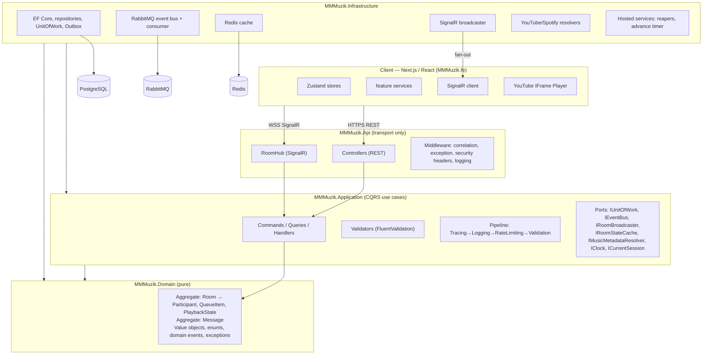
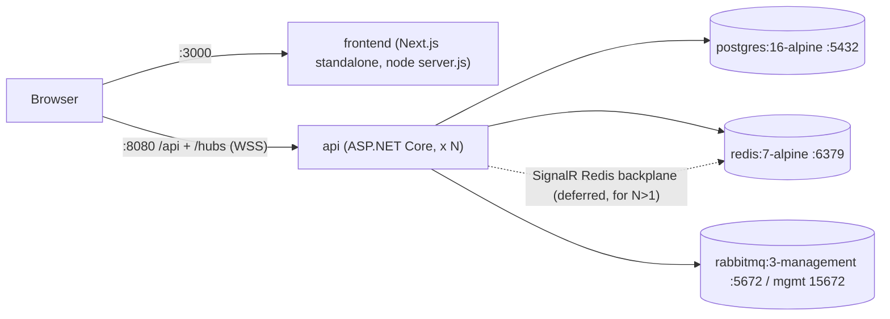

# PROJECT_KNOWLEDGE.md — MMMuzik

> **Purpose.** This document is the single, exhaustive engineering record of the MMMuzik system. It is written so that a new engineer (human or AI) can **rebuild the entire system from scratch without reading the original source code**. Every feature, contract, table, event, formula, environment variable, and known issue is documented here.
>
> **Source of truth.** Reverse-engineered from the actual code in `MMMuzik.be/` (backend) and `MMMuzik.fe/` (frontend) plus the design docs in `docs/`. Where the code and the older design docs disagree, **the code wins** and the divergence is called out explicitly.
>
> **How to read this.** Sections 1–3 are product/behavioral. Sections 4–9 are the technical core (architecture, DB, realtime, queue, playback, YouTube). Sections 10–14 are operations, config, lessons, future work, and the technology inventory.
>
> **Conventions.** "FR-x.y" = Functional Requirement (see §2). "Host" = the one participant who controls playback. "Guest"/"Member" = any non-host participant. All timestamps are UTC. Wire JSON is camelCase.

---

## Table of Contents

1. [Executive Summary](#1-executive-summary)
2. [Functional Requirements](#2-functional-requirements)
3. [User Flows](#3-user-flows)
4. [Technical Architecture](#4-technical-architecture)
5. [Database Design](#5-database-design)
6. [Realtime Design](#6-realtime-design)
7. [Queue System](#7-queue-system)
8. [Playback Engine](#8-playback-engine)
9. [YouTube Player Integration](#9-youtube-player-integration)
10. [Deployment Architecture](#10-deployment-architecture)
11. [Configuration](#11-configuration)
12. [Known Issues and Lessons Learned](#12-known-issues-and-lessons-learned)
13. [Future Improvements](#13-future-improvements)
14. [Technology Inventory](#14-technology-inventory)

---

# 1. Executive Summary

## What the product does

**MMMuzik** is a real-time collaborative music-listening web application. A user creates a **room**, shares a short code or invite link, and everyone who joins hears the **same song at the same position at the same moment**. Participants collaboratively build a shared **queue** (any YouTube/Spotify link), the **host** controls playback (play/pause/seek/skip), and everyone can **chat** in real time. There is **no registration** — a user is identified only by a nickname and an opaque session cookie.

Product promise: *"Share a link. Listen together. Right now."*

## Main business purpose

Recreate the social feeling of "sharing a pair of headphones" for distributed groups, with **zero onboarding friction**. The differentiators are:

- **True real-time synchronized playback** (perceived drift target < 1 second).
- **Collaborative queue curation** (anyone can add).
- **Clear single-host control** (mirrors "whoever holds the aux").
- **Multi-source music** (YouTube + Spotify) without proxying audio — clients embed the provider's own player; the server only synchronizes *control + position*.

## Target users

For the MVP: **internal team members and friends** — small, trusted groups (NFR target: up to **50 concurrent participants per room**) who want a lightweight, spontaneous, synchronized listening experience. No public discovery, no accounts, no moderation beyond host-remove.

## Core use cases

1. **Spontaneous listening party** — one person starts a room, drops a link in chat, friends join in seconds and listen together.
2. **Collaborative queue building** — everyone adds tracks; the group "DJs" together while the host keeps order.
3. **Watch/listen-along** — a host plays a track; late joiners are auto-synced to the current position mid-song.
4. **Social back-channel** — chat alongside the music ("skip pls", "this one's a classic").

## What it is NOT (out of MVP scope)

Authentication / accounts / profiles · friends / followers / public room discovery · playlists / saved history · voice / video / emoji-reactions in chat · AI recommendations · native mobile apps (responsive web only) · moderation beyond host-remove (no kick/ban) · payments / ads.

---

# 2. Functional Requirements

These FR IDs are referenced throughout the code (in XML doc-comments) and by acceptance criteria. They are the contract for *what the system does*.

## 2.0 Authentication

**There is no authentication, by design.** Identity = a chosen **nickname** + an opaque **session id** carried in an httpOnly cookie (`mmmuzik_session`). There are no users, no passwords, no `[Authorize]`, no authorization policies. "Authority" (host-only actions) is a **domain rule** (`Room` checks `HostSessionId`), not an auth layer. Abuse is mitigated with rate limiting + input validation + CORS, not identity.

> Implication: anyone with the code/link can participate. Acceptable for the trusted-audience MVP; flagged for a future auth pass (§13).

## 2.1 Rooms (Room Management)

| FR | Requirement |
|----|-------------|
| **FR-1.1** | A user can create a room by providing a room name. |
| **FR-1.2** | On creation the system generates a unique **Room Code** + shareable **Invite Link**; the creator becomes **Host**. |
| **FR-1.3** | A room has a lifecycle status: **Active**, **Idle**, **Closed**. |
| **FR-1.4** | A room with no participants for a configurable period **auto-closes**. |

**Create room.** `POST /api/rooms { name, nickname? }` → `Room.Create(...)` makes the caller host + first participant, status `Active`, playback `Idle`. Returns `{ roomId, code, hostSessionId, inviteUrl }` and sets the session cookie.

**Join room.** Two ways (FR-2.1 link, FR-2.2 code). `POST /api/rooms/{code}/join { nickname }` → `Room.Join(...)`. Returns `{ roomId, sessionId, nickname, isHost }`, issues/refreshes the cookie.

**Leave room.** `POST /api/rooms/{id}/leave` (session from cookie, never the URL) → `Room.Leave(...)`. Removes the participant; if the leaver was host, triggers **host transfer** (below).

**Room ownership / Host.** Exactly one host per room. The creator is the initial host. The host is the only participant allowed to Play/Pause/Seek/Skip, Remove queue items, and Close the room. Host identity is `Room.HostSessionId`.

**Host transfer / failover (FR-3.2).** Two paths:
- **Explicit:** `Room.TransferHostTo(from, to)` (requires `from` is host) demotes all, promotes `to`, raises `HostChanged`.
- **Automatic on host departure:** when the host **leaves** or their reconnect grace **expires**, host transfers to the **longest-present remaining online participant** (by `JoinedAtUtc`); if none online, to the longest-present offline; if no one remains, the room goes **Idle** and playback pauses.

## 2.2 Joining & Guests

| FR | Requirement |
|----|-------------|
| **FR-2.1** | Join via invite link. |
| **FR-2.2** | Join by entering a room code. |
| **FR-2.3** | A joining user provides a nickname; no registration. |
| **FR-2.4** | Duplicate nicknames are allowed; the system appends a numeric suffix (`Duy`, `Duy (2)`, `Duy (3)`). |
| **FR-2.5** | A returning/reconnecting user is re-bound to their existing participant identity within a short window (reconnect grace). |

## 2.3 Participants & Presence

| FR | Requirement |
|----|-------------|
| **FR-3.1** | Every participant sees a live list of who is in the room. |
| **FR-3.2** | The host is visually identified (and auto-transfers — see above). |
| **FR-3.3** | Join/leave events reflect to all participants in real time. |

## 2.4 Queue

| FR | Requirement |
|----|-------------|
| **FR-4.1** | Any participant can add a song via a YouTube/Spotify link or identifier. |
| **FR-4.2** | Songs are appended to the end of the queue. |
| **FR-4.3** | Each queue item shows song info + who added it. |
| **FR-4.4** | The host can remove any song and skip to the next. |
| **FR-4.5** | When a song finishes, the next plays automatically (auto-advance). |

## 2.5 Playback

| FR | Requirement |
|----|-------------|
| **FR-5.1** | The host can play, pause, skip, seek. |
| **FR-5.2** | Playback is synchronized across all participants. |
| **FR-5.3** | A participant joining mid-song is synced to the current position. |
| **FR-5.4** | Non-host participants cannot control playback. |

## 2.6 Chat

| FR | Requirement |
|----|-------------|
| **FR-6.1** | Send/receive text messages in real time. |
| **FR-6.2** | Each message shows sender nickname + time. |
| **FR-6.3** | Recent message history is shown on join (default 50, max 100, oldest-first). |

## 2.7 Music Sources

| FR | Requirement |
|----|-------------|
| **FR-7.1** | Supports YouTube. |
| **FR-7.2** | Supports Spotify. |
| **FR-7.3** | Song metadata (title, artist, duration, thumbnail) shown regardless of source. |

## 2.8 Non-Functional Requirements (selected)

- **NFR-1 Sync:** perceived drift between participants **< 1 s**.
- **NFR-2 Join time:** join → listening **< 2 s** (excluding provider buffering).
- **NFR-3 Capacity:** up to **50 concurrent participants per room**.
- **NFR-5 Reliability:** brief disconnects auto-recover; participant rebinds + re-syncs on reconnect.
- **NFR-6 Availability:** single-region; graceful degradation (chat/queue stay usable if a provider hiccups; Redis/RabbitMQ optional).
- **NFR-7 Privacy:** no PII beyond nickname; rooms ephemeral.
- **NFR-9 Observability:** logs/traces/metrics to diagnose sync/realtime issues.

---

# 3. User Flows

Step-by-step journeys. (Wire details in §6; sync details in §8.)

## 3.1 Create a room

1. On the **Home** screen (`/`), the user enters a **room name** and a **nickname**.
2. FE calls `POST /api/rooms { name, nickname }`.
3. Backend: `CreateRoomCommand` → `Room.Create(code, name, hostSessionId, hostNickname, now)` → status `Active`, caller is host + first participant, playback `Idle`. Raises `RoomCreatedDomainEvent`.
4. Response `{ roomId, code, hostSessionId, inviteUrl }`; backend sets the `mmmuzik_session` cookie to `hostSessionId`.
5. FE persists the room to `localStorage` and navigates to `/room/{roomId}`.
6. The room screen opens the SignalR connection, calls `JoinRoom(roomId)`, and pulls snapshots (participants/queue/playback/messages).

## 3.2 Invite users

1. In the room, the host sees the **room code** and an **invite link** (`InviteShare` component).
2. Host copies the link/code and shares it out-of-band (e.g., pastes into another chat).
3. The invite link points at `/join/{code}`.

## 3.3 Add a YouTube/Spotify link

1. Any participant opens the **Add song** dialog and pastes a URL (or bare id).
2. FE auto-detects provider (`/spotify\.com|spotify:/i` → Spotify, else YouTube).
3. FE invokes hub `AddTrack(roomId, provider, urlOrId)`.
4. Backend `AddTrackCommand`: resolves metadata via `IMusicMetadataResolver` (YouTube Data API → oEmbed → noembed fallback; Spotify Web API), then `Room.AddTrack(track, addedBy, now)` appends to the queue tail and records who added it.
5. **First track auto-plays:** if the queue was idle (`CurrentItemId == null`), the new track becomes current and starts playing.
6. Backend raises `TrackAddedToQueueDomainEvent`; the domain-event handler broadcasts `TrackAddedToQueue(QueueItemDto)` to the room group and (if a playback change occurred) `PlaybackStateChanged`.
7. All clients append the item to their queue; a toast confirms "Added to the queue".

## 3.4 Play music together

1. Host presses **Play** → hub `Play(roomId)` → `PlayCommand` → `Room.Play(...)` re-anchors playback (`Status=Playing`, `UpdatedAtUtc=now`) and raises `PlaybackStateChangedDomainEvent`.
2. The handler broadcasts `PlaybackStateChanged(PlaybackStateDto)` (carrying `currentItemId`, `positionMs`, `status`, `isPlaying`, `serverTimestampUtc`) to all clients and invalidates the Redis playback snapshot.
3. Each client computes the expected position from the server anchor + its clock offset (see §8) and reconciles its embedded player (seek + play).
4. While playing, the host's player periodically reports its true position (`ReportPosition`) so the server clock tracks reality; guests continuously reconcile to the server.

## 3.5 Host disconnect

1. Host's socket drops → hub `OnDisconnectedAsync` → `BeginDisconnectCommand` → `Participant.BeginDisconnect(now)` opens a **reconnect grace window** (~30 s). The host is **not** failed over yet, and no presence/host event fires.
2. **If the host returns within grace** (page refresh, blip, auto-reconnect): a fresh `JoinRoom`/`MarkOnline` clears `DisconnectedAtUtc`; host ownership is preserved.
3. **If grace expires:** the `ReconnectGraceReaper` calls `Room.ReconcileDisconnections(cutoff, now)`, finalizes the host offline, and **auto-transfers host** to the longest-present remaining online participant (raising `HostChanged`). If nobody is online, the room goes **Idle** and playback pauses.
4. Clients receive `HostChanged(newHostSessionId)`; the promoted guest's UI flips to host controls (the YouTube player remounts into host mode).

## 3.6 A new user joins during playback (late-join sync — FR-5.3)

1. User opens `/join/{code}` → FE loads `GET /api/rooms/{code}` (room summary). If the room is **Closed**, this returns **404** so the join screen never looks joinable.
2. User enters nickname → `POST /api/rooms/{code}/join` → `{ roomId, sessionId, isHost }` → navigate to `/room/{roomId}`.
3. FE connects the hub, calls `JoinRoom(roomId)`, then pulls snapshots: `GET .../participants`, `.../queue`, `.../playback`, `.../messages`.
4. The **playback snapshot** carries the fully-resolved current track + `positionMs` + `serverTimestampUtc`. FE measures the **clock offset** via `Ping`, computes the expected position, and seeks the embedded player to it — the newcomer drops straight into the song mid-play.

## 3.7 Queue ends (auto-advance + drain)

1. The current track finishes. Two convergent paths advance it (idempotent):
   - **Authority:** the server-side `PlaybackAdvanceService` timer detects `elapsed ≥ duration (+grace)` and advances.
   - **Accelerator:** the host's player fires `ENDED` → `NotifyTrackEnded(roomId, endedItemId)`.
2. `Room` advances to the next queued item (`SetCurrent(next)`, position 0, status Playing), raises `TrackEnded` + `PlaybackStateChanged`.
3. If there is **no next item**, playback becomes **Idle** (`CurrentItemId = null`, `Status = Idle`). The room stays open; adding a new track auto-starts it again.

---

# 4. Technical Architecture

## 4.1 System shape

MMMuzik is a **Distributed Modular Monolith**: a single deployable ASP.NET Core app, internally partitioned into modules (Rooms, Participants, Queue, Playback, Chat), built with **Clean Architecture + DDD-lite + CQRS**, and seamed with an **integration event bus (RabbitMQ + transactional outbox)** so modules can later be extracted into services.



**Dependency rule (inward only):** `Api → Application → Domain`; `Infrastructure → Application + Domain`; `Api → Infrastructure` for DI wiring only. The Domain references nothing framework-specific (no EF/MediatR/ASP.NET/Redis/RabbitMQ). These rules are enforced by **architecture tests** (`MMMuzik.ArchitectureTests`, NetArchTest).

## 4.2 Why this architecture (rationale)

| Decision | Rationale |
|----------|-----------|
| Distributed modular monolith | One deploy/debug surface for the MVP; enforced module boundaries + event bus make later service extraction mechanical. |
| Clean Architecture | Domain independent of frameworks → testable, durable, swappable infra. |
| DDD-lite (aggregate = `Room`) | One consistency boundary keeps participants/queue/playback coherent; invariants in one place. |
| CQRS | Reads (snapshots) are hot and Redis-friendly; writes need transactional consistency through the aggregate. |
| SignalR (+ Redis backplane ready) | First-class .NET realtime with horizontal scale-out path. |
| RabbitMQ integration events + outbox | Decouples modules, guarantees no lost/ghost events, enables extraction. |
| Postgres + Redis split | Postgres = durable truth; Redis = fast hot projections. |
| Server as playback clock authority | Deterministic sync; clients reconcile to one truth. |

## 4.3 Backend architecture (4 projects)

```
MMMuzik.be/src/
├── MMMuzik.Api/            transport + composition root (controllers, RoomHub, Program.cs, middleware)
├── MMMuzik.Application/    CQRS use cases: commands/queries/handlers/validators, ports, behaviors, DTOs, integration events
├── MMMuzik.Domain/         aggregates, value objects, domain events, domain exceptions (PURE — no frameworks)
└── MMMuzik.Infrastructure/ EF Core, repositories, UoW, outbox, Redis, RabbitMQ, SignalR broadcaster, providers, hosted services
```

### Domain model

**Aggregate roots:**
- **`Room`** — the single consistency boundary. Owns `Participants`, `Queue` (ordered `QueueItem`s), and `Playback` (owned `PlaybackState`). All business rules live here.
- **`Message`** — chat is its own aggregate (durable, independently queryable, soft-deletable), not under `Room`.

**Child entities:** `Participant` (identity = `SessionId`), `QueueItem` (identity = `QueueItemId`).

**Value objects:** `RoomCode`, `Nickname`, `Track` (owned), `SongSource` (owned, nested in Track), `PlaybackState` (owned), `PlaybackPosition`, and strongly-typed ids (`RoomId`, `SessionId`, `QueueItemId`, `MessageId` — all `readonly record struct` over a `Guid`).

**Enums:** `RoomStatus { Active=0, Idle=1, Closed=2 }`, `PlaybackStatus { Idle=0, Playing=1, Paused=2 }`, `MusicProvider { YouTube=0, Spotify=1 }`.

**`Room` public surface (selected):**

| Method | Host-gated | Effect / events |
|--------|:----------:|-----------------|
| `Create(code, name, hostSessionId, hostNickname, now)` (static) | — | New room, caller = host + first participant, `Active`, playback `Idle` → `RoomCreatedDomainEvent` |
| `Join(session, nickname, now)` | no | Add/re-mark participant; dedupe nickname with `(n)` suffix → `ParticipantJoinedDomainEvent` |
| `MarkOnline(session, now)` | no | Clear `DisconnectedAtUtc`; raise join event only on offline→online transition |
| `BeginDisconnect(session, now)` | no | Open reconnect grace (`DisconnectedAtUtc=now`), idempotent, no event |
| `ReconcileDisconnections(cutoff, now)` | no (system) | Finalize expired offline; auto-transfer host; idle if none → `ParticipantLeft`, `HostChanged` |
| `Leave(session, now)` | no | Remove participant; failover host if leaver was host → `ParticipantLeft`, `HostChanged` |
| `TransferHostTo(from, to, now)` | yes | Demote all, promote `to` → `HostChanged` |
| `AddTrack(track, addedBy, now)` | no | Append to tail; auto-play if idle → `TrackAddedToQueue` (+ `PlaybackStateChanged`) |
| `RemoveTrack(itemId, by, now)` | yes | Remove + recompact positions; **cannot remove current track** → `TrackRemovedFromQueue` |
| `ReorderQueue(orderedIds, by, now)` | yes | Reorder; ids must be the exact set → `QueueReordered` |
| `Play(by, now)` / `Pause(by, now)` | yes | Re-anchor playback (banks elapsed) → `PlaybackStateChanged` |
| `Seek(position, by, now)` | yes | New anchor at `position` → `PlaybackStateChanged` |
| `SyncHostPosition(reported, by, now)` | yes | Re-anchor **only if drift ≥ 750 ms**; returns bool → `PlaybackStateChanged` (only if re-anchored) |
| `Skip(by, now)` | yes | Advance to next → `TrackSkipped` + `PlaybackStateChanged` |
| `ReportTrackEnded(by, endedItemId, now)` | yes | Idempotent auto-advance (no-op if `endedItemId` not current) → `TrackEnded` + `PlaybackStateChanged` |
| `ReportTrackDuration(by, itemId, durationMs, now)` | yes | Correct placeholder duration in place; no event |
| `CloseByHost(by, now)` | yes | `Closed`, pause playback → `RoomClosedDomainEvent("closed_by_host")` |
| `CloseDueToInactivity(now)` | no (system) | If `Idle`, close → `RoomClosedDomainEvent("idle_timeout")` |

**Domain invariants (testable, enforced in `Room`):**
- A room always has exactly one `PlaybackState`.
- First track added to an idle queue auto-starts; subsequent adds never interrupt.
- Queue drains to **Idle** when the last track ends.
- The **currently-playing track cannot be removed** (`CannotRemoveCurrentTrackException`) — skip instead.
- Pause **banks elapsed** time so the stored position is always the true offset at `UpdatedAtUtc`.
- Host survives a reconnect grace window (~30 s); only on expiry does failover fire.
- `ReportTrackEnded` naming a non-current track is a no-op (idempotent advance).
- Reorder must list every current item id **exactly once** (`InvalidQueueReorderException`).
- Any mutation on a `Closed` room throws `RoomClosedException`.

**Domain events (12)** — `RoomCreated`, `ParticipantJoined`, `ParticipantLeft`, `HostChanged`, `TrackAddedToQueue`, `TrackRemovedFromQueue`, `QueueReordered`, `PlaybackStateChanged`, `TrackSkipped`, `TrackEnded`, `RoomClosed`, `ChatMessageSent`.

**Domain exceptions** — `InvalidNickname`, `InvalidRoomCode`, `InvalidRoomName`, `InvalidSongSource`, `InvalidTrack`, `InvalidPlaybackPosition`, `EmptyMessage`, `MessageTooLong`, `NotRoomHost`, `RoomClosed`, `RoomNotFound`, `ParticipantNotFound`, `QueueItemNotFound`, `QueueEmpty`, `CannotRemoveCurrentTrack`, `InvalidQueueReorder` (all inherit `DomainException`).

**Clock-as-parameter:** the Domain never reads the clock. Methods take a `DateTime utcNow` parameter; handlers pass `IClock.UtcNow`. Keeps the Domain pure and deterministic.

### Application layer (CQRS modules)

Vertical slices: `Rooms`, `Participants`, `Queue`, `Playback`, `Chat`, `Tracks`. Each owns its commands/queries/handlers/validators/DTOs. Modules never call each other's handlers — they coordinate through the `Room` aggregate or via integration events.

**Commands** (mutate, transactional): CreateRoom, JoinRoom, LeaveRoom, MarkOnline, BeginDisconnect, AddTrack, RemoveTrack, ReorderQueue, Play, Pause, Seek, SyncPosition, Skip, AutoAdvance, ReportTrackEnded, ReportDuration, SendMessage.
**Queries** (read-only, no transaction): GetRoom, GetParticipants, GetQueue, GetPlayback, GetMessages, ResolveTrack.

All routed through **MediatR** with a pipeline (outer→inner): **Tracing → Logging → RateLimiting → Validation → Handler**. (Note: there is **no `UnitOfWorkBehavior`** — handlers own a single `IUnitOfWork.SaveChangesAsync()` call; ADR-0005.)

**Result/Error pattern:** handlers return `Result` / `Result<T>` with a typed `Error(code, message, type)`. `ErrorType` maps to HTTP: `Validation→400`, `NotFound→404`, `Conflict→409`, `Forbidden→403`, `Unexpected→500`. Error code catalog (selected): `room.not_found`, `room.closed`, `room.session_required`, `room.code_generation_failed`, `queue.item_not_found`, `queue.cannot_remove_current`, `queue.forbidden`, `queue.invalid_provider`, `queue.resolve_failed`, `queue.invalid_reorder`, `playback.forbidden`, `playback.queue_empty`, `playback.invalid_position`, `chat.empty_message`, `chat.message_too_long`, `track.invalid_provider`, `track.resolve_failed`.

**Ports (interfaces the Application depends on; Infrastructure implements):** `IUnitOfWork` (+ `Room`, `Messages` repositories), `IEventBus`, `IOutboxWriter`, `IRoomBroadcaster` / `IRoomClient`, `IConnectionTracker`, `IRoomStateCache`, `IMusicMetadataResolver`, `IClock`, `ICurrentSession`, `IDomainEventDispatcher`.

### Event handlers (the broadcast + outbox seam)

For each domain event there is an **Application event handler** that does two things after the aggregate commits:
1. **Broadcasts** in-process to the SignalR room group via `IRoomBroadcaster` (the **primary, low-latency** realtime path) and updates/invalidates the Redis snapshot.
2. **Enqueues** a 1:1 **integration event** (`*IntegrationEvent`) to the **outbox** (the durable path, published to RabbitMQ after commit).

The 12 integration events mirror the domain events (`RoomCreated`, `ParticipantJoined`, `ParticipantLeft`, `HostChanged`, `TrackAddedToQueue`, `TrackRemovedFromQueue`, `QueueReordered`, `PlaybackStateChanged`, `TrackSkipped`, `TrackEnded`, `RoomClosed`, `ChatMessageSent`).

### Repositories & Unit of Work

- Repositories are **never injected directly** — always reached via `IUnitOfWork` (`_unitOfWork.Room`, `_unitOfWork.Messages`). All EF/LINQ queries live inside repository implementations.
- `UnitOfWork.SaveChangesAsync()` is the single commit point, in one DB transaction:
  1. `DbContext.SaveChangesAsync()` (persist aggregate; audit interceptor stamps)
  2. dispatch **domain events** in-process (handlers enqueue outbox rows + broadcast)
  3. `DbContext.SaveChangesAsync()` (persist outbox rows, same transaction)
  4. `Commit`
  Guarantees: an integration event is enqueued **iff** the aggregate write commits.

## 4.4 Frontend architecture (Next.js feature-based)

```
MMMuzik.fe/src/
├── app/            routes (composition only, no logic): / , /join/[code], /room/[roomId], layout.tsx, globals.css
├── features/       room · playback · queue · chat · participants
│   └── <feature>/  components · hooks · services · store · types
├── components/     shared presentational UI (shadcn/ui + Radix, feedback, layout)
├── lib/            http · signalr · env · session · youtube · utils · mock
└── stores/         root stores (connectionStore)
```

**Rules:** pages contain no logic; all REST + SignalR calls live in **services**; state lives in **Zustand stores** (no API calls in stores); business logic lives in **hooks/services**; the local player is **reconciled to server-authoritative state** (never canonical).

**State stores (Zustand):**
- `connectionStore` — the single `HubConnection` + status (`idle|connecting|connected|reconnecting|disconnected`).
- `roomStore` — `{ room, isReady, closed }` + `setHost`; rehydrated from `localStorage` (survives refresh).
- `playbackStore` — `{ playback, clockOffsetMs }` + setters (`serverNow ≈ clientNow + clockOffsetMs`).
- `queueStore` — `items` + `hydrate` (merge-by-id so a late snapshot can't clobber just-added items), `setItemDuration` (fix placeholder durations), `reset`.
- `chatStore` — `messages` (dedupe by id).
- `participantsStore` — `participants` + `setHost`/`setPresence`.

**Per-feature service pattern:** each feature service exposes `subscribe(conn, handlers)` returning a **per-handler disposer** (`conn.off(event, handler)`, never the global `conn.off(event)` which would strip other features' handlers on the shared connection). Data-owning hooks **subscribe before fetching the snapshot**, then **re-fetch on `onreconnected`**.

## 4.5 End-to-end write/read flow (CQRS)

```
WRITE (command)                                READ (query)
───────────────                                ───────────
Hub/Controller                                 Hub/Controller
  │ IMediator.Send(Command)                      │ IMediator.Send(Query)
  ▼                                              ▼
[Tracing][Logging][RateLimiting][Validation]   [Tracing][Logging][Validation]
  │                                              │
CommandHandler                                 QueryHandler
  │ load aggregate via IUnitOfWork.Room           │ read IRoomStateCache (Redis)
  │ room.DoSomething() → domain events            │   miss → repository (Postgres, AsNoTracking)
  │ IUnitOfWork.SaveChangesAsync()                │   warm cache
  │   → persist + dispatch events + outbox        ▼
  │   → event handlers broadcast + enqueue      return DTO
  ▼
return DTO (Result<T>)
```

---

# 5. Database Design

PostgreSQL via EF Core. **snake_case + plural** names (`EFCore.NamingConventions`). All timestamps `timestamptz` (UTC). Only `Room` and `Message` are persistence roots; `participants` and `queue_items` load/save through the `Room` graph.

> **Migration history:** `20260612050059_InitialCreate` → `20260613030922_AddParticipantDisconnectedAt` → `20260616051916_ParticipantCompositeKey`.

## 5.1 ER diagram

```mermaid
erDiagram
  ROOMS ||--o{ PARTICIPANTS : has
  ROOMS ||--o{ QUEUE_ITEMS : has
  ROOMS ||--o{ CHAT_MESSAGES : has

  ROOMS {
    uuid id PK
    varchar code UK
    varchar name
    varchar status
    uuid host_session_id
    uuid pb_current_item_id "nullable (owned PlaybackState)"
    bigint pb_position_ms
    varchar pb_status
    timestamptz pb_updated_at
    timestamptz closed_at "nullable"
    xid xmin "optimistic concurrency"
    timestamptz created_at_utc
    timestamptz updated_at_utc
  }
  PARTICIPANTS {
    uuid room_id PK_FK
    uuid session_id PK
    varchar nickname
    bool is_host
    bool is_online
    timestamptz joined_at
    timestamptz last_seen_at
    timestamptz disconnected_at "nullable"
  }
  QUEUE_ITEMS {
    uuid id PK
    uuid room_id FK
    int position
    varchar title "owned Track"
    varchar artist
    bigint duration_ms "0 = unknown placeholder"
    varchar thumbnail_url "nullable"
    varchar provider "owned SongSource"
    varchar provider_track_id
    uuid added_by_session
    varchar added_by_nickname
    timestamptz added_at
  }
  CHAT_MESSAGES {
    uuid id PK
    uuid room_id
    uuid session_id
    varchar nickname
    varchar body
    timestamptz sent_at
    bool is_deleted
    timestamptz deleted_at "nullable"
    timestamptz created_at_utc
    timestamptz updated_at_utc
  }
  OUTBOX_MESSAGES {
    uuid id PK
    varchar type
    jsonb payload
    timestamptz occurred_at
    timestamptz processed_at "nullable"
    int attempts
  }
```

## 5.2 Tables (exact)

### `rooms`
| Column | Type | Notes |
|--------|------|-------|
| `id` | uuid | PK (`RoomId`) |
| `code` | varchar | **UNIQUE** (`ix_rooms_code`) — the join code |
| `name` | varchar | ≤ 80 |
| `status` | varchar | enum→string: `Active`/`Idle`/`Closed` |
| `host_session_id` | uuid | current host's session |
| `pb_current_item_id` | uuid? | **owned** `PlaybackState`; null when Idle |
| `pb_position_ms` | bigint | banked position (`PlaybackPosition` converter) |
| `pb_status` | varchar | enum→string `Idle`/`Playing`/`Paused` (3-state; lossless vs the SYSTEM_DESIGN `pb_is_playing` bool — ADR-0008) |
| `pb_updated_at` | timestamptz | the **anchor** for elapsed-time math |
| `closed_at` | timestamptz? | when closed |
| `xmin` | xid (system) | **optimistic concurrency token** (`IsConcurrencyToken`; no extra row_version column) |
| audit | timestamptz/varchar | `created_at_utc`, `created_by`, `updated_at_utc`, `updated_by` |

### `participants`
| Column | Type | Notes |
|--------|------|-------|
| `room_id` + `session_id` | uuid | **composite PK** `(room_id, session_id)` — a reused session cookie can belong to two rooms (FR-2.5); the earlier session-id-only PK caused a `23505` duplicate-key crash and was fixed in `ParticipantCompositeKey`. |
| `nickname` | varchar | |
| `is_host` | bool | |
| `is_online` | bool | presence |
| `joined_at` | timestamptz | used for host-failover ordering |
| `last_seen_at` | timestamptz | |
| `disconnected_at` | timestamptz? | reconnect-grace marker; **indexed** for the reaper query |
| FK | | `room_id → rooms.id` (Cascade) |

### `queue_items`
| Column | Type | Notes |
|--------|------|-------|
| `id` | uuid | PK (`QueueItemId`) |
| `room_id` | uuid | FK → rooms (Cascade) |
| `position` | int | 0-based; recompacted after removal; index `(room_id, position)` |
| `title`, `artist`, `duration_ms`, `thumbnail_url` | varchar/bigint | **owned `Track`** (`duration_ms = 0` ⇒ unknown placeholder) |
| `provider`, `provider_track_id` | varchar | **owned `SongSource`** (YouTube id = 11 chars, Spotify id = 22 chars) |
| `added_by_session`, `added_by_nickname` | uuid/varchar | who added (snapshot of nickname) |
| `added_at` | timestamptz | |

### `chat_messages`
| Column | Type | Notes |
|--------|------|-------|
| `id` | uuid | PK (`MessageId`) |
| `room_id`, `session_id` | uuid | |
| `nickname` | varchar | sender's display name at post time |
| `body` | varchar | ≤ 2000 |
| `sent_at` | timestamptz | index `(room_id, sent_at)` |
| `is_deleted`, `deleted_at` | bool/timestamptz? | **soft delete**; a global query filter `WHERE is_deleted = false` is applied to all reads |
| audit | | `created_at_utc`, etc. |

### `outbox_messages`
| Column | Type | Notes |
|--------|------|-------|
| `id` | uuid | PK (= event id) |
| `type` | varchar | event CLR type name |
| `payload` | jsonb | serialized integration event |
| `occurred_at` | timestamptz | |
| `processed_at` | timestamptz? | NULL = pending; **indexed** for the dispatcher's `WHERE processed_at IS NULL` |
| `attempts` | int | incremented on dispatch failure |

## 5.3 EF Core mapping notes

- **Value-object converters** (`Converters.cs`): all strongly-typed ids ↔ Guid; `RoomCode`↔string; `Nickname`↔string; `PlaybackPosition`↔long ms.
- **Owned types** flatten onto the parent row: `Room.Playback` → `pb_*`; `QueueItem.Track` (and nested `Track.Source`) → the title/artist/duration/thumbnail/provider columns.
- **Interceptors:** `AuditableInterceptor` stamps `created/updated` on `IAuditable` (Room, Message); `SoftDeleteInterceptor` converts `Delete` → `Modified` + `IsDeleted=true` on `ISoftDelete` (Message).
- **Design-time factory** (`AppDbContextFactory`) lets `dotnet ef` build the context without booting the API; honors `MMMUZIK_DB` override.

## 5.4 Data lifecycle

- **Rooms** are short-lived but persisted (durability + reconnect across restarts). `RoomReaperService` closes idle rooms; closed rooms reject joins/mutations.
- **Soft delete** for chat messages (filtered out of reads).
- **Optimistic concurrency** (`xmin`) on `rooms` protects rapid playback updates.
- **Outbox** rows accumulate then are marked `processed_at` by the dispatcher (housekeeping/cleanup of old processed rows is a future op).

---

# 6. Realtime Design

## 6.1 Topology

**One SignalR hub:** `RoomHub` at `/hubs/room`, typed `Hub<IRoomClient>`. (There is **no** separate PlaybackHub/ChatHub — all realtime is consolidated onto `RoomHub` because SignalR groups are per-hub-type and the single `IRoomBroadcaster` targets `RoomHub`; ADR-0011.) **Group convention:** `room:{roomId}`. A `HubExceptionFilter` maps domain/rate-limit exceptions to client-safe `HubException`s and hides unexpected ones.

## 6.2 Connection lifecycle

```mermaid
sequenceDiagram
  participant C as Client
  participant H as RoomHub
  participant M as Mediator/Handlers
  C->>C: POST /rooms/{code}/join (REST) → cookie set
  C->>H: start() WebSocket (withCredentials → cookie sent)
  C->>H: JoinRoom(roomId)
  H->>H: tracker.Track(connId, roomId, sessionId from cookie)
  H->>M: MarkOnlineCommand(roomId, sessionId)
  H->>H: Groups.AddToGroup(connId, "room:{roomId}")
  Note over C,H: client then pulls REST snapshots + RequestState/Ping
  C--xH: connection drops
  H->>M: BeginDisconnectCommand (open grace; NO host failover here)
  Note over H,M: ReconnectGraceReaper finalizes offline after ~30s if no return
```

- **Session identity** is bound from the httpOnly cookie at connection time — never trusted from a method argument.
- **`OnDisconnectedAsync`** opens the reconnect grace window only; it does **not** mark offline or fail over host (so a refresh/blip never moves ownership).

## 6.3 Client → Server (RoomHub methods — actual current signatures)

| Method | Signature | Maps to |
|--------|-----------|---------|
| JoinRoom | `JoinRoom(Guid roomId)` | track connection + `MarkOnlineCommand` + add to group |
| LeaveRoom | `LeaveRoom(Guid roomId)` | untrack + remove from group |
| AddTrack | `AddTrack(Guid roomId, string provider, string urlOrId)` | `AddTrackCommand` |
| RemoveTrack | `RemoveTrack(Guid roomId, Guid queueItemId)` | `RemoveTrackCommand` |
| ReorderQueue | `ReorderQueue(Guid roomId, Guid[] orderedQueueItemIds)` | `ReorderQueueCommand` |
| Play / Pause | `Play(Guid roomId)` / `Pause(Guid roomId)` | `PlayCommand` / `PauseCommand` |
| Seek | `Seek(Guid roomId, long positionMs)` | `SeekCommand` |
| ReportPosition | `ReportPosition(Guid roomId, long positionMs)` | `SyncPositionCommand` (host heartbeat) |
| Skip / SkipNext | `Skip(Guid roomId)` / `SkipNext(Guid roomId)` (alias) | `SkipCommand` |
| SkipPrevious | `SkipPrevious(Guid roomId)` | `SeekCommand(roomId, 0)` (restart current — no history in MVP) |
| NotifyTrackEnded | `NotifyTrackEnded(Guid roomId, Guid endedItemId)` | `ReportTrackEndedCommand` (optional accelerator) |
| ReportDuration | `ReportDuration(Guid roomId, Guid queueItemId, long durationMs)` | `ReportDurationCommand` (correct placeholder) |
| RequestState | `RequestState(Guid roomId)` | `GetPlaybackQuery` → `Clients.Caller.PlaybackStateChanged(...)` |
| Ping | `long Ping()` | returns server epoch **ms** (RPC) for clock-offset |
| SendMessage | `SendMessage(Guid roomId, string body)` | `SendMessageCommand` |

## 6.4 Server → Client events (`IRoomClient`)

| Event | Payload |
|-------|---------|
| `RoomClosed` | `string reason` |
| `ParticipantJoined` | `ParticipantDto { sessionId, nickname, isHost, isOnline }` |
| `ParticipantLeft` | `Guid sessionId` |
| `HostChanged` | `Guid newHostSessionId` |
| `TrackAddedToQueue` | `QueueItemDto` |
| `TrackRemoved` | `Guid queueItemId` |
| `QueueReordered` | `Guid[] orderedQueueItemIds` |
| `PlaybackStateChanged` | `PlaybackStateDto { currentItemId, currentTrack?, positionMs, status, isPlaying, serverTimestampUtc }` |
| `MessagePosted` | `ChatMessageDto { id, roomId, sessionId, nickname, body, sentAtUtc }` |

> **Live vs snapshot:** the *live broadcast* `PlaybackStateChanged` carries `currentTrack = null` (clients resolve the track from their already-synced queue). The *REST snapshot* `GET /api/rooms/{id}/playback` carries the fully-resolved `currentTrack` for late-join/reconnect.

## 6.5 Two delivery paths (primary + durable)

```
Command commits → domain event handler
   ├─ PRIMARY (low-latency UX):   IRoomBroadcaster → SignalR group room:{id}   (+ Redis snapshot update/invalidate)
   └─ DURABLE (decoupling/extraction): IOutboxWriter → outbox row → OutboxDispatcher → RabbitMQ mmmuzik.events
                                          → ProjectionsConsumerService (dedupe, log; NEVER re-broadcasts)
```

A broker backlog does **not** block live playback/chat (in-process broadcast is primary). RabbitMQ is the seam for projections and future service extraction.

## 6.6 Reconnection strategy

- **Client:** `withAutomaticReconnect([0, 1000, 2000, 5000, 10000])`. On `onreconnecting` → show banner; on `onreconnected` → re-`JoinRoom`, re-pull snapshots (queue/playback), re-measure clock offset (`Ping`).
- **Server:** the disconnect opens a grace window; the participant rebinds on return within ~30 s with no presence/host churn.

## 6.7 State synchronization

- Reads are **read-through Redis** (snapshot) → fall back to Postgres on miss → re-warm. Writes **invalidate-on-write**. So Redis always mirrors committed Postgres state.
- Late-join sync: REST snapshots + `RequestState` + `Ping` clock offset (see §8).

## 6.8 Message ordering & failure recovery

- SignalR preserves per-connection ordering of server→client invocations within the room group.
- Integration consumers are **idempotent** (dedupe by `MessageId`), retry with backoff, then dead-letter to `*.dlq` (poison messages investigated/replayed via the RabbitMQ management UI / shovel — RUNBOOK §5).
- Auto-advance is **idempotent** (`ReportTrackEnded`/timer only advance when `endedItemId` is still current), so duplicate end-signals never double-skip.

---

# 7. Queue System

The queue is the shared, ordered list of upcoming songs — the heart of collaborative curation. It is part of the `Room` aggregate (`Room.Queue`, position-ordered).

## 7.1 Add track

- **Who:** any participant (FR-4.1). **Where:** hub `AddTrack(roomId, provider, urlOrId)` → `AddTrackCommand`.
- **Steps:** validate provider (enum) + `urlOrId` ≤ 2048; resolve metadata (`IMusicMetadataResolver`); `Room.AddTrack(track, addedBy, now)` appends to the **tail**, recording `AddedBySessionId` + `AddedByNickname` (FR-4.2/4.3).
- **Auto-play:** if `Playback.CurrentItemId == null` (idle queue), the new track becomes current and starts playing — no manual Play needed for the first song.
- **Events/broadcast:** `TrackAddedToQueueDomainEvent` → `TrackAddedToQueue(QueueItemDto)` to the room group (+ `PlaybackStateChanged` if it auto-started). Rate limited (≈15/60s).

## 7.2 Remove track

- **Who:** host only (FR-4.4). Hub `RemoveTrack(roomId, queueItemId)` → `RemoveTrackCommand`.
- **Guard:** the **currently-playing** track cannot be removed (`CannotRemoveCurrentTrackException` → `queue.cannot_remove_current` 409) — skip it instead.
- **Effect:** removes the item, **recompacts** positions to 0..n, broadcasts `TrackRemoved(queueItemId)`.

## 7.3 Reorder

- **Who:** host only. Hub `ReorderQueue(roomId, orderedQueueItemIds)` → `ReorderQueueCommand`.
- **Rule:** `orderedQueueItemIds` must contain **every** current item id **exactly once** (else `InvalidQueueReorderException` → `queue.invalid_reorder` 400). Updates positions, broadcasts `QueueReordered(orderedQueueItemIds)`.
- **Status:** implemented end-to-end on the backend; the current FE does not yet invoke it (unused surface).

## 7.4 Auto-next (auto-advance)

When a track finishes, the next queued item plays automatically (FR-4.5). Two convergent, idempotent paths:
1. **Authority — server timer:** `PlaybackAdvanceService` (poll ~1 s) computes `elapsed = pb_position_ms + (now − pb_updated_at)` and, when `elapsed ≥ duration (+ grace)`, sends `AutoAdvanceCommand`. In multi-instance deploys a Redis `SET NX` lock (`playback:advance-lock:{roomId}:{endedItemId}`, ~30 s TTL) ensures only one instance advances.
2. **Accelerator — host report:** host player `ENDED` → `NotifyTrackEnded(roomId, endedItemId)` → `ReportTrackEndedCommand`.

Both call the same idempotent advance (`AdvanceIfCurrent(endedItemId)`): no-op unless `endedItemId` is still current. Advance sets the next item current (position 0, Playing), raises `TrackEnded` + `PlaybackStateChanged`. **No next item ⇒ playback goes Idle** (queue drained), room stays open.

## 7.5 Duration correction (placeholder fix)

When no YouTube Data API key is configured, the resolver ships a **placeholder duration** (oEmbed/noembed have no duration). The host's player measures the real duration and reports it (`ReportDuration` → `Room.ReportTrackDuration`), so the auto-advance timer fires at the right time and the now-playing row shows the correct length. Upcoming (not-yet-played) rows show the placeholder until played — the real fix is to set `MusicProviders:YouTubeApiKey`.

## 7.6 Edge cases

- **Add to empty/idle queue** → auto-plays (§7.1).
- **Remove the only/last item that isn't current** → fine; removing the current item is blocked.
- **Skip on last item** → playback goes Idle.
- **Reorder with a missing/extra id** → rejected (`invalid_reorder`).
- **Late snapshot vs realtime add (FE):** `queueStore.hydrate` merges by id and appends realtime-only items so a delayed `GET /queue` can't wipe a just-added track.
- **Duplicate end-signals / timer + host both fire** → idempotent advance handles it once.

---

# 8. Playback Engine

## 8.1 Model: server is the clock authority

The server stores a single authoritative playback anchor on the room: `{ CurrentItemId, Position (ms), Status (Idle/Playing/Paused), UpdatedAtUtc }`. Clients **reconcile** their embedded provider player to this anchor; they never treat their local player clock as canonical.

The **current client model** is **"host native + guests reconcile":**
- **Host:** uses native YouTube controls; the host's player *drives* the server (its play/pause/seek/end map to hub commands), and the host's player heartbeat (`ReportPosition`) keeps the server anchor aligned with reality.
- **Guests:** controls disabled; a reconcile loop continuously aligns the guest player to the server anchor.

## 8.2 The position invariant (banking)

`PlaybackState` maintains the invariant that `Position` is always the true offset **at** `UpdatedAtUtc`:
- `Play()` / `Pause()` call `BankElapsed(now)`: if currently Playing, add `(now − UpdatedAtUtc)` to `Position`, then set the new status + `UpdatedAtUtc = now`.
- `Seek(pos, now)` sets `Position = pos`, `UpdatedAtUtc = now` (replaces, no banking).
- `SetCurrent(itemId, now)` (advance/skip) sets `Position = 0`, `UpdatedAtUtc = now`, status Playing (or Idle if no item).

Therefore the true position now is:

```
expectedPos = isPlaying ? Position + (serverNow − UpdatedAtUtc) : Position
```

## 8.3 Clock synchronization (offset estimation)

The client cannot trust its own wall clock relative to the server, so it estimates an **offset** via an NTP-style probe against the hub `Ping()` RPC (which returns server epoch ms):

```
client sends at t0 ; receives serverMs at t1
rtt    = t1 − t0
offset = serverMs − (t0 + rtt/2)          // serverClock ≈ clientClock + offset
serverNow = Date.now() + offset
```

The client takes the **best (min-RTT) of several pings** (least jitter / most symmetric path), and re-measures on mount, on `onreconnected`, and on an interval. `offset` is stored as `playbackStore.clockOffsetMs`.

## 8.4 Reconciliation (drift handling)

On every `PlaybackStateChanged` and on a periodic tick, each client computes `expectedPos` (§8.2 with `serverNow`) and reconciles its player:

```
if player has no/old video      → loadVideoById({ videoId, startSeconds: expectedSec })
match play/pause to isPlaying   → play() / pause()
if |playerPos − expectedPos| > DRIFT_THRESHOLD  → seekTo(expectedPos)   (rate-limited)
skip seek while BUFFERING/UNSTARTED/CUED (unreliable readings)
```

**Design thresholds (SYSTEM_DESIGN §11 + domain):** drift threshold **750 ms**, reconcile tick **1 s**, ping refresh **10 s**. The server's own `SyncHostPosition` re-anchors only when the host has drifted **≥ 750 ms** (confirmed by domain tests), avoiding broadcast churn.

> **Implementation note (current FE tuning, `YouTubePlayer.tsx`):** the client uses conservative anti-thrash constants — a periodic drift **check every ~7 s**, a seek **threshold ~500 ms**, a **~2 s** minimum cooldown between seeks, and a **~2.5 s** grace after a host manual action during which guests don't fight the in-flight command. These tunables can differ from the design defaults above; treat the design numbers as the spec and these as the current knobs. Reconcile also runs immediately whenever a new server state arrives (not only on the tick).

## 8.5 Playback state model & transitions

```
        ┌─────────┐   host Play     ┌─────────┐
        │ PAUSED  │ ──────────────▶ │ PLAYING │
        │         │ ◀────────────── │         │
        └────┬────┘   host Pause    └────┬────┘
             │                           │ song ends / host Skip
             ▼                           ▼
          (resume from banked pos)   advance → next current (pos 0, Playing)
                                         │ queue empty
                                         ▼
                                       IDLE (CurrentItemId = null)
```

## 8.6 Host vs Guest responsibilities

| | **Host** | **Guest** |
|---|----------|-----------|
| Player controls | native enabled (`controls:1`) | disabled (`controls:0`, keyboard off) |
| Drives server | yes — onStateChange→`Play`/`Pause`; manual-scrub detection→`Seek`; `ENDED`→`NotifyTrackEnded`; first real duration→`ReportDuration`; heartbeat→`ReportPosition` | no |
| Reconciles to server | minimal (host *is* the reference; brief grace after own actions) | continuously (load/seek/play/pause to match anchor) |
| Sends commands | yes (Play/Pause/Seek/Skip/NotifyTrackEnded/ReportDuration/ReportPosition) | none |

## 8.7 Late-join sync (FR-5.3)

1. New client pulls `GET /api/rooms/{id}/playback` (full snapshot, incl. resolved current track + `serverTimestampUtc`).
2. Measures clock offset via `Ping`.
3. Computes `expectedPos` and seeks its player there + matches play/pause → drops into the song mid-play.

---

# 9. YouTube Player Integration

Implemented in `MMMuzik.fe/src/features/playback/components/YouTubePlayer.tsx` + `PlayerCard.tsx`, with the IFrame API loader/types in `lib/youtube.ts`. **We never proxy audio** — we embed YouTube's own player and synchronize control + position.

## 9.1 IFrame API usage & player vars

- One persistent player **keyed by role** (`host` | `guest`) — it remounts only on **host transfer**, not per track. Track changes reuse the player via `loadVideoById`.
- Player vars (the important ones):
  - `autoplay: 1`, `mute: 1` — autoplay is only allowed muted; the player starts muted.
  - `controls: isHost ? 1 : 0`, `disablekb: isHost ? 0 : 1` — native controls for the host, read-only for guests.
  - `modestbranding: 1`, `rel: 0`, `playsinline: 1`.
  - `origin = window.location.origin`, `widget_referrer = window.location.origin` — declared for embed trust.
- **Host = `https://www.youtube.com`** (configurable via `NEXT_PUBLIC_YT_PLAYER_HOST`). **Do NOT use `youtube-nocookie.com`** — a cookieless session looks bot-like and blocks the real fix (a signed-in youtube.com session in the user's browser).

## 9.2 Video loading

- New track → `player.loadVideoById({ videoId, startSeconds: expectedSec })` (atomic load+seek, so it never gets stuck "loaded but paused").
- The video id is YouTube's 11-char id, extracted by the backend `MusicProviderUrlParser` and carried as `TrackDto.providerId` / `QueueItemDto.externalId`.

## 9.3 Playback control & event handling

- Player starts **muted**; on the first user gesture (`pointerdown`/`keydown`) the player `unMute()`s. A corner "Tap to unmute" button is shown while muted.
- **Host:** `onStateChange` PLAYING/PAUSED → `sendPlay()`/`sendPause()`; a 1-s poll reads `getCurrentTime()` and, if the position jumps beyond natural ~1 s/s progression, treats it as a manual scrub → `sendSeek(ms)`; `ENDED` → `notifyEnded(trackId)`.
- **Duration reporting:** the same poll reads `getDuration()`; the first non-zero value is reported once per track via `onDuration` → `reportDuration` (de-duped by `queueItemId:durationMs`) and also updates the FE's now-playing row (`queueStore.setItemDuration`).
- **Guest:** reconcile loop only (load/seek/play/pause to match the server anchor).

## 9.4 Restrictions & the "open on YouTube" hatch

- **Click-to-play facade (anti-bot):** historically the iframe was built only on a user click (thumbnail + play button) rather than on mount, because autoplay-on-load is a bot trigger. (Current code keeps the role-keyed persistent player; the facade gesture + mute/unmute flow remain the levers against the wall.)
- **Fallback UI** in `PlayerCard`: an always-available "Can't play here? **Open on YouTube** ↗ · **Retry**" — Retry bumps a `reloadKey`/`reloadSignal` to rebuild/reload the player in place; the link opens `youtube.com/watch?v={id}`.

## 9.5 Known YouTube limitations

- **"Confirm you're not a bot" sign-in wall:** server-side YouTube anti-abuse keyed on IP reputation / signed-out browser / specific video. It is **not bypassable from the browser** and **not** caused by our code (we have no bot detection). Mitigations: declare `origin`/`widget_referrer`, use the real `youtube.com` host, present a user gesture, and offer the "Open on YouTube" hatch. **Real fix:** sign into YouTube in that browser; a hard-flagged IP (e.g., from repeated dev testing) may need a different network or time to cool off.
- **No duration without the Data API:** oEmbed/noembed return title+thumbnail but no duration → placeholder until the player reports the real value (see §7.5).
- **Autoplay policy:** only muted autoplay is permitted; hence `mute:1` + gesture-unmute.

---

# 10. Deployment Architecture

## 10.1 Containers (Docker Compose)

`docker compose up -d` brings up the full stack. Compose is the canonical local/prod-style topology; `docker-compose.override.yml` is auto-merged in dev to expose infra ports + run the API in `Development`.



| Service | Image | Port | Healthcheck |
|---------|-------|------|-------------|
| frontend | built from `MMMuzik.fe/Dockerfile` (node:20-alpine, standalone) | 3000 | `wget --spider /` |
| api | built from `MMMuzik.be/Dockerfile` (aspnet:9.0) | 8080 | `curl /health` |
| postgres | `postgres:16-alpine` | 5432 | `pg_isready` |
| redis | `redis:7-alpine` | 6379 | `redis-cli ping` |
| rabbitmq | `rabbitmq:3-management-alpine` | 5672 / 15672 | `rabbitmq-diagnostics ping` |

**Start order:** Postgres/Redis/RabbitMQ become healthy → API (depends on all three healthy, runs migrations on startup in Dev/Docker) → frontend (depends on API healthy).

**Automatic provisioning on first start:**
- Postgres: `postgres/init/01-create-db.sh` creates the `mmmuzik_app` role with DML grants (the superuser is init-only).
- RabbitMQ: `rabbitmq/definitions.json` creates the vhost, exchanges, queues, DLQs, bindings.
- Redis: `redis/redis.conf` enables AOF persistence + LRU eviction.
- API: `MigrationExtensions.ApplyMigrationsAsync()` runs EF migrations before serving traffic.

## 10.2 Backend image (`MMMuzik.be/Dockerfile`)

Multi-stage: **build** (`sdk:9.0`, restore via copied `.csproj` + central-package files for cache-warm layering, then `dotnet publish -c Release /p:UseAppHost=false`) → **dev** (`dotnet watch` for compose dev profile) → **final** (`aspnet:9.0`, non-root `appuser`, `curl` for healthcheck, `ENTRYPOINT dotnet MMMuzik.Api.dll`, port 8080).

## 10.3 Frontend image (`MMMuzik.fe/Dockerfile`)

Multi-stage: **deps** (`npm ci`) → **dev** (`next dev`) → **builder** (`next build`, **`output: "standalone"`**) → **runner** (`node:20-alpine`, non-root `nextjs`, copies `.next/standalone` + `.next/static` + `public`, `CMD node server.js`, port 3000).

> **Critical build-time fact:** `NEXT_PUBLIC_*` values (`NEXT_PUBLIC_API_BASE_URL`, `NEXT_PUBLIC_HUB_BASE_URL`, `NEXT_PUBLIC_SPOTIFY_CLIENT_ID`) are **baked into the browser bundle at build time** as Docker **build args**. Changing the API URL/port requires **rebuilding** the frontend image (`docker compose build frontend`). There is no runtime override for these. (See §12 "localhost build issue".)

## 10.4 Reverse proxy / ingress (production)

Production fronts N API instances behind a reverse proxy/ingress that routes `/api` + `/hubs` to the API and serves the SPA. Notes:
- For **WSS + cross-origin cookies**, the proxy must terminate TLS; the session cookie needs `SameSite=None; Secure` cross-site (the current cookie is `SameSite=Lax`, `Secure=Request.IsHttps` — see §12).
- For **N > 1 API instances**, the **SignalR Redis backplane** must be wired (`Microsoft.AspNetCore.SignalR.StackExchangeRedis`) or broadcasts won't fan out across instances (currently deferred).
- Behind a proxy, configure `ForwardedHeaders` so rate-limiting `ClientId` doesn't collapse all clients to the proxy IP.

## 10.5 Cloudflare tunnel (operational pattern — not in repo)

There is **no Cloudflare config in the repository**; exposing the local stack via a Cloudflare tunnel (e.g., `cloudflared` / `trycloudflare`) is an operational pattern used to share a dev instance over a public HTTPS URL. When doing so you must address three things (all confirmed by the code mechanics): (1) **rebuild** the frontend with `NEXT_PUBLIC_API_BASE_URL`/`HUB_BASE_URL` pointing at the **tunnel URL** (build-time bake, §10.3); (2) add the tunnel origin to **`Cors:AllowedOrigins`**; (3) make the session cookie cross-site-capable (`SameSite=None; Secure` over the HTTPS tunnel). See §12 for the failure modes.

## 10.6 CI

`.github/workflows/ci.yml`: restore → build (warnings-as-errors) → unit + architecture tests → Testcontainers (Postgres) integration tests → build API image + FE lint/build. Migrations on deploy via `Database:AutoMigrate` (single-instance) or a pre-deploy `dotnet ef database update` step (multi-instance) — RUNBOOK §3.

---

# 11. Configuration

## 11.1 Compose environment variables (`.env`, copied from `.env.example`)

| Variable | Default | Purpose |
|----------|---------|---------|
| `POSTGRES_DB` | `mmmuzik` | database name |
| `POSTGRES_USER` / `POSTGRES_PASSWORD` | `postgres` / `postgres` | **superuser — init only**, never used by the app |
| `POSTGRES_HOST` / `POSTGRES_PORT` | `postgres` / `5432` | |
| `APP_DB_USER` / `APP_DB_PASSWORD` | `mmmuzik_app` / `mmmuzik_password` | **application** DB role (DML + migration DDL) |
| `REDIS_HOST` / `REDIS_PORT` | `redis` / `6379` | |
| `RABBITMQ_HOST` / `RABBITMQ_PORT` / `RABBITMQ_MGMT_PORT` | `rabbitmq` / `5672` / `15672` | |
| `RABBITMQ_USERNAME` / `RABBITMQ_PASSWORD` / `RABBITMQ_VHOST` | `mmmuzik_app` / `mmmuzik_password` / `mmmuzik` | broker creds + vhost |
| `API_PORT` | `8080` | host port → API |
| `FRONTEND_PORT` | `3000` | host port → FE |
| `YOUTUBE_API_KEY` | *(blank)* | YouTube Data API v3 key — enables exact duration; blank ⇒ oEmbed fallback |
| `SPOTIFY_CLIENT_ID` / `SPOTIFY_CLIENT_SECRET` | *(blank)* | Spotify Web API client-credentials; blank ⇒ Spotify disabled |

## 11.2 API configuration (env / `appsettings.{Env}.json`)

The compose file sets these env vars (which override `appsettings.Docker.json`); double-underscore = nested config key:

| Key | Example | Purpose |
|-----|---------|---------|
| `ASPNETCORE_ENVIRONMENT` | `Docker` / `Development` / `Production` | environment selection |
| `ASPNETCORE_HTTP_PORTS` | `8080` | listen port |
| `ConnectionStrings__Postgres` | `Host=postgres;Port=5432;Database=mmmuzik;Username=mmmuzik_app;Password=…` | **required** |
| `ConnectionStrings__Redis` | `redis:6379` | optional — **absent ⇒ NullRoomStateCache** (serve from Postgres) |
| `ConnectionStrings__RabbitMQ` | `amqp://mmmuzik_app:…@rabbitmq:5672/mmmuzik` | optional — **absent ⇒ messaging off** (in-process broadcast still works) |
| `Cors__AllowedOrigins__0` | `http://localhost:3000` | **must list the real SPA origin** (browser sends the session cookie); empty by default in Production |
| `MusicProviders__YouTubeApiKey` | *(blank)* | YouTube Data API key |
| `MusicProviders__SpotifyClientId` / `__SpotifyClientSecret` | *(blank)* | Spotify client-credentials |
| `Database__AutoMigrate` | `true` (Prod single-instance) | migrate on startup (RUNBOOK §3) |

**Optional/defaulted tunables** (read via options): `MetadataResolution` (`CacheSeconds` ≈ 3600, `UnknownTrackDurationMs` placeholder); `Playback` (`PollIntervalMs` ≈ 1000, `GraceMs` ≈ 1500, `MaxTrackMs` ≈ 6h, `AdvanceLockSeconds` ≈ 30). Rate limits (fixed-window, fail-open via Redis): CreateRoom ≈ 10/60s, JoinRoom ≈ 20/60s, ResolveTrack ≈ 30/60s, AddTrack ≈ 15/60s, SendMessage throttle.

## 11.3 Frontend configuration

| Variable | Default | Purpose |
|----------|---------|---------|
| `NEXT_PUBLIC_API_BASE_URL` | `http://localhost:8080` | REST base |
| `NEXT_PUBLIC_HUB_BASE_URL` | `http://localhost:8080` | SignalR base (`/hubs/room`) |
| `NEXT_PUBLIC_SPOTIFY_CLIENT_ID` | *(blank)* | enables Spotify embed |
| `NEXT_PUBLIC_YT_PLAYER_HOST` | `https://www.youtube.com` | YouTube IFrame host (do not use nocookie) |
| `NEXT_PUBLIC_DEMO_MODE` | *(off)* | seed stores from `lib/mock.ts`, no backend |

> All `NEXT_PUBLIC_*` are **build-time** (baked into the bundle). Compose passes them as **Docker build args** to the FE image. Local dev uses `MMMuzik.fe/.env.local` (copy `.env.local.example`).

## 11.4 Infra config files

- `postgres/init/01-create-db.sh` — creates `mmmuzik_app` with `CONNECT`, `USAGE/CREATE` on schema `public`, and DML on all tables/sequences (+ default privileges). Idempotent.
- `rabbitmq/rabbitmq.conf` + `rabbitmq/definitions.json` — load topology on startup (exchanges/queues/DLQs/bindings).
- `redis/redis.conf` — AOF (`appendonly yes`, `appendfsync everysec`) + RDB snapshots + `allkeys-lru`.

## 11.5 Backend build/config files

`Directory.Build.props` (`TargetFramework net9.0`, `Nullable enable`, `TreatWarningsAsErrors true`), `Directory.Packages.props` (Central Package Management — all versions pinned), `global.json` (SDK pin ~9.0.x), `MMMuzik.slnx` (Rider/VS 17.12+) + `MMMuzik.sln` (classic VS).

---

# 12. Known Issues and Lessons Learned

> Facts (code-confirmed) and operational lessons are separated. Items 12.4–12.6 are **operational lessons** that follow from the code's mechanics but are **not encoded in the repo** (no Cloudflare/caching config exists in-tree).

## 12.1 YouTube "confirm you're not a bot" / sign-in wall  *(fact + lesson)*

- **Symptom:** the embedded player shows a YouTube sign-in / "confirm you're not a bot" wall and won't play.
- **Cause:** server-side YouTube anti-abuse keyed on **IP reputation**, a **signed-out browser**, or a **specific video**. **Not** caused by our code (we run no bot detection) and **not** bypassable from the browser.
- **What helps:** real `youtube.com` host (not `nocookie`), declared `origin`/`widget_referrer`, a user gesture before play, signing into YouTube in that browser.
- **What makes it worse:** `youtube-nocookie.com` (cookieless ⇒ bot-like) and autoplay-on-load without a gesture.
- **Escape hatch:** the always-visible "Open on YouTube ↗ · Retry" in `PlayerCard`.
- **Lesson:** repeated dev testing from one IP can get it hard-flagged — switch networks or wait it out.

## 12.2 Sync drift  *(fact)*

- **Symptom:** listeners' positions diverge over a long track.
- **Root cause / design:** clients can't trust their local clock and player readings are noisy during buffering. Fixed by the **server-authoritative anchor + clock-offset (Ping) + reconcile loop** (§8).
- **Anti-thrash trade-off:** seeking on every small drift causes audible rebuffer "thrash," so reconciliation is **rate-limited** (only seek past a drift threshold, with a cooldown, and not during buffering) and the host gets a brief grace after manual actions. Design target is < 1 s perceived drift (750 ms threshold); the current FE uses more conservative knobs (§8.4).
- **Lesson:** per-listener play/pause/seek is intentionally *not* hard-forced anymore — the host drives, guests reconcile. Re-adding strict host→guest position forcing is future work.

## 12.3 Participant primary-key collision (join 500)  *(fact — fixed)*

- **Symptom:** `POST /rooms/{code}/join` → HTTP 500, Postgres `23505 duplicate key … pk_participants`.
- **Cause:** `participants` was keyed by `session_id` **alone**, so a reused 30-day session cookie (FR-2.5) collided when the same session joined a **second** room (e.g., a host of room A joining room B).
- **Fix:** composite PK `(room_id, session_id)` (migration `ParticipantCompositeKey`).
- **Lesson:** a session is unique **per room**, not globally — model the key accordingly.

## 12.4 Cloudflare tunnel issue  *(operational lesson — not in repo)*

- **Symptom:** sharing the local stack over a Cloudflare tunnel "works for the page but realtime/join fails" (CORS errors, cookie not sent, WS won't connect).
- **Causes (all from code mechanics):**
  1. The FE bundle still points at `localhost:8080` (build-time bake, §10.3) — the public browser can't reach localhost.
  2. The tunnel origin isn't in `Cors:AllowedOrigins`, so the credentialed cross-origin request is rejected.
  3. The session cookie is `SameSite=Lax` — it **won't be sent cross-site** between the FE origin and the API origin over the tunnel.
- **Fix:** rebuild the FE with `NEXT_PUBLIC_*` = the tunnel URL; add the tunnel origin to `Cors:AllowedOrigins`; serve over HTTPS and set the cookie `SameSite=None; Secure` for cross-site.
- **Lesson:** a tunnel changes the origin — every origin-bound assumption (baked URLs, CORS allow-list, cookie SameSite) must be updated together.

## 12.5 Localhost build issue  *(operational lesson — rooted in code)*

- **Symptom:** the deployed/shared frontend keeps calling `http://localhost:8080` and fails for anyone not on the build machine.
- **Cause:** `NEXT_PUBLIC_*` are **baked at build time** (Docker build args; §10.3) and default to `localhost:8080`. Building with defaults and then serving over LAN/tunnel/another host leaves the wrong URL embedded.
- **Fix:** pass the correct `NEXT_PUBLIC_API_BASE_URL`/`HUB_BASE_URL` as build args and **rebuild** (`docker compose build frontend`); there is no runtime override.

## 12.6 Browser caching issue  *(operational lesson)*

- **Symptom:** after rebuilding the FE with new env (e.g., a new API URL), users still hit the old API / see stale UI.
- **Cause:** the standalone Next bundle + static assets are cached by the browser/CDN; the old hashed bundle (with the old baked URL) is served until the cache clears.
- **Fix:** hard-refresh / clear cache; ensure new builds produce new asset hashes; set sensible cache headers at the proxy/CDN for HTML vs hashed static assets.

## 12.7 Other operational gotchas  *(fact)*

- **Docker DDL permissions:** the runtime DB user `mmmuzik_app` has DML grants but **not table ownership**. If original tables were created by the `postgres` superuser out-of-band, `Database:AutoMigrate` (running as the app user) **cannot run DDL** and crash-loops with `42501: must be owner of table`. **Apply schema migrations as the superuser** (`Username=postgres dotnet ef database update …`) so startup no-ops. Long-term: grant DDL/ownership to `mmmuzik_app` or use a privileged pre-deploy migration step.
- **RabbitMQ `ACCESS_REFUSED`:** in some dev setups outbox publishing fails auth (background noise; does not fail requests because in-process broadcast is primary) — worth fixing separately.
- **FE↔BE contract drift (historical):** an integration review (2026-06-13) found the FE defaulting to `DEMO_MODE` and pervasive wire-shape drift (hub calls missing `roomId`, `MessageReceived` vs `MessagePosted`, flat vs nested queue DTOs, create/join responses not matching the FE `Room`). The backend follows SYSTEM_DESIGN; aligning the running FE is a dedicated integration pass. Several post-release fixes (queue layout/state-sync, closed-room 404 gate, participant PK) have since landed.
- **Docker intermittent locally:** Testcontainers-backed infra tests need a running Docker daemon; offline-verify with `dotnet test --filter "FullyQualifiedName!~PersistenceTests&FullyQualifiedName!~OutboxProcessorTests"`.

---

# 13. Future Improvements

## 13.1 Spotify-level synchronization
- Tighten the host→guest position sync (optionally re-introduce stricter forced reconcile within the anti-thrash envelope), adaptive drift thresholds, and predictive seeking that accounts for buffer latency.
- Per-track sync-quality telemetry (client-reported drift) to auto-tune thresholds.
- Consider a dedicated "sync conductor" that smooths network jitter (jitter buffer / EWMA on offset).

## 13.2 Permanent tunnel / domain
- Replace ad-hoc tunnels with a **stable domain + managed TLS** (named Cloudflare tunnel or a real ingress). Then bake the production URL into the FE build, set the CORS allow-list once, and use `SameSite=None; Secure` cookies — eliminating the §12.4–12.6 churn.

## 13.3 Production authentication
- Optional accounts (OAuth/social), persistent identity, "reclaim host," saved rooms/history. Layer auth on top of the existing session model; keep guest/no-auth as a fast path.
- Add `[Authorize]`/policies only where identity is genuinely required; keep host-authority as a domain rule.

## 13.4 Scalability improvements
- Wire the **SignalR Redis backplane** for N>1 API instances (the one piece needed for horizontal realtime scale-out).
- Move presence + `code:{code}` lookups into Redis (O(1) join-by-code), shard Redis, add Postgres read replicas + pgbouncer.
- Extract a hot module (e.g., Playback or Chat) into its own service consuming the same integration events.
- Load-test a 50-participant room (NFR-3) and measure end-to-end drift on the real WS path.

## 13.5 Monitoring and logging
- Export the already-defined OpenTelemetry traces/metrics to a backend (active rooms, online participants, realtime delivery latency, client-reported drift, **outbox depth**, **DLQ count**) with dashboards + alerts.
- A DLQ drain/replay tool and outbox-depth alerting (the projections consumer is log-only today).
- `WebApplicationFactory` API tests (ProblemDetails status mapping, cookie issuance, 404/403/409/429 paths) and broker/Redis round-trip integration tests.

## 13.6 Contract maturity
- Publish an OpenAPI document (Swashbuckle is already referenced) with `[ProducesResponseType]` on every action, and generate FE types with `openapi-typescript`.
- Maintain a single shared **SignalR contract module** generated from `IRoomClient` + hub signatures to kill wire drift permanently.

## 13.7 Product roadmap (from PROJECT_PLAN)
Identity & persistence → richer collaboration (queue voting/reorder UI, co-hosts, "up next") → social chat (emoji/reactions/replies, light moderation) → discovery & more sources (SoundCloud/Apple Music) → AI (recommendations, auto-DJ) → native mobile + multi-region.

---

# 14. Technology Inventory

## 14.1 Backend (`MMMuzik.be`) — targets **net9.0**

> Note: early ADR-0001 and the README reference **.NET 10**; the **Phase 13 fix reverted the Dockerfile and target to net9.0** (confirmed by `Directory.Build.props` `net9.0` and `sdk:9.0`/`aspnet:9.0` images). Treat **net9.0** as current truth.

| Technology | Version | Why chosen |
|------------|---------|-----------|
| .NET / ASP.NET Core | net9.0 | First-class realtime (SignalR), performance, mature ecosystem; one stack for REST + WS + background services. |
| C# | latest lang | Records/struct-records for value objects & events; nullable reference types on. |
| Entity Framework Core | 9.0.0 | ORM with owned types + value converters that map the rich domain cleanly to Postgres. |
| Npgsql.EntityFrameworkCore.PostgreSQL | 9.0.2 | PostgreSQL provider; `xmin` concurrency, jsonb for outbox. |
| EFCore.NamingConventions | 9.0.0 | snake_case + plural table/column names. |
| MediatR | 12.4.1 (+ Contracts 2.0.1) | CQRS dispatch + pipeline behaviors. **Pinned to the 12.x free/Apache line** (v13+ is commercial). |
| FluentValidation | 12.1.1 | Declarative request validation in the pipeline. |
| StackExchange.Redis | 2.9.11 | Hot read-through snapshots, rate-limit counters, advance lock; graceful when absent. |
| RabbitMQ.Client | 6.8.1 | Durable integration event bus (topic exchange + DLQ) for decoupling/extraction. |
| Serilog.AspNetCore | 8.0.3 | Structured logs enriched with CorrelationId/RoomId/SessionId. |
| OpenTelemetry (Hosting/AspNetCore/EFCore/Console) | 1.16.0 / 1.15.2 / 1.15.1-beta.1 | Traces across HTTP→EF→messaging via `traceparent`. |
| Microsoft.Extensions.Http.Resilience (Polly) | 8.10.0 | Resilient `HttpClient`s for provider metadata calls. |
| Swashbuckle.AspNetCore | 7.2.0 | OpenAPI/Swagger UI (`/swagger` in Dev/Docker). |
| Microsoft.Extensions.Caching.Memory | 9.0.0 | In-memory metadata cache (resolved-track TTL). |
| NetArchTest.Rules | 1.3.2 | Architecture tests enforcing layer dependency rules. |
| xUnit + FluentAssertions + Testcontainers.PostgreSql | 2.9.x / **6.12.2** / 4.12.0 | Unit/integration tests. FluentAssertions pinned to the last MIT version (v8+ commercial). |

**Backend infra services:** PostgreSQL 16 (durable truth), Redis 7 (cache/projections + locks), RabbitMQ 3 (integration bus). Central Package Management (`Directory.Packages.props`); warnings-as-errors.

## 14.2 Frontend (`MMMuzik.fe`)

| Technology | Version | Why chosen |
|------------|---------|-----------|
| Next.js (App Router) | 14.2.18 | SSR/standalone output, file-based routing, production server (`node server.js`). |
| React / React-DOM | 18.3.1 | UI runtime. |
| TypeScript | ^5 (strict) | Type safety across services/stores/contracts. |
| @microsoft/signalr | 8.0.7 | SignalR WebSocket client (auto-reconnect, RPC `Ping`). |
| Zustand | 5.0.2 | Minimal, boilerplate-free feature stores. |
| Tailwind CSS (+ tailwindcss-animate) | 3.4.17 / 1.0.7 | Utility-first, dark-mode-first design tokens. |
| shadcn/ui on Radix UI | various | Accessible headless components (dialog, tabs, slider, tooltip, avatar, scroll-area, etc.). |
| next-themes | 0.4.4 | Dark-mode theming. |
| sonner | 1.7.1 | Toast notifications. |
| lucide-react | 0.468.0 | Icon set. |
| class-variance-authority / clsx / tailwind-merge | 0.7.1 / 2.1.1 / 2.5.5 | Component variants + className merging. |
| YouTube IFrame Player API | (CDN) | Embedded YouTube playback (no audio proxying). |
| Spotify (embed / Web Playback) | — | Spotify source (embed/preview in no-auth MVP). |
| Playwright (dev) | 1.60.0 | E2E test tooling. |

**FE build:** `next build` with `output: "standalone"`; `npm run dev|build|start|lint|typecheck`; package manager **npm** (`package-lock.json`). Image allow-list: `i.ytimg.com`, `i.scdn.co`, `images.unsplash.com`.

## 14.3 Cross-cutting

| Concern | Choice |
|---------|--------|
| Containerization | Docker + Docker Compose (multi-stage Dockerfiles, non-root runtime users, healthchecks) |
| CI | GitHub Actions (`.github/workflows/ci.yml`) |
| Identity | Nickname + opaque `mmmuzik_session` httpOnly cookie (no auth) |
| Realtime | SignalR over WebSockets, `room:{roomId}` groups |
| Messaging | RabbitMQ topic exchange `mmmuzik.events` + transactional outbox + DLQ |
| Caching | Redis (read-through + invalidate-on-write, graceful degradation) |
| Observability | Serilog structured logs + OpenTelemetry traces (+ planned metrics) |

---

## Appendix A — REST API quick reference

| Method | Route | Body | Returns | Notes |
|--------|-------|------|---------|-------|
| POST | `/api/rooms` | `{ name, nickname? }` | `{ roomId, code, hostSessionId, inviteUrl }` (+cookie) | create; caller=host; rate ~10/60s |
| GET | `/api/rooms/{code}` | — | `RoomSummaryDto { roomId, code, name, status, listenerCount }` | **404 if Closed** |
| POST | `/api/rooms/{code}/join` | `{ nickname }` | `{ roomId, sessionId, nickname, isHost }` (+cookie) | rate ~20/60s |
| POST | `/api/rooms/{id}/leave` | — (cookie) | 204 | session from cookie |
| GET | `/api/rooms/{id}/participants` | — | `ParticipantDto[]` | snapshot |
| GET | `/api/rooms/{id}/queue` | — | `QueueItemDto[]` | Redis read-through |
| GET | `/api/rooms/{id}/playback` | — | `PlaybackStateDto` (full `currentTrack`) | late-join sync |
| GET | `/api/rooms/{id}/messages?take=50` | — | `ChatMessageDto[]` (oldest-first, take 1–100) | history |
| POST | `/api/tracks/resolve` | `{ provider, urlOrId }` | `TrackDto { id, provider, providerId, title, artist, artworkUrl?, durationMs }` | rate ~30/60s |
| GET | `/health` / `/health/ready` | — | health | liveness / readiness (Redis+RabbitMQ) |

## Appendix B — DTO field reference

- **RoomSummaryDto:** `roomId, code, name, status, listenerCount`
- **ParticipantDto:** `sessionId, nickname, isHost, isOnline`
- **QueueItemDto** (flat): `id, provider, externalId, title, artist, durationMs, thumbnailUrl, position, addedBySessionId, addedByNickname, addedAtUtc`
- **PlaybackStateDto:** `currentItemId, currentTrack?, positionMs, status (Idle|Playing|Paused), isPlaying, serverTimestampUtc`
- **ChatMessageDto:** `id, roomId, sessionId, nickname, body, sentAtUtc`
- **TrackDto:** `id, provider (lowercase), providerId, title, artist, artworkUrl?, durationMs`

## Appendix C — RabbitMQ topology

- **Exchange:** `mmmuzik.events` (topic, durable). **DLX:** `mmmuzik.dlx` (direct).
- **Routing key pattern:** `{module}.{aggregate}.{event}` (e.g., `room.participant.joined`, `room.queue.track_added`, `room.playback.state_changed`, `room.chat.message_posted`).
- **Queues:** `mmmuzik.q.room.participants` (`room.participant.#`), `…queue` (`room.queue.#`), `…playback` (`room.playback.#`), `…chat` (`room.chat.#`), `mmmuzik.q.projections` (`room.#`); each with a `*.dlq` via the DLX.
- **Publisher:** persistent (`DeliveryMode=2`), `MessageId` = event id (idempotency key), `traceparent` header for tracing.
- **Consumer (`ProjectionsConsumerService`):** dedupe by `MessageId`, retry→nack→DLQ; **never re-broadcasts** (in-process broadcast is the realtime path).

## Appendix D — Source map (where to look)

| Area | Path |
|------|------|
| Domain aggregates/VOs/events | `MMMuzik.be/src/MMMuzik.Domain/` |
| Use cases (CQRS) | `MMMuzik.be/src/MMMuzik.Application/<Module>/` |
| REST controllers | `MMMuzik.be/src/MMMuzik.Api/Controllers/` |
| SignalR hub | `MMMuzik.be/src/MMMuzik.Api/Hubs/RoomHub.cs` |
| Startup/DI/pipeline | `MMMuzik.be/src/MMMuzik.Api/Program.cs` + each layer's `DependencyInjection.cs` |
| EF mapping/migrations | `MMMuzik.be/src/MMMuzik.Infrastructure/Persistence/` |
| Redis / RabbitMQ / providers / hosted | `MMMuzik.be/src/MMMuzik.Infrastructure/{Caching,Messaging,Metadata,Hosted}/` |
| FE routes | `MMMuzik.fe/src/app/` |
| FE features (stores/hooks/services/components) | `MMMuzik.fe/src/features/<feature>/` |
| FE YouTube player | `MMMuzik.fe/src/features/playback/components/YouTubePlayer.tsx` + `PlayerCard.tsx` |
| FE lib (signalr/http/session/env/youtube) | `MMMuzik.fe/src/lib/` |
| Compose / infra config | `docker-compose.yml`, `.env.example`, `postgres/`, `rabbitmq/`, `redis/` |
| Design docs | `docs/` (SYSTEM_DESIGN, ARCHITECTURE_DECISIONS, PROJECT_PLAN, RUNBOOK, INTEGRATION_REPORT, IMPLEMENTATION_ROADMAP) |

---

*Generated as a rebuild-from-scratch knowledge base. If code and this document ever diverge, re-derive from the source paths in Appendix D and update this file.*
