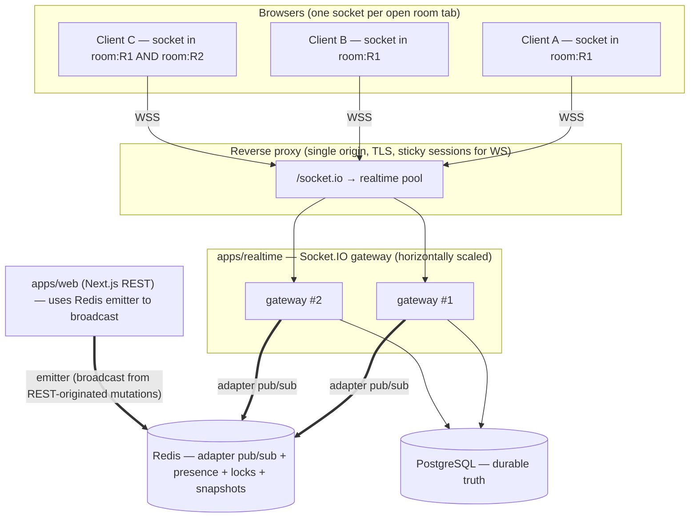
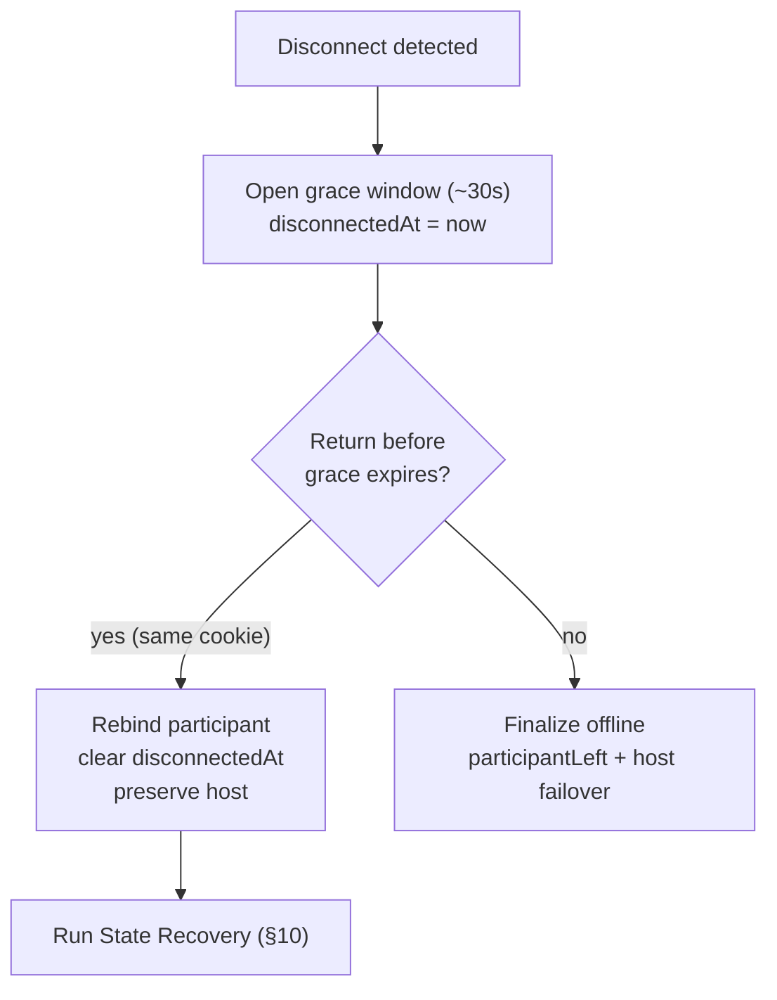
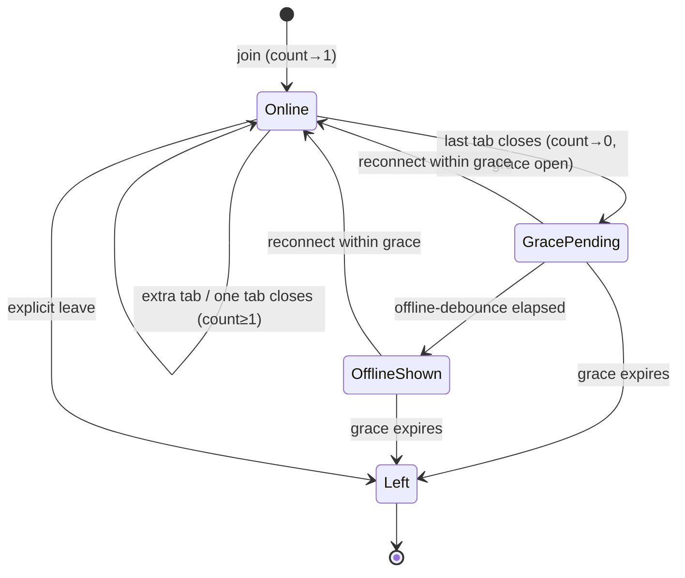
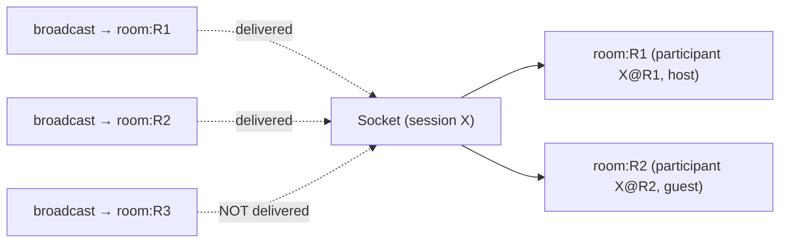

# REALTIME_ENGINE.md — MMMuzik V2 Realtime Communication

> **Purpose.** Define the realtime communication architecture for MMMuzik V2: the transport and topology, the complete catalog of realtime events (every direction, payload, producer, consumer, and reliability requirement), and the protocols for connection lifecycle, reconnection, session recovery, state recovery, and presence. It is designed for **low latency**, **high reliability**, and **multi-room** operation, and is precise enough to implement directly.
>
> **Source of truth.** `PROJECT_KNOWLEDGE.md` (V1) §6 (Realtime Design), Appendices B/C (DTOs / topology), §3.5 (host disconnect), §12.3 (participant key). Behavior targets: `SPEC.md`. Transport/process model: `ARCHITECTURE.md` (Socket.IO, single origin, Redis adapter + emitter). Playback payload shape: `PLAYBACK_ENGINE.md` (the anchor + `revision`).
>
> **One sentence.** A single Socket.IO namespace, room-scoped by `room:{roomId}`, fanned out across instances by a Redis adapter, where **commands are acknowledged and retryable**, **broadcasts are ordered and snapshot-reconcilable**, and **identity is bound from the session cookie at the handshake — never trusted from a payload**.

---

## Table of Contents

1. [Goals & Principles](#1-goals--principles)
2. [Transport & Topology](#2-transport--topology)
3. [Identity & Handshake Authentication](#3-identity--handshake-authentication)
4. [Event Model & Conventions](#4-event-model--conventions)
5. [Reliability Model](#5-reliability-model)
6. [Event Catalog](#6-event-catalog)
   - 6.1 [Room Events](#61-room-events)
   - 6.2 [Presence Events](#62-presence-events)
   - 6.3 [Playback Events](#63-playback-events)
   - 6.4 [Queue Events](#64-queue-events)
   - 6.5 [Chat Events](#65-chat-events)
   - 6.6 [System & Connection Events](#66-system--connection-events)
7. [Connection Lifecycle](#7-connection-lifecycle)
8. [Reconnection Flow](#8-reconnection-flow)
9. [Session Recovery](#9-session-recovery)
10. [State Recovery](#10-state-recovery)
11. [Presence Tracking](#11-presence-tracking)
12. [Design for Low Latency / High Reliability / Multi-Room](#12-design-for-low-latency--high-reliability--multi-room)
13. [Configuration & Tunables](#13-configuration--tunables)
14. [Appendix A — DTO Reference](#appendix-a--dto-reference)
15. [Appendix B — Error Codes](#appendix-b--error-codes)

---

# 1. Goals & Principles

| # | Principle | V1 lesson it encodes |
|---|-----------|----------------------|
| **RT-1** | **One namespace, room-scoped.** All realtime traffic flows over a single Socket.IO server; isolation is by `room:{roomId}` membership. | V1 consolidated to one hub because realtime groups are per-hub and one broadcaster targeted one hub (§6.1). |
| **RT-2** | **Identity from the handshake, never the payload.** The session is bound from the cookie when the socket connects. | V1 bound session from the cookie, never a method arg (§6.2) — prevents identity spoofing. |
| **RT-3** | **Commands are acknowledged; broadcasts are reconcilable.** Mutations use ack callbacks and client retry; broadcasts can be lost without harm because clients re-pull a snapshot on reconnect and converge via revision/id keys. | V1's primary in-process broadcast + REST snapshot reconciliation + idempotent advance (§6.5–6.8). |
| **RT-4** | **Disconnect ≠ leave.** A drop opens a grace window; it does not remove the participant or move the host. | V1 `OnDisconnectedAsync` opened grace only (§3.5, §6.2). |
| **RT-5** | **Fan-out across instances from day one.** A Redis adapter makes every broadcast reach every room member on every instance. | V1 deferred the realtime backplane, blocking multi-instance scale-out (§10.4). |
| **RT-6** | **The server is the source of truth; realtime is an accelerator.** Redis mirrors committed Postgres state; clients reconcile to it. | V1 read-through Redis + invalidate-on-write (§6.7). |
| **RT-7** | **Lean live payloads.** Live events carry only what changed; full resolution lives in snapshots. | V1 live `PlaybackStateChanged` carried `currentTrack=null`; REST snapshot carried the resolved track (§6.4). |

---

# 2. Transport & Topology



- **Transport:** Socket.IO over WebSocket (with HTTP long-polling as a fallback only). Same origin as the UI and REST API, so the session cookie is sent automatically and there is **no CORS or `SameSite=None` complexity** (the V1 §12.4 tunnel pain is structurally gone).
- **Process:** the gateway is a **long-lived Node process** (`apps/realtime`), separate from Next.js because request-scoped handlers cannot hold WebSocket connections (ARCHITECTURE §4).
- **Rooms:** every socket that joins room `R` is added to the Socket.IO room `room:{R}`. All broadcasts target a `room:{roomId}`. A single socket **may belong to multiple rooms** (RT multi-room, §12.3).
- **Cross-instance fan-out:** the **Redis adapter** publishes each room broadcast to all gateway instances, so a guest on gateway #2 receives an event emitted from gateway #1.
- **REST-originated broadcasts:** when a mutation happens over REST (e.g., `POST /join`), `apps/web` emits the resulting event through the **Redis emitter**, which the gateways' adapter fans out — one broadcast fabric, two entrypoints (ARCHITECTURE §4).

---

# 3. Identity & Handshake Authentication

```mermaid
sequenceDiagram
  participant C as Client
  participant WEB as Next.js REST
  participant G as Gateway (Socket.IO)
  participant RD as Redis

  C->>WEB: POST /api/rooms/{code}/join { nickname }
  WEB-->>C: { roomId, sessionId, isHost } + Set-Cookie: session (httpOnly, SameSite=Lax, same-origin)
  C->>G: io() connect  (cookie sent on handshake)
  G->>G: io.use middleware: parse cookie → resolve sessionId
  alt no/invalid session
    G-->>C: connect_error("unauthorized")
  else valid
    G->>RD: register conn:{connId} → { sessionId }
    G-->>C: connect (socket.data.sessionId bound)
  end
  C->>G: emit("room:join", { roomId }, ack)
  G->>G: verify session belongs to room (or create membership) ; socket.join("room:{roomId}")
```

**Rules**
- The handshake middleware reads the **httpOnly session cookie**, resolves the `sessionId`, and stores it on the socket (`socket.data.sessionId`). Every subsequent command derives the actor from `socket.data.sessionId` — **the `sessionId` is never read from any event payload** (RT-2).
- A connection with no valid session is rejected with `connect_error`. The client must first obtain a session by creating or joining a room over REST.
- **Authority** (host-only commands) is checked in the domain aggregate per command using the bound `sessionId`, not in the transport (SPEC REQ-SESS-6). The transport only guarantees *who* is speaking; the domain decides *what* they may do.

---

# 4. Event Model & Conventions

## 4.1 Naming & direction

Events are namespaced `domain:thing` and split by direction:
- **Commands** (Client → Server): imperative (`playback:play`, `queue:add`). Carry `roomId`. Use an **ack callback** that returns a `Result` (§5.2). Producer = a client; consumer = the gateway.
- **Broadcasts** (Server → Clients): past-tense facts (`playback:stateChanged`, `queue:trackAdded`). Always carry `roomId` so a multi-room client routes them to the correct store. Producer = the server (gateway or REST-via-emitter); consumers = all clients in `room:{roomId}`.

All event names and payload types live in the shared **`packages/contracts`** typed event maps (`ClientToServer`, `ServerToClient`), so a producer and consumer that disagree fail to compile — the structural cure for V1's wire drift (ARCHITECTURE AD-1).

## 4.2 The `Result` ack envelope

Every command's ack callback receives:

```
type Result<T> =
  | { ok: true;  data: T }
  | { ok: false; error: { code: string; type: ErrorType; message: string; retryAfterMs?: number } }

type ErrorType = "Validation" | "NotFound" | "Conflict" | "Forbidden" | "TooManyRequests" | "Unexpected"
```

The same error catalog backs REST (mapped to HTTP status) and realtime (returned in the ack) — one catalog, two transports (V1 §4.3; codes in Appendix B).

## 4.3 Payload conventions

- All ids are opaque strings; all timestamps are server **epoch milliseconds** (UTC). Wire JSON is camelCase.
- Live broadcasts are **lean**: `playback:stateChanged` omits the resolved track (`currentTrack=null`); clients resolve it from their already-synced queue. Full resolution is only in snapshots (REST or `room:requestState` ack). (V1 §6.4 / RT-7.)
- Playback payloads carry a monotonic **`revision`** so clients reject stale/out-of-order updates (PLAYBACK_ENGINE §2).

---

# 5. Reliability Model

Each event is tagged with one of four reliability levels. This is the contract that lets the system be both **low-latency** (no heavyweight delivery guarantees on the hot path) and **reliable** (everything converges via snapshots + idempotency).

| Level | Name | Delivery semantics | Used for |
|-------|------|--------------------|----------|
| **R0** | **Ephemeral** | Fire-and-forget; loss is harmless because the next message supersedes it. No ack. | `playback:reportPosition` (host heartbeat), `sync:time` probe. |
| **R1** | **Ack'd command (at-least-once)** | Sent with an ack callback + timeout; on timeout/`ok:false`-transient, the client retries. Handlers are **idempotent or naturally safe**. | All mutating commands (`queue:add`, `playback:*`, `chat:send`, `room:join/leave`). |
| **R2** | **Reconcilable broadcast (ordered, best-effort)** | Delivered in order per connection; a missed event is recovered by the snapshot re-pull on reconnect. Convergence guaranteed by **revision-gating** (playback), **merge-by-id** (queue), **dedupe-by-id** (chat), **id-keyed** (presence). | Most broadcasts. |
| **R3** | **Critical broadcast (reconcilable + out-of-band backstop)** | Like R2, but also enforced by an authoritative side channel so a silent miss cannot strand a client. | `room:closed` (also enforced by REST 404), `presence:hostChanged` (recoverable from participants snapshot), `playback:stateChanged` (revision-gated + `room:requestState`). |

**Idempotency mechanisms (all carried from V1, §6.8):**
- **Playback:** clients ignore any `playback:stateChanged` whose `revision ≤ local`; servers run idempotent auto-advance (`advanceIfCurrent`) guarded by a per-`(roomId, endedItemId)` Redis `SET NX` lock.
- **Queue:** clients merge incoming items **by id** and append realtime-only items, so a late snapshot can't clobber a just-added track (V1 §7.6).
- **Chat:** clients dedupe **by message id**.
- **Presence:** participant state is keyed by `sessionId`; repeated join/online events are convergent, not additive.

**Ordering:** Socket.IO preserves per-connection ordering of server→client emits within a room (V1 §6.8). The Redis adapter preserves this per consumer. Cross-event causal ordering is *not* assumed — clients reconcile from authoritative state, never by replaying event order.

---

# 6. Event Catalog

Each category lists its **Commands** (Client→Server) and **Broadcasts** (Server→Client). Every row documents **name, payload, producer, consumer, reliability**. DTO shapes are in [Appendix A](#appendix-a--dto-reference).

## 6.1 Room Events

**Commands**

| Event | Payload | Producer | Consumer | Reliability |
|-------|---------|----------|----------|:-----------:|
| `room:join` | `{ roomId }` → ack `Result<{ participant: ParticipantDto, isHost: boolean }>` | Any client (on connect / reconnect) | Gateway | **R1** |
| `room:leave` | `{ roomId }` → ack `Result<void>` | Any client | Gateway | **R1** |
| `room:requestState` | `{ roomId }` → ack `Result<RoomSnapshot>` (playback + participants + queue; chat via REST) | Any client (fast resync) | Gateway | **R1** |

**Broadcasts**

| Event | Payload | Producer | Consumer | Reliability |
|-------|---------|----------|----------|:-----------:|
| `room:closed` | `{ roomId, reason: "closed_by_host" \| "idle_timeout" }` | Server (host close / idle reaper) | All in `room:{roomId}` | **R3** |
| `room:statusChanged` | `{ roomId, status: "Active" \| "Idle" }` | Server | All in `room:{roomId}` | **R2** |

> `room:closed` also makes the room return **404 on REST**, so a client that missed the broadcast learns the room is gone on its next interaction (R3 backstop). V1 §3.6 closed-room 404 gate.

## 6.2 Presence Events

**Commands:** presence is derived from connection lifecycle + `room:join`/`room:leave`; there is no separate presence command.

**Broadcasts**

| Event | Payload | Producer | Consumer | Reliability |
|-------|---------|----------|----------|:-----------:|
| `presence:participantJoined` | `{ roomId, participant: ParticipantDto }` | Server (on offline→online transition / first join) | All in `room:{roomId}` | **R2** |
| `presence:participantLeft` | `{ roomId, sessionId }` | Server (explicit leave / grace expiry) | All in `room:{roomId}` | **R2** |
| `presence:participantOffline` | `{ roomId, sessionId }` | Server (grace open, **after offline debounce**) | All in `room:{roomId}` | **R2** |
| `presence:participantOnline` | `{ roomId, sessionId }` | Server (reconnect within grace) | All in `room:{roomId}` | **R2** |
| `presence:hostChanged` | `{ roomId, newHostSessionId }` | Server (explicit transfer / auto-failover) | All in `room:{roomId}` | **R3** |

> `presence:participantOffline` is emitted **only after a short debounce** so a refresh/blip never flickers the list (SPEC REQ-PRES-5). `presence:hostChanged` is R3: a missed event self-heals because the participants snapshot carries `isHost`.

## 6.3 Playback Events

**Commands** (host-only unless noted; authority checked in the domain)

| Event | Payload | Producer | Consumer | Reliability |
|-------|---------|----------|----------|:-----------:|
| `playback:play` | `{ roomId }` → ack `Result<void>` | Host | Gateway | **R1** |
| `playback:pause` | `{ roomId }` → ack `Result<void>` | Host | Gateway | **R1** |
| `playback:seek` | `{ roomId, positionMs }` → ack `Result<void>` | Host | Gateway | **R1** |
| `playback:skip` | `{ roomId }` → ack `Result<void>` | Host | Gateway | **R1** |
| `playback:skipPrevious` | `{ roomId }` → ack `Result<void>` (restart current; no history) | Host | Gateway | **R1** |
| `playback:notifyTrackEnded` | `{ roomId, endedItemId }` → ack `Result<void>` | Host player (accelerator) | Gateway | **R1** (idempotent) |
| `playback:reportDuration` | `{ roomId, queueItemId, durationMs }` → ack `Result<void>` | Host player | Gateway | **R1** (idempotent) |
| `playback:reportPosition` | `{ roomId, positionMs }` (no ack) | Host player (1 s heartbeat) | Gateway | **R0** |

**Broadcasts**

| Event | Payload | Producer | Consumer | Reliability |
|-------|---------|----------|----------|:-----------:|
| `playback:stateChanged` | `{ roomId, state: PlaybackStateDto }` (live ⇒ `currentTrack=null`; carries `revision`, `anchorAt`, `durationMs`) | Server | All in `room:{roomId}` | **R3** |

> Track *change*, *skip*, *end*, *seek*, *play/pause* are all conveyed by a single `playback:stateChanged` carrying the new anchor — clients diff `currentItemId`/`status`/`revision` to decide hard vs soft sync (PLAYBACK_ENGINE §9, §15). `reportPosition` is never re-broadcast; the server re-anchors and emits `playback:stateChanged` **only if the host drifted ≥ `HOST_REANCHOR_MS`** (avoids churn — V1 §8.6).

## 6.4 Queue Events

**Commands**

| Event | Payload | Producer | Consumer | Reliability |
|-------|---------|----------|----------|:-----------:|
| `queue:add` | `{ roomId, provider, urlOrId }` → ack `Result<QueueItemDto>` | Any participant | Gateway | **R1** |
| `queue:remove` | `{ roomId, queueItemId }` → ack `Result<void>` (host; cannot remove current) | Host | Gateway | **R1** |
| `queue:reorder` | `{ roomId, orderedQueueItemIds }` → ack `Result<void>` (host; exact set) | Host | Gateway | **R1** |

**Broadcasts**

| Event | Payload | Producer | Consumer | Reliability |
|-------|---------|----------|----------|:-----------:|
| `queue:trackAdded` | `{ roomId, item: QueueItemDto }` | Server | All in `room:{roomId}` | **R2** |
| `queue:trackRemoved` | `{ roomId, queueItemId }` | Server | All in `room:{roomId}` | **R2** |
| `queue:reordered` | `{ roomId, orderedQueueItemIds }` | Server | All in `room:{roomId}` | **R2** |
| `queue:itemUpdated` | `{ roomId, queueItemId, durationMs }` (duration correction) | Server (after `reportDuration`) | All in `room:{roomId}` | **R2** |

> `queue:itemUpdated` is a **V2 improvement**: V1 corrected duration only on the host's own row (§7.5); V2 broadcasts the correction so every client's now-playing/upcoming row shows the real length. Adding the first track to an idle queue auto-starts it, which surfaces as both `queue:trackAdded` **and** a `playback:stateChanged` (SPEC §7.6).

## 6.5 Chat Events

**Commands**

| Event | Payload | Producer | Consumer | Reliability |
|-------|---------|----------|----------|:-----------:|
| `chat:send` | `{ roomId, body }` → ack `Result<ChatMessageDto>` | Any participant | Gateway | **R1** |

**Broadcasts**

| Event | Payload | Producer | Consumer | Reliability |
|-------|---------|----------|----------|:-----------:|
| `chat:messagePosted` | `{ roomId, message: ChatMessageDto }` | Server | All in `room:{roomId}` | **R2** |

> Recent history (default 50, max 100, oldest-first) is fetched via **REST** on join, not pushed (SPEC REQ-CHAT-3). Clients **dedupe by message id** so the ack'd message and the broadcast don't double-render.

## 6.6 System & Connection Events

**App-level system broadcasts**

| Event | Payload | Producer | Consumer | Reliability |
|-------|---------|----------|----------|:-----------:|
| `sync:time` | *(command)* `()` → ack `{ serverEpochMs }` | Any client (clock probe) | Gateway | **R0** |
| `system:resyncRequired` | `{ roomId?, reason }` | Server (after restart / detected gap) | Targeted client(s) | **R2** |
| `system:rateLimited` | `{ action, retryAfterMs }` | Server | Offending client | informational (limit also returned in the command ack) |
| `system:error` | `{ code, type, message }` | Server | Offending client | informational |

**Transport-level connection events (Socket.IO built-ins, handled by the client):**

| Event | Meaning | Client action |
|-------|---------|---------------|
| `connect` | socket established | (re)run join + initial sync (§7) |
| `disconnect(reason)` | socket dropped | show reconnecting banner; pause host heartbeat |
| `connect_error(err)` | handshake/connect failed (e.g., unauthorized) | if auth → send to join screen; else let auto-reconnect retry |
| `reconnect_attempt(n)` | client retrying (backoff) | keep banner |
| `reconnect` | re-established | run reconnection flow (§8) |
| `reconnect_failed` | gave up after max attempts | show "connection lost — retry" CTA |

> The transport also runs its own **heartbeat** (engine.io `pingInterval`/`pingTimeout`) to detect dead connections. This is distinct from the app-level `sync:time` clock probe and from `playback:reportPosition`.

---

# 7. Connection Lifecycle

```mermaid
sequenceDiagram
  participant C as Client
  participant G as Gateway
  participant DOM as Room domain
  participant RD as Redis
  participant DB as Postgres

  C->>G: connect (cookie → sessionId bound)  [transport: connect]
  C->>G: emit("room:join", { roomId }, ack)
  G->>DOM: markOnline(roomId, sessionId, now)
  DOM->>DB: clear disconnectedAt ; (raise ParticipantJoined only on offline→online)
  G->>RD: presence INCR room:{roomId}:{sessionId}  (ref count)
  G->>G: socket.join("room:{roomId}")
  G-->>C: ack { participant, isHost }
  par broadcast (only if transition)
    G->>RD: emit presence:participantJoined → room:{roomId}
  end
  C->>G: emit("sync:time", ack) ×5   (clock offset burst)
  C->>G: emit("room:requestState", { roomId }, ack)  // OR pull REST snapshots
  G-->>C: ack { playback (resolved), participants, queue }
  Note over C: hydrate stores (merge-by-id) ; player runs join-in-progress sync (PLAYBACK_ENGINE §10)
```

**Lifecycle states (per socket):** `connecting → connected → joined → (disconnected → reconnecting → connected) → left/closed`.

**On `connect`:** bind identity, then `room:join`, then the **clock burst** (before any seek — PLAYBACK_ENGINE §10), then **state recovery** (§10). Subscribe handlers **before** requesting state so no event is missed in the gap (V1 §4.4).

**On `room:join`:** the server marks the participant online (clearing `disconnectedAt`), adds the socket to `room:{roomId}`, increments the presence ref-count, and — only on an **offline→online transition** — broadcasts `presence:participantJoined` (so a refresh doesn't spam joins).

---

# 8. Reconnection Flow

The client uses Socket.IO automatic reconnection with capped exponential backoff (the V2 analogue of V1's `[0,1000,2000,5000,10000]`, §6.6). The grace window on the server means a quick return is seamless.

```mermaid
sequenceDiagram
  participant C as Client
  participant G as Gateway
  participant R as Grace reaper (worker)
  participant DB as Postgres
  participant RD as Redis

  C--xG: transport drop (network blip / refresh / sleep)
  G->>DB: beginDisconnect(roomId, sessionId, now)  // open ~30s grace ; NO host failover
  G->>RD: presence DECR room:{roomId}:{sessionId}  // → 0 starts offline-debounce timer
  Note over C: [disconnect] → show "Reconnecting…" banner ; pause host heartbeat
  loop backoff: 0.5s, 1s, 2s, … cap 10s (±jitter)
    C->>G: reconnect attempt
  end
  alt reconnect within grace
    C->>G: connect (same cookie → same sessionId)  [reconnect]
    C->>G: emit("room:join", { roomId }, ack)
    G->>DB: markOnline → clear disconnectedAt (identity & host preserved)
    G->>RD: presence INCR  (cancel offline-debounce)
    C->>G: sync:time burst + room:requestState   // STATE RECOVERY (§10)
    Note over C: banner clears ; player hard-resyncs to current anchor
  else grace expires (no return)
    R->>DB: reconcileDisconnections(cutoff, now) → finalize offline + host failover
    R->>RD: emit presence:participantLeft (+ presence:hostChanged if host)
  end
```

**Client-side reconnection config (§13)** uses capped exponential backoff with jitter. On the `reconnect` event the client **re-runs join + state recovery** (it does not assume the server preserved its room membership across the gap — though Socket.IO Connection State Recovery may make this a no-op; see §9).

---

# 9. Session Recovery

**Goal:** a returning user is the *same participant*, with the *same host status*, with *no duplicate* in the list (SPEC §7.12, V1 §2.5/§3.5).

Two layers cooperate:

1. **Application session (authoritative).** Identity is the **httpOnly session cookie**, persisted by the browser across refreshes and reconnects. On every (re)connect the handshake re-derives `sessionId` from the cookie (§3). The server keys the participant by **`(roomId, sessionId)`** (the V1 §12.3 composite-key fix), so:
   - The same session reconnecting to the same room **rebinds** to its existing participant (clears `disconnectedAt`) — no duplicate, host preserved if within grace.
   - The same session in a **different** room is a **distinct** participant (multi-room, §12.3).
   - A session returning **after grace expired** is treated as a **fresh join** (it does not silently reclaim host — SPEC edge case).

2. **Transport session (optimization).** Socket.IO **Connection State Recovery** may restore the socket's room memberships and replay a short buffer of missed broadcasts after a brief drop. This is a **latency optimization only**; correctness never depends on it. Whether or not it succeeds, the client performs **state recovery (§10)**, and the **server is the source of truth**.



---

# 10. State Recovery

**Goal:** after any (re)connection, the client's stores and player match the room's authoritative state, with no lost local edits.

**Procedure (idempotent, runs on every connect/reconnect):**

1. **Clock burst** — `sync:time` ×5, min-RTT → EWMA offset (PLAYBACK_ENGINE §5). Do this *before* any seek.
2. **Pull the snapshot** — either `room:requestState` (ack returns playback + participants + queue in one round trip) **or** the REST snapshots (`/participants`, `/queue`, `/playback`, `/messages`). Chat history always comes from REST.
3. **Reconcile each store (convergent merge, never blind replace):**
   - **Queue:** `hydrate` **merges by id** and appends realtime-only items → a delayed snapshot cannot wipe a just-added track (V1 §7.6).
   - **Playback:** accept the anchor only if `revision > local`; then the player runs join-in-progress sync (predictive, latency-compensated — PLAYBACK_ENGINE §10).
   - **Participants:** replace by `sessionId` keying; `isHost` from the snapshot self-heals any missed `presence:hostChanged`.
   - **Chat:** dedupe by message id.
4. **Resume host duties** if host: restart the `reportPosition` heartbeat.

The server can also proactively send **`system:resyncRequired`** (e.g., after a gateway restart, or if it detects a client's `revision` is far behind) to prompt step 2 without waiting for a reconnect.

```mermaid
sequenceDiagram
  participant C as Client
  participant G as Gateway
  participant RD as Redis (snapshots)
  participant DB as Postgres

  Note over C: on connect / reconnect / system:resyncRequired
  C->>G: sync:time ×5 (ack)              %% clock offset
  C->>G: room:requestState { roomId } (ack)
  G->>RD: read playback + participants + queue snapshots
  alt cache miss
    G->>DB: read-through ; warm RD
  end
  G-->>C: ack { playback(resolved), participants, queue }
  C->>C: merge-by-id (queue) ; revision-gate (playback) ; key-by-sessionId (participants)
  C->>G: (REST) GET /messages?take=50  %% chat history
```

---

# 11. Presence Tracking

Presence answers "who is here, and what's their state" while honoring two competing rules: **show offline state** (SPEC REQ-PRES-4) yet **never flicker on a blip** (REQ-PRES-5).

## 11.1 Data model (Redis, per room)

- **Connection ref-count:** `presence:{roomId}` is a hash `sessionId → activeConnectionCount`. A session is **online** iff count ≥ 1. This handles **multiple tabs**: closing one tab doesn't mark the user offline while another tab is open.
- **Disconnect marker:** the participant's `disconnectedAt` (in Postgres) is the grace anchor used by the reaper; presence ref-count is the fast online/offline signal.

## 11.2 Transitions

| Trigger | Effect | Broadcast |
|---------|--------|-----------|
| `room:join` / connect (count 0→1) | mark online, clear `disconnectedAt` | `presence:participantJoined` **only** if this was an offline→online transition |
| additional tab connects (count ≥1→≥2) | none (already online) | none |
| one tab disconnects (count →≥1) | none (still online) | none |
| last tab disconnects (count →0) | open grace (`disconnectedAt=now`); start **offline-debounce** timer | none yet |
| offline-debounce elapses, still 0 | mark visibly offline | `presence:participantOffline` |
| reconnect before grace expiry (count 0→1) | clear `disconnectedAt`; cancel debounce | `presence:participantOnline` (or `participantJoined` if offline was already announced) |
| grace expires with count 0 | finalize leave; host failover if host | `presence:participantLeft` (+ `presence:hostChanged`) |
| explicit `room:leave` | remove immediately; host failover if host | `presence:participantLeft` (+ `presence:hostChanged`) |



> **Debounce vs grace:** the **offline-debounce** (~4 s) controls when *others see you dimmed*; the **grace window** (~30 s) controls when you're *finalized as gone* and host fails over. A 1-second refresh trips neither — no flicker, no churn (V1 §3.5, §6.2).

---

# 12. Design for Low Latency / High Reliability / Multi-Room

## 12.1 Low latency

- **WebSocket-first** transport over a single origin; no CORS preflight, no cross-site cookie negotiation (V1 §12.4 eliminated).
- **In-process emit + Redis adapter:** same-instance members receive a broadcast with no extra hop; cross-instance adds one Redis pub/sub hop (sub-millisecond on a colocated Redis).
- **Lean live payloads** (`currentTrack=null`, ids over objects) keep frames small (RT-7).
- **No heartbeat re-broadcast:** `reportPosition` is host→server only; the server re-anchors and broadcasts **only on real drift** (`≥ HOST_REANCHOR_MS`), so a playing room is near-silent on the wire between user actions.
- **Single-round-trip resync:** `room:requestState` returns playback + participants + queue in one ack.
- **Clock offset via ack** (one RTT) rather than a request/response pair.

## 12.2 High reliability

- **Commands are ack'd and retryable (R1)** with idempotent handlers; the client retries on ack timeout.
- **Broadcasts are reconcilable (R2/R3):** any miss is healed by the snapshot pull on the next (re)connect, and convergence is guaranteed by **revision-gating / merge-by-id / dedupe-by-id / sessionId-keying** (§5).
- **Disconnect ≠ data loss:** the grace window + composite-key rebind preserve identity and host across blips (§9).
- **Cross-instance correctness:** the Redis adapter guarantees every room member on every gateway receives each broadcast (V1 §10.4 gap closed).
- **Liveness:** engine.io ping/pong detects half-open connections; `pingTimeout` forces a clean disconnect → grace.
- **Server is the source of truth:** Redis mirrors committed Postgres; clients never treat a broadcast as authoritative beyond reconciliation (RT-6).

## 12.3 Multi-room support

- **Room-scoped isolation:** broadcasts target `room:{roomId}`; a socket only receives events for rooms it has joined. Every broadcast carries `roomId` so a multi-room client routes it to the correct store instance.
- **A single socket may join multiple rooms** (`socket.join` is additive). The gateway tracks `socket.data.rooms: Set<roomId>` and rejects commands whose `roomId` the socket hasn't joined (and whose `(roomId, sessionId)` membership doesn't exist).
- **Identity is per room:** the participant key is `(roomId, sessionId)`, so the same session is a distinct participant in each room — no cross-room collision (the V1 §12.3 fix is foundational here).
- **Per-room coordination keys** in Redis: presence (`presence:{roomId}`), advance lock (`playback:advance-lock:{roomId}:{itemId}`), snapshots (`room:{roomId}:*`), rate-limit counters keyed by `(sessionId, action)` (optionally per room).
- **Fair fan-out:** because rooms are independent Redis-adapter channels, traffic in a busy room does not amplify delivery work for sockets that aren't in it.



---

# 13. Configuration & Tunables

| Setting | Default | Purpose / V1 lineage |
|---------|---------|----------------------|
| Transport | `["websocket","polling"]` (WS preferred) | Low latency; polling only as fallback. |
| `pingInterval` / `pingTimeout` | `25 s` / `20 s` | Transport liveness (engine.io). |
| Reconnection | `on`, `reconnectionDelay=500ms`, `reconnectionDelayMax=10 s`, `randomizationFactor=0.5` | Capped exponential backoff (V1 used `[0,1k,2k,5k,10k]`, §6.6). |
| Ack timeout (client) | `5 s`, then retry (idempotent) | R1 at-least-once. |
| **Reconnect grace window** | `~30 s` | Host/identity survival (V1 §3.5). |
| **Offline-debounce** | `~4 s` | Announce offline without flicker (SPEC REQ-PRES-5). |
| `HOST_REANCHOR_MS` | `500 ms` | Re-anchor/broadcast only on real host drift (PLAYBACK_ENGINE §14). |
| Host heartbeat (`reportPosition`) | `1 s` | Keep anchor honest (V1 §8.6). |
| Connection State Recovery | enabled, `maxDisconnectionDuration ≈ 2 min` | Transport-level fast resume (optimization only, §9). |
| Sticky sessions (proxy) | required for WS | Multi-instance scale-out (ARCHITECTURE §12). |
| Max event payload | bounded (e.g., `urlOrId ≤ 2048`, `body ≤ 2000`) | Input validation / abuse resistance (V1 §7.1, §6 chat). |
| Rate limits | per `(sessionId, action)`: add ≈15/min, send throttled, join ≈20/min | Abuse resistance, fail-open via Redis (V1 §11.2). |

All values are **runtime-configured** (no build-time baking — ARCHITECTURE §13 / V1 §12.5).

---

# Appendix A — DTO Reference

Shapes live in `packages/contracts`; camelCase wire JSON; timestamps are server epoch ms.

```
ParticipantDto    { sessionId, nickname, isHost, isOnline }

QueueItemDto      { id, provider, externalId, title, artist, durationMs,
                    thumbnailUrl?, position, addedBySessionId, addedByNickname, addedAt }

PlaybackStateDto  { currentItemId | null,
                    currentTrack?: TrackDto | null,   // resolved in snapshots; null in live broadcasts
                    positionMs, status: "Idle"|"Playing"|"Paused", isPlaying,
                    anchorAt,        // server epoch ms — the elapsed-math anchor (T)
                    durationMs,      // 0 = unknown placeholder
                    revision }       // monotonic; clients reject revision ≤ local

TrackDto          { id, provider, providerId, title, artist, artworkUrl?, durationMs }

ChatMessageDto    { id, roomId, sessionId, nickname, body, sentAt }

RoomSummaryDto    { roomId, code, name, status, listenerCount }

RoomSnapshot      { playback: PlaybackStateDto, participants: ParticipantDto[], queue: QueueItemDto[] }
```

# Appendix B — Error Codes

Returned in the command ack `Result.error.code` (and mapped to HTTP status on REST). `type` drives client handling.

| Code | Type | Meaning |
|------|------|---------|
| `room.not_found` | NotFound | room/code unknown |
| `room.closed` | Conflict | room is Closed — no mutations |
| `room.session_required` | Forbidden | no bound session on the socket |
| `queue.item_not_found` | NotFound | unknown queue item |
| `queue.cannot_remove_current` | Conflict | can't remove the playing track — skip instead |
| `queue.forbidden` | Forbidden | non-host attempted host-only queue op |
| `queue.invalid_provider` | Validation | unsupported/garbled provider |
| `queue.resolve_failed` | Unexpected | metadata resolution failed |
| `queue.invalid_reorder` | Validation | reorder set ≠ exact current item set |
| `playback.forbidden` | Forbidden | non-host attempted a transport command |
| `playback.queue_empty` | Conflict | playback action with no current track |
| `playback.invalid_position` | Validation | seek out of range |
| `chat.empty_message` | Validation | blank message |
| `chat.message_too_long` | Validation | body exceeds max (~2000) |
| `rate.limited` | TooManyRequests | rate limit exceeded (`retryAfterMs` set) |

---

*This document is implementation-ready: §2–§3 fix transport and identity, §4–§5 fix the wire conventions and delivery guarantees, §6 enumerates every event with producer/consumer/reliability, §7–§11 specify the lifecycle protocols, and §12 ties it to the latency/reliability/multi-room goals. Keep the event names and payloads in `packages/contracts` so producer and consumer can never drift (the V1 mistake this design exists to prevent).*

---

# As-Built Notes (through Phase 4)

- **Ack/envelope:** unified to `{ success, data }` / `{ success, code, message }` for both HTTP and socket acks (Phase 2 D2), superseding the `{ ok, error }` shape sketched in §4.2.
- **Implemented events:** `playback:play/pause/seek` (host, ack'd) → `playback:stateChanged` (carries `revision`); `system:ping` → `system:pong`; `room:join`/`room:leave` (ack'd); presence `presence:participant{Joined,Left,Online,Offline}`, `presence:hostChanged`, `room:closed`.
- **Presence (Phase 4):** join/online emitted from the socket handler (has `io`); leave/host-change/room-closed emitted from REST via the **Redis emitter** (`@socket.io/redis-emitter`) — the §4 cross-process broadcast bridge, needed because Next route handlers run in a separate module graph from the co-hosted Socket.IO server.
- **Single-instance note:** the Redis adapter + emitter are wired, but multi-instance fan-out hasn't been load-tested yet (NFR-3). Reconnect-grace (disconnect → grace → host-failover-on-expiry) is still deferred to the reconnection phase; Phase 4 marks participants offline on disconnect without removal.
- **Phase 6 events:** added C→S `queue:add` (any participant) · `queue:remove`/`queue:reorder`/`queue:clear`/`playback:skip` (host) · `playback:trackEnded` + `playback:reportDuration` (host player reports); S→C `queue:updated` (authoritative full snapshot) + `playback:nextTrack` (notification). `playback:loadVideo` was **removed**. Queue mutations broadcast from `queueService` via the Redis emitter (uniform across socket handlers, the advance worker, and REST). REST `GET /api/rooms/:id/queue` provides the join-in-progress snapshot.
